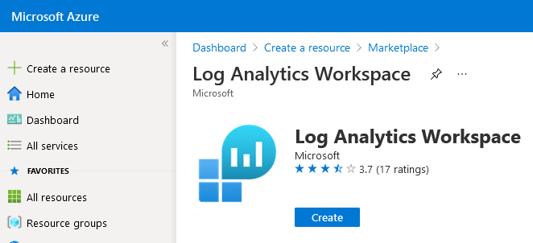

# How to configure VM update and management on Azure Stack | UKCloud Ltd

## Overview

Azure Monitor is the platform service that provides a single source for monitoring Azure resources. With Azure Monitor, you can visualize, query, route, archive, and otherwise take action on the metrics and logs coming from resources in Azure.

This guide will enable the following solutions for Azure Stack VMs:

1. [Azure Monitor for VMs](https://docs.microsoft.com/en-us/azure/azure-monitor/insights/vminsights-overview)
2. [Inventory](https://docs.microsoft.com/en-us/azure/automation/automation-vm-inventory)
3. [Change Tracking](https://docs.microsoft.com/en-us/azure/automation/change-tracking)
4. [Update Management](https://docs.microsoft.com/en-us/azure/automation/automation-update-management)

## Prerequisites

To complete the steps in this guide, you must have appropriate access to a subscription in the **Azure** & **Azure Stack** portal.

## Enabling VM Update & Management

1. Login to the Azure portal:

    <https://portal.azure.com>

2. Create a *LogAnalytics Workspace* in your Azure subscription:

    - Click **All Services** and search `log analytics`.
        
        
    
    - Select **Log Analytics Workspaces**.
    
    - Click **Add** and in the *new* blade, select choices for the following items:

        - *Name* for the **Log Analytics workspace**. Example: `DefaultLAWorkspace`
        
        - *Subscription* to link to the workspace.
        
        - *Resource Group* to link to the workspace. Can be an existing resource group or choose to create a new one.
        
        - *Location* available to host the workspace on.

        - *Pricing Tier* to use.

        Here is an example of the blade and all items filled out:

        

    - Press **OK** once finished. The **Log Analytics workspace** will now begin deployment. A notification will appear on the top right of the portal.
        
    - Once deployment is complete, press the *refresh* button and you should now see your **Log Analytics workspace**.

    - Click the newly create workspace. On the *new* blade, under settings, select *Advanced settings*, then select *Windows* or *Linux* servers depending on the *VMType* you created. 
    Note down the **Workspace ID** and **Primary Key** values.

        
    
    > [!TIP]
    > Leave the public azure portal open; it is still needed for later steps.
    
3. Login to the Azure Stack portal:

    <https://portal.frn00006.azure.ukcloud.com>

4. Navigate to the VM which you wish to enable **Update Management** on and under settings, select the *extensions* blade.

5. Click **Add** at the top and select the resource `Azure Monitor, Update and Configuration Management`; click **Create**.

    

6. Once the deployment is finished. Head back to the public azure portal, navigate to the *Log Analytics workspace* -> *Advanced settings* -> *`VMType` Servers*.

    - You should now see `x` number of `[VMType]` COMPUTERS CONNECTED. Depending on how many VMs you linked to the workspace.

        
    
    - Click on *`x vmtype` COMPUTERS CONNECTED*. This will bring up logs for the *Log Analytics workspace*.

7. Execute the following log query passing in your `VMTYPE`:

    - `Heartbeat | where OSType == "VMTYPE" | summarize arg_max(TimeGenerated, *) by SourceComputerId | top 500000 by Computer asc | render table`

    - Example: 

        `Heartbeat | where OSType == "Linux" | summarize arg_max(TimeGenerated, *) by SourceComputerId | top 500000 by Computer asc | render table`
    
    - If your VM shows in the results, you have successfully linked your VM from Azure Stack to your *Log Analytics workspace*.

        - [See here for more information; if required.](https://docs.microsoft.com/en-us/azure/automation/automation-update-management#confirm-that-non-azure-machines-are-onboarded)

8. []
