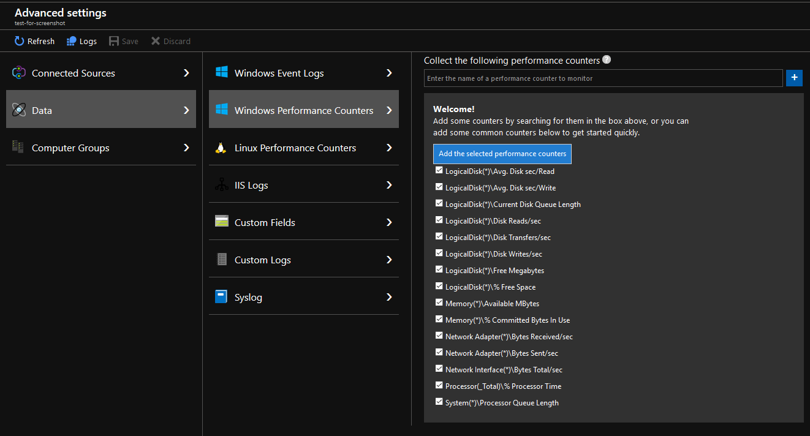
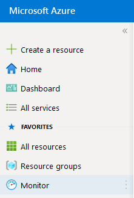
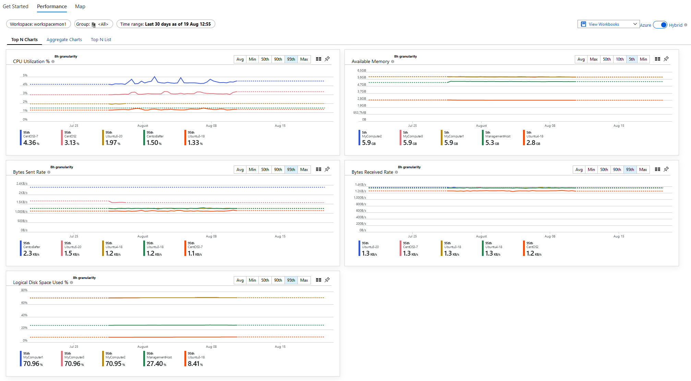
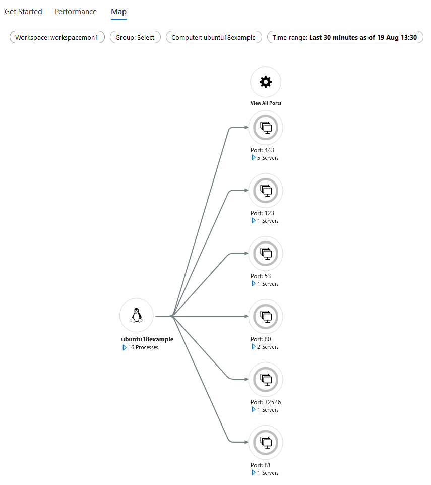

# How to configure VM update management on Azure Stack Hub

## Overview

> [!TIP]
> Azure Stack Hub has built-in Azure Monitor capabilities.
> You can find out more about them in the following article [Use Azure Monitor on Azure Stack Hub](https://docs.microsoft.com/en-us/azure-stack/user/azure-stack-metrics-azure-data).

Azure Monitor is the platform service that provides a single source for monitoring Azure resources. With Azure Monitor, you can visualise, query, route, archive, and otherwise take action on the metrics and logs coming from resources in Azure.

This article will enable the following solutions for Azure Stack Hub VMs:

- [Azure Monitor for VMs](https://docs.microsoft.com/en-us/azure/azure-monitor/insights/vminsights-overview)

- [Inventory](https://docs.microsoft.com/en-us/azure/automation/automation-vm-inventory)

- [Change Tracking](https://docs.microsoft.com/en-us/azure/automation/change-tracking)

- [Update Management](https://docs.microsoft.com/en-us/azure/automation/automation-update-management)

## Prerequisites

To complete the steps in this article, you must have appropriate access to a subscription in the Azure and Azure Stack Hub portal.

## Enabling VM Update & Management

> [!WARNING]
> Before proceeding, check [here](https://docs.microsoft.com/en-gb/azure/azure-monitor/insights/vminsights-enable-overview#supported-operating-systems) that your VMs' OS version is supported.

1. Log in to the [public Azure portal](https://portal.azure.com).

2. Create a *Log Analytics workspace* in your Azure subscription:

    - Click **Create a resource**

    - In the search bar, search for `log analytics`

        

    - Click **Log Analytics**

    - Click **Create**

    - Provide the following:

        - A name for the **Log Analytics Workspace**. Example: `DefaultLAWorkspace`

        - A **Subscription** to link the workspace to

        - A **Resource group** to host the workspace in

        - A **Location** to host the workspace in

            > [!NOTE]
            > Azure Monitor for VMs supports a Log Analytics workspace in the these [regions](https://docs.microsoft.com/en-us/azure/azure-monitor/insights/vminsights-enable-overview#log-analytics).

        - A **Pricing tier** to use

            

            *The example above shows the blade with all items filled out.*

        - Click **OK** once finished. The Log Analytics workspace will now begin deploying. A notification will appear in the top right of the portal.
    
        - Once deployment is complete, navigate to the resource group you placed the Log Analytics workspace in.
    
        - Click the newly created workspace. On the new blade, under *Settings*, select **Advanced settings**, **Connected Sources** and then **Windows Servers** or **Linux Servers** depending on the VM type you want to add analytics to.
    
        - Note down the **Workspace ID** and **Primary Key** values.

           

        - Within *Advanced settings*, select the *Data* blade and click **Windows Performance Counters** or **Linux Performance Counters**.

        - Ensure all counters are selected, then click **Add the selected performance counters**.

            > [!NOTE]
            > For Linux performance counters, ensure **Apply below configuration to my machines** is selected.

        - Click **Save**.

            

3. Create and configure an *Automation Account*:

    - Click **Create a resource**

    - Search for `automation`

    - Select **Automation** and then click **Create**

        

    - Choose a **Name**, **Subscription**, **Resource group**, **Location** and ensure **Create Azure Run As account** is set to **Yes**

    - Click **Create**

        

        > [!NOTE]
        > The error "Azure Classic Run As account creation error" may occur. This **DOES NOT** affect the process.

4. Once deployed, navigate to the *Automation Account*. In the new blade, under *Configuration Management*, select the solution to enable (**Inventory** or **Change Tracking**).

    - Select the Log Analytics workspace to link the automation account to

    - Click **Enable**

    - Wait for the deployment to complete

    - Repeat step 4 for **Update Management** under *Update Management*

        > [!TIP]
        > Leave the public Azure portal open; you will need to use it again later.

5. Log in to the [Azure Stack Hub portal](https://portal.frn00006.azure.ukcloud.com).

# [Portal](#tab/tabid-a)

6. Navigate to the VM that you want to enable Azure Monitor on and under *Settings*, select the *Extensions* blade.

    > [!WARNING]
    > For any monitoring to work correctly, the VM **must** have HTTPS (Port 443) enabled in the **Network Security Group** rules.

7. Click **Add** at the top, select the extension **Azure Monitor Dependency Agent**, click **Create** and then **OK**.

    > [!WARNING]
    > Wait for the deployment to finish before continuing.

    - Repeat this step for the **Azure Monitor, Update and Configuration Management** extension. Providing the extension with the **Workspace ID** and **Primary Key** values (noted down previously) when prompted.

        

# [PowerShell](#tab/tabid-b)

6. Execute the following PowerShell script to setup the **Azure Monitor Dependency Agent** and **Azure Monitor, Update and Configuration Management** extensions.

    ### Declare variables

    Enter details below to provide values for the variables in the following script in this article:

    | Variable name   | Variable description                                               | Input            |
    |-----------------|--------------------------------------------------------------------|------------------|
    | \$VMName    | The name of the virtual machine                 | <form oninput="result.value=vmname.value" id="vmname" style="display: inline;"><input type="text" id="vmname" name="vmname" style="display: inline;" placeholder="AzureStackHubVM"/></form> |
    | \$ResourceGroupName        | Name of the resource group which the VM resides in                           | <form oninput="result.value=resourcegroup.value;result1.value=resourcegroup.value" id="resourcegroup" style="display: inline;"><input type="text" id="resourcegroup" name="resourcegroup" style="display: inline;" placeholder="MyResourceGroup"/></form> |
    | \$WorkspaceKey        | The log analytics workspace primary key                           | <form oninput="result.value=workspacekey.value" id="workspacekey" style="display: inline;"><input type="text" id="workspacekey" name="workspacekey" style="display: inline;" placeholder="2Fzno02qWtiyVWbyvxelAFbjyMGsAgRDpolEmaf8ndiIbi4g8Uht+TNU/aTLEzkVw5/eA9K65+W3pKfiP7GYRQ=="/></form> |
    | \$WorkspaceId        | The log analytics workspace ID                           | <form oninput="result.value=workspaceid.value" id="workspaceid" style="display: inline;"><input type="text" id="workspaceid" name="workspaceid" style="display: inline;" placeholder="a40470ff-d8a0-4d37-ba13-274d4649a674"/></form> |
    | \$NetworkSecurityGroupName        | The name of the network security group to apply the inbound port 443 rule to                           | <form oninput="result.value=networksecuritygroupname.value" id="networksecuritygroupname" style="display: inline;"><input type="text" id="networksecuritygroupname" name="networksecuritygroupname" style="display: inline;" placeholder="AzureStackHubVMNSG"/></form> |

    <pre><code class="language-PowerShell"># Declare variables
    $ResourceGroupName = "<output form="resourcegroup" name="result" style="display: inline;">MyResourceGroup</output>"
    $VMName = "<output form="vmname" name="result" style="display: inline;">AzureStackHubVM</output>"
    $WorkspaceKey = "<output form="workspacekey" name="result" style="display: inline;">2Fzno00qWtiyVWbyvxelAFbjyMGsAgRDpolEmaf8ndiIbi4g8Uht+TNU/aTLEzkVw5/eA9K65+W3pKfiP7GYRQ==</output>"
    $PublicSettings = "{'workspaceId': '<output form="workspaceid" name="result" style="display: inline;">a40470ef-d8a0-4d37-ba13-274d4649a674</output>'}"
    $ProtectedSettings = "{'workspaceKey': `'$WorkspaceKey`'}"
    $Location = (Get-AzureRmLocation).Location
    
    # Get the virtual machine to apply the custom script extensions to
    $VM = Get-AzureRmVM -ResourceGroupName $ResourceGroupName -VMName $VMName

    # Obtain network security group, create the port 443 inbound network security group rule and apply the rule to it
    Get-AzureRmNetworkSecurityGroup -Name "<output form="networksecuritygroupname" name="result" style="display: inline;">AzureStackHubVMNSG</output>" -ResourceGroupName "<output form="resourcegroup" name="result1" style="display: inline;">MyResourceGroup</output>" | New-AzureRmNetworkSecurityRuleConfig -Name "Port443-Rule" -Description "Allow port 443" -Access "Allow" -Protocol "TCP" -Direction "Inbound" -Priority 100 -DestinationPortRange 443 -SourceAddressPrefix "*" -SourcePortRange "*" -DestinationAddressPrefix "*" | Set-AzureRmNetworkSecurityGroup

    # Deploy DependencyAgent extension
    Set-AzureRmVMExtension -ExtensionName "DependencyAgent" `
    -ResourceGroupName $VM.ResourceGroupName `
    -VMName $VM.Name `
    -Publisher "Microsoft.Azure.Monitoring.DependencyAgent" `
    -ExtensionType "DependencyAgentLinux" `
    -TypeHandlerVersion 9.7 `
    -Location $Location `
    -Verbose

    # Deploy Microsoft.EnterpriseCloud.Monitoring extension
    Set-AzureRmVMExtension -ExtensionName "Microsoft.EnterpriseCloud.Monitoring" `
    -ResourceGroupName $VM.ResourceGroupName `
    -VMName $VM.Name `
    -Publisher "Microsoft.EnterpriseCloud.Monitoring" `
    -ExtensionType "OmsAgentForLinux" `
    -TypeHandlerVersion 1.12 `
    -SettingString $PublicSettings `
    -ProtectedSettingString $ProtectedSettings `
    -Location $Location `
    -Verbose</code></pre>

7. Continue to step 8.

***

8. Once the deployment is finished, head back to the public Azure portal and navigate to the *Log Analytics workspace* -> *Advanced settings* -> *`VM Type` Servers*.

    - You will see **_`x VM Type`_ COMPUTERS CONNECTED**, depending on how many VMs you linked to the workspace.

        

    - Click **_`x` `VM Type`_ COMPUTERS CONNECTED**. This will bring up the logs for that specific VM type.

    - Change the time range to **Last 30 minutes**.

9. Execute the following log query, passing in your *`VM Type`*:

    - `Heartbeat | where OSType == "VMTYPE" | summarize arg_max(TimeGenerated, *) by SourceComputerId | top 500000 by Computer asc | render table`

    - `Heartbeat | where OSType == "Linux" | summarize arg_max(TimeGenerated, *) by SourceComputerId | top 500000 by Computer asc | render table`

        

        > [!NOTE]
        > If your VM shows in the **Results** tab, then you have successfully linked your VM from Azure Stack Hub to your Log Analytics workspace [(see here for more information)](https://docs.microsoft.com/en-us/azure/automation/automation-update-management#confirm-that-non-azure-machines-are-onboarded).

10. Navigate to the *Automation Account*. In the new blade, under *Update Management*, select **Update Management**.

    - You will see the following prompt:

        

    - Select **Click to manage machines**.

    - Select **Enable on all available and future machines**.

        

    - Click **Enable**.

    - Repeat step 10 for **Inventory**.

    - Everything is now enabled. The API is called every 15 minutes to query for the last update time to determine whether the status has changed. If the status has changed, a compliance scan is initiated.

        > [!NOTE]
        > It can take between 30 minutes and 6 hours for the dashboard to display updated data from managed VMs.

11. Within the *Automation Account*, the blades *Inventory*, *Change Tracking* and *Update Management* will provide useful analytics.

    

    

    

12. In public Azure, on the top left, click the hamburger icon and select **Monitor**.

    

13. In the new blade under *Insights*, click **Virtual Machines**.

14. You will see three usage analytics tabs (**Get Started**, **Performance** and **Map**) for the VMs you have enabled **Azure Monitor for VMs** on.
    > [!CAUTION]
    > The **Get Started** tab does **not** show Azure Stack Hub VMs.

    

15. At the top, click the *Performance* tab, then on the right, move the switch from **Azure** to **Hybrid**:

    

16. A prompt will appear to upgrade the workspace, click **Upgrade**. In the new blade, click **Upgrade** again.

17. Upon refreshing the page, the prompt will disappear and the workspace will begin showing usage analytics for the VMs you have enabled **Azure Monitor for VMs** on.

    
    
    
    
    > [!NOTE]
    > It can take between 30 minutes and 6 hours for the dashboard to display updated data from Azure Monitor enabled VMs.

## Feedback

If you find a problem with this article, click **Improve this Doc** to make the change yourself or raise an [issue](https://github.com/UKCloud/documentation/issues) in GitHub. If you have an idea for how we could improve any of our services, send an email to <feedback@ukcloud.com>.
