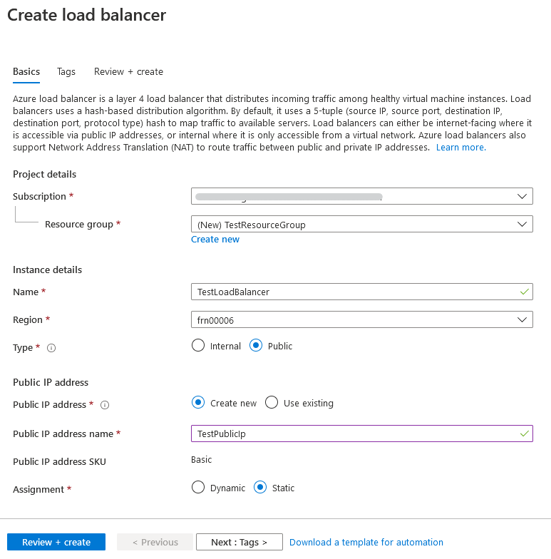
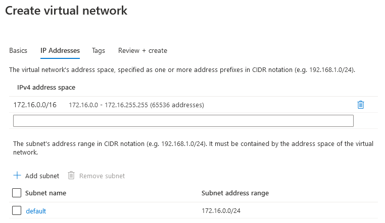
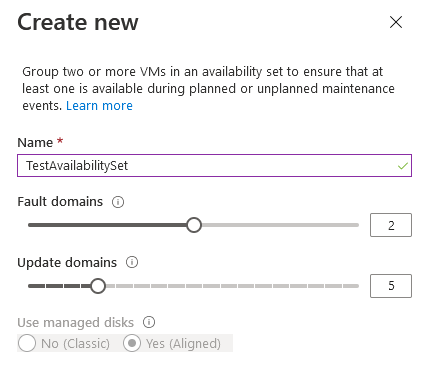
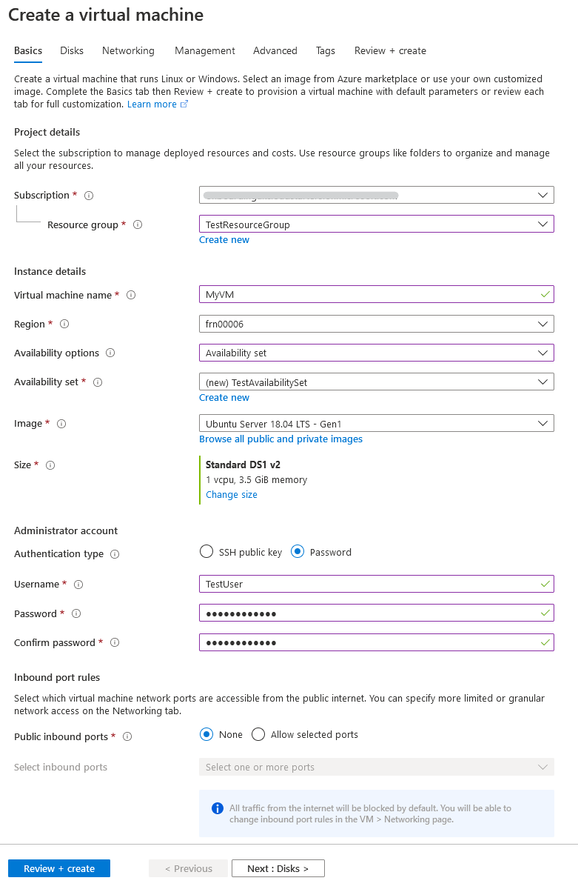
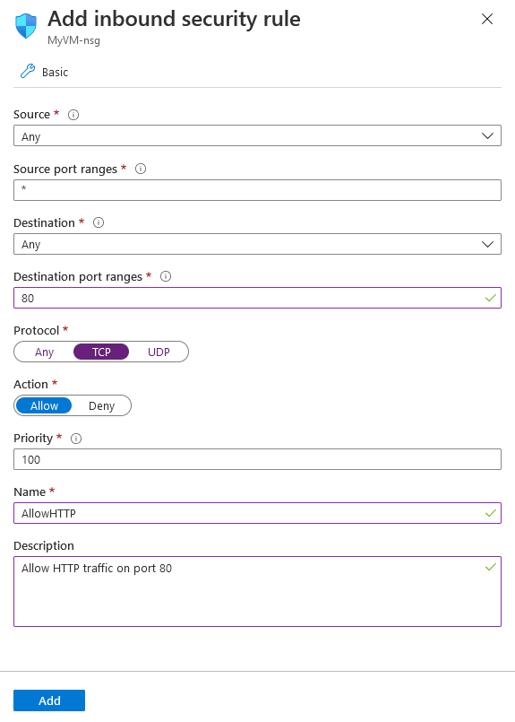
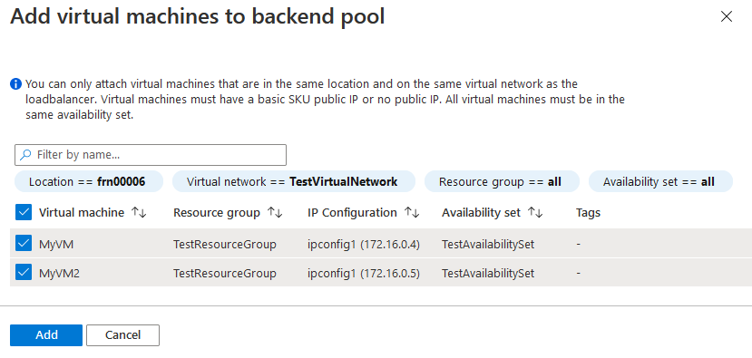
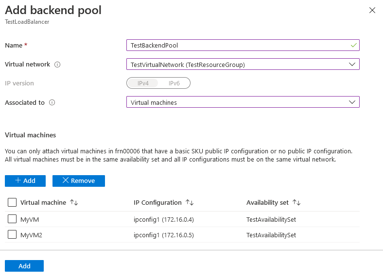
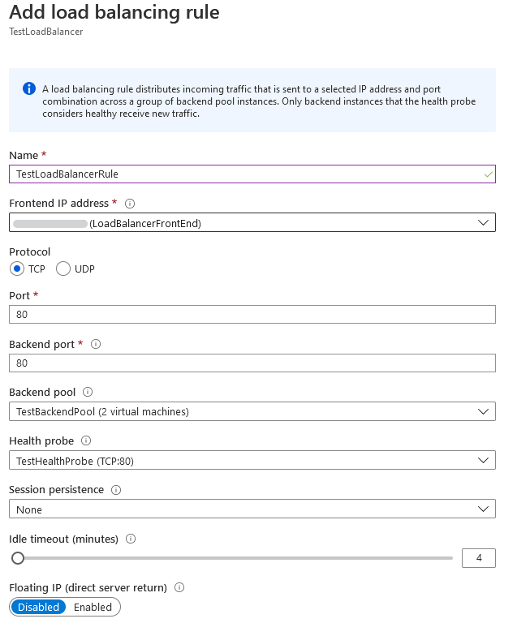

# How to create a load balancer for Azure Stack Hub

## Overview

A load balancer provides scale and availability by spreading incoming requests across multiple virtual machines within a load balancing pool. This guide shows you how to create a pool of back-end servers and a load balancer to spread traffic across them. In this example, the load balancer spreads traffic across two web servers.

### Intended audience

To complete the steps in this guide, you must have appropriate access to a subscription in the Azure Stack Hub portal.

## Creating a load balancer

In this section we will create a load balancer with a public IP address.

1. Log in to the Azure Stack Hub portal.

   For more detailed instructions, see the [*Getting Started Guide for UKCloud for Microsoft Azure*](azs-gs.md).

2. In the favourites panel, select **Create a resource**.

   

3. In the **New** blade, select **Networking**.

   

4. In the **Featured** section, select **Load Balancer**.

   

5. In the **Create load balancer** blade, enter the following information:

    - **Subscription** - This is your UKCloud for Microsoft Azure subscription and will be pre-populated by default.

    - **Resource Group** - Select an existing resource group, or create a new one by clicking the **Create new** link and then typing a name for your new resource group in the pop out window.

    - **Name** - The name of the load balancer.

    - **Region** - This will be `frn00006`, which is the location of the Azure Stack Hub.

    - **Type** - You can use internal load balancers to balance traffic from private IP addresses. Public load balancers can balance traffic originating from public IP addresses. For this example we will be creating a public load balancer.

    - **Public IP address** - The public IP address that will be assigned to this load balancer. To create a new public IP address:

        - Select **Create new** from the **Public IP address** options.

        - Enter a name for the public IP address.

        - Select either **Dynamic** or **Static** from the **Assignment** options. We recommend selecting the **Static** option when creating a load balancer.

      

6. Click **Review + create**, then click **Create** on the review blade.

## Create back-end servers

In this section we will create a virtual network and two virtual machines which exist on this network. This will form the back-end pool of the load balancer.

### Create a virtual network

1. In the favourites panel, select **Create a resource**.

   

2. In the **New** blade, select **Networking**.

   

3. In the **Featured** section, select **Virtual network**.

   

4. In the **Create virtual network** blade, enter the following information:

    - *Basics*

        - **Subscription** - This is your UKCloud for Microsoft Azure subscription and will be pre-populated by default.

        - **Resource Group** - Select an existing resource group, or create a new one by clicking the **Create new** link and then typing a name for your new resource group in the pop out window.

        - **Name** - The name of the virtual network.

        - **Region** - This will be `frn00006`, which is the location of the Azure Stack Hub.

      

    - *IP Addresses*

        - **IPv4 address space** - The virtual network's address range in CIDR notation (for example, 192.168.1.0/16).

        - **Subnet name** - The name of the first subnet within the virtual network.

        - **Subnet address range** - The subnet's address range in CIDR notation (for example, 192.168.1.0/24). It must be contained by the address space of the virtual network. The address range of a subnet which is in use can't be edited.

      

5. Click **Review + create**, then click **Create** on the review blade.

### Create the virtual machines

1. In the favourites panel, select **Create a resource**.

   

2. In the **New** blade, select **Compute**.

   

3. In the **Compute** blade, select the template that you want to use for your VM.

    

4. In the **Create virtual machine** blade, in the **Basics** step, enter general information about the VM, including a name, credentials and resource group.

5. Click *Change size* under the currently selected VM size to view all the available sizes. Select the appropriate size for your VM, depending on its purpose, then click **Select**.

    For information about the different available VM sizes, see <https://docs.microsoft.com/en-gb/azure/azure-stack/user/azure-stack-vm-sizes>.

    > [!TIP]
    > By default, the list shows a selection of recommended VM sizes. To see all available VM sizes, click **See all sizes**.

    

6. The VM needs to belong to an availability set. To create a new availability set:

    - Select **Availability set** from the **Availability options** dropdown

    - Select **Create new** under the new **Availability set** dropdown.

    - In the **Create new** blade, enter a name for the availability set and choose the number of fault domains and update domains, then click **OK**.

    

    

7. Once all done, go to the **Networking** tab

8. Ensure that the virtual network and subnet created earlier are selected, then click **Review + create**

    

9. In the **Review + create** step, review the selections you've made and then click **Create** to start the deployment.

10. Create another VM, ensuring that the **Availability set**, **Virtual network**, **Subnet** and **Network Security Group** are the same.

### Create network security group rules

In this section we will create NSG rules to allow inbound traffic.

> [!NOTE]
> For testing purposes, we will create a rule to allow all inbound traffic on port 80 (HTTP) in order to access the web server home page on both of the virtual machines.

1. Navigate to your network security group by clicking on **All services** in the favourites panel, then selecting **Network security groups** under the networking section.

2. Select the network security group your VMs are using from the list.

3. In the blade for your network security group, select **Inbound security rules** under the **Settings** section.

4. Click the **+Add** button.

5. In the **Add inbound security rule** blade, enter the following information:

   - **Source** - The source filter can be Any, an IP address range, or a default tag. It specifies the incoming traffic from a specific source IP address range that will be allowed or denied by this rule.

   - **Source port ranges** - Provide a single port, such as 80; a port range, such as 1024-65535; or a comma-separated list of single ports and/or port ranges, such as 80,1024-65535. This specifies for which ports traffic will be allowed or denied by this rule. Provide an asterisk (\*) to allow traffic on any port.

   - **Destination** - The destination filter can be Any, an IP address range, or a default tag. It specifies the outgoing traffic for a specific destination IP address range that will be allowed or denied by this rule.

   - **Destination port ranges** - Provide a single port, such as 80; a port range, such as 1024-65535; or a comma-separated list of single ports and/or port ranges, such as 80,1024-65535. This specifies for which ports traffic will be allowed or denied by this rule. Provide an asterisk (\*) to allow traffic on any port.

   - **Protocol** - Specify whether to allow inbound traffic using UDP, TCP or both.

   - **Action** - Choose whether the rule allows or denies the traffic specified.

   - **Priority** - Rules are processed in priority order; the lower the number, the higher the priority. We recommend leaving gaps between rules - 100, 200, 300, etc. - so that it's easier to add new rules without having to edit existing rules.

   - **Name** - The name of the security rule.

   - **Description** - A description of the security rule.

    

6. Click **Add**.

### Create a back-end address pool

To spread traffic load across the VMs, you must create a back-end address pool. This pool contains the IP addresses of the VMs.

1. Navigate to your load balancer by clicking **All services** in the favourites panel, then selecting **Load balancers** under the networking section.

2. From the list, select the load balancer you created earlier.

3. In the blade for your load balancer, select **Backend pools** under the **Settings** section.

4. Click the **+Add** button.

5. In the **Add backend pool** blade, enter a name for the backend pool.

6. Select the virtual network created earlier.

7. Select **Virtual machines** for the **Associated to** option.

8. Click the **+Add** button in the *Virtual machines* section.

9. In the **Add virtual machines to backend pool** blade, select the two virtual machines created earlier amd click **Add**.

   

10. Click the **Add** button on the **Add backend pool** blade.

   

### Create a health probe

When creating a load balancer, you can use a health probe to monitor the status of your application. In Azure Stack Hub, the health probe adds and removes VMs from the load balancer back-end pool based on their current status.

> [!NOTE]
> Again, for testing purposes, we will create the health probe to monitor traffic on port 80 (HTTP).

1. Navigate to your load balancer by clicking **All services** in the favourites panel, then selecting **Load balancers** under the networking section.

2. From the list, select the load balancer you created earlier.

3. In the blade for your load balancer, select **Health Probes** under the **Settings** section.

4. Click the **+Add** button.

5. In the **Add health probe** blade, enter the following information:

   - **Name** - The name of your health probe.

   - **Protocol** - The protocol that the health probe uses to monitor the status of your VMs.

   - **Port** - The port that the health probe uses to monitor the status of your VMs.

   - **Interval** - The number of seconds between probe attempts.

   - **Unhealthy threshold** - The number of consecutive probe failures that must occur before a virtual machine is considered unhealthy and is removed from the pool.

    

6. Click **OK**.

### Create a load balancing rule

A load balancer rule defines how traffic is distributed between VMs. The rule listens for traffic on a front-end IP address, then distributes it among the back-end pool.

> [!NOTE]
> Again, for testing purposes, we will create the load balancer rule for port 80 (HTTP).

1. Navigate to your load balancer by clicking on **All services** in the favourites panel, then selecting **Load balancers** under the networking section.

2. From the list, select the load balancer you created earlier.

3. In the blade for your load balancer, select **Load balancing rules** under the **Settings** section.

4. Click the **+Add** button.

5. In the **Add load balancing rule** blade, enter the following information:

   - **Name** - The name of your load balancing rule.

   - **Frontend IP address** - Clients communicating with this load balancer on the selected IP address and service will have their traffic routed to the target virtual machine by this NAT rule.

   - **Protocol** - The protocol that the rule redirects traffic for.

   - **Port** - The front-end port that the rule listens on.

   - **Backend port** - You can choose to route traffic to the virtual machines in the back-end pool using a different port than the one clients use to communicate with the load balancer.

   - **Backend pool** - The virtual machines in the selected back-end pool will be the target for the load-balanced traffic of this rule. Select the pool that you created in the previous section.

   - **Health probe** - The selected probe is used by this rule to determine which virtual machines in the back-end pool are healthy and can receive load-balanced traffic. Select the probe that you created in the previous section.

   - **Session Persistence** - Session persistence specifies that traffic from a client should be handled by the same virtual machine in the back-end pool for the duration of a session.

      - **None** specifies that successive requests from the same client may be handled by any virtual machine.

      - **Client IP** specifies that successive requests from the same client IP address will be handled by the same virtual machine.

      - **Client IP and protocol** specifies that successive requests from the same client IP address and protocol combination will be handled by the same virtual machine.

   - **Idle timeout (minutes)** - Keep a TCP or HTTP connection open without relying on clients to send keep-alive messages.

   - **Floating IP (direct server return)** - Can be enabled to change the IP address mapping scheme to allow for additional flexibility, see [here](https://docs.microsoft.com/en-us/azure/load-balancer/load-balancer-multivip-overview) for further details.

    

6. Click **OK**.

## Test the load balancer

After installing the application that is being load-balanced on each of the VMs, the load balancer is ready to test.

1. Navigate to your load balancer by clicking **All services** in the favourites panel, then selecting **Load balancers** under the networking section.

2. From the list, select the load balancer you created earlier.

3. Copy the **Public IP address** from the **Overview** section.

4. Test the connection to your application. For example, if the app is a web server, paste the public IP into the address bar of your browser. The home page of the web server should be displayed.

## Feedback

If you find a problem with this article, click **Improve this Doc** to make the change yourself or raise an [issue](https://github.com/UKCloud/documentation/issues) in GitHub. If you have an idea for how we could improve any of our services, send an email to <feedback@ukcloud.com>.
