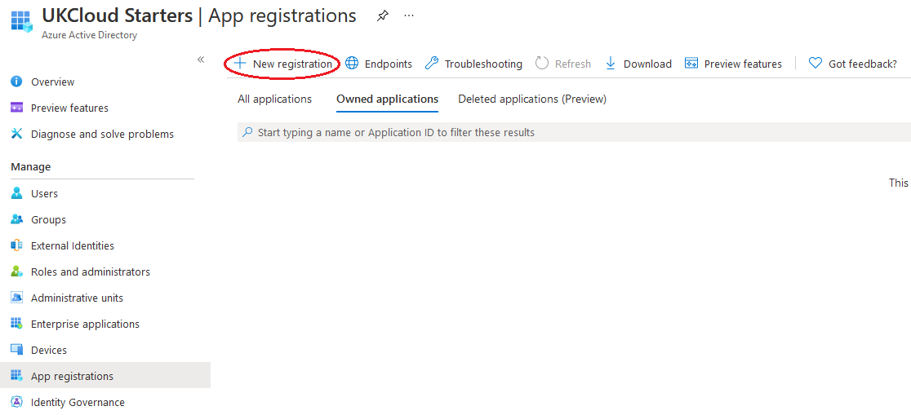
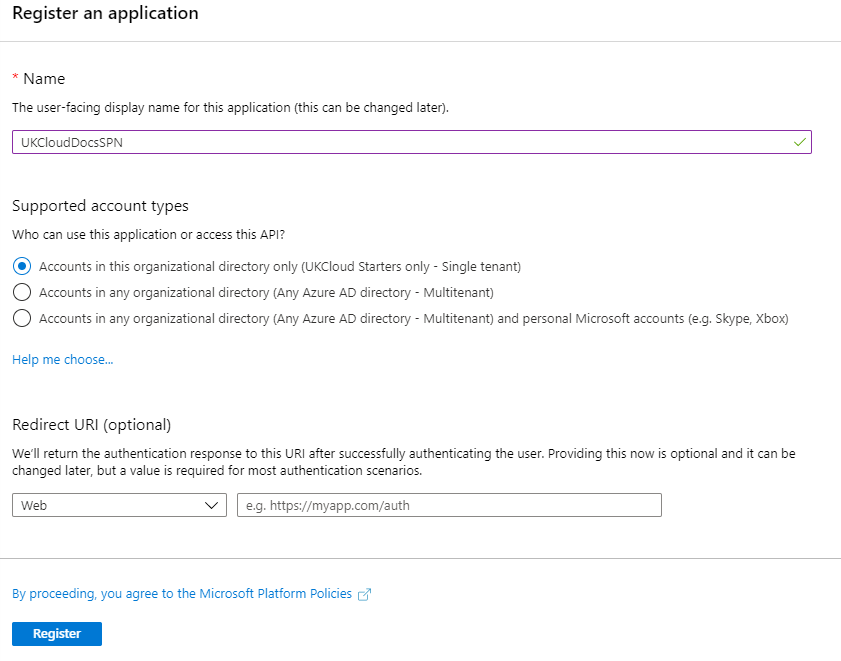
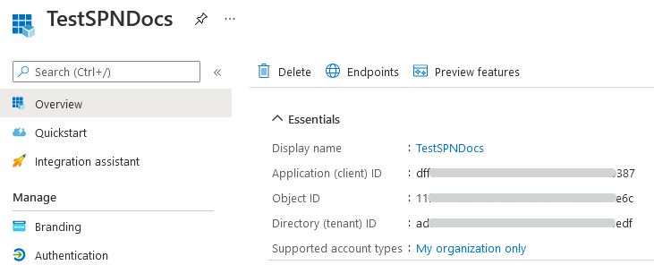
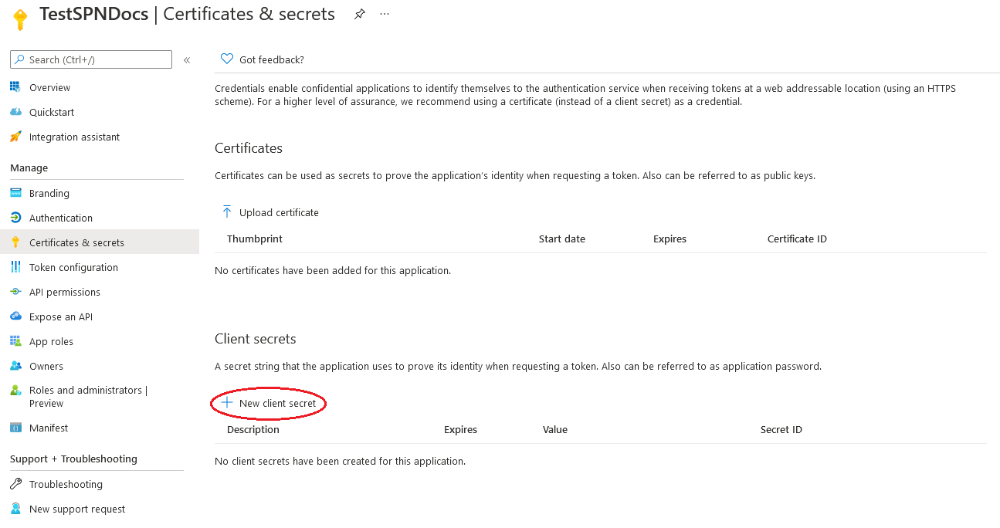
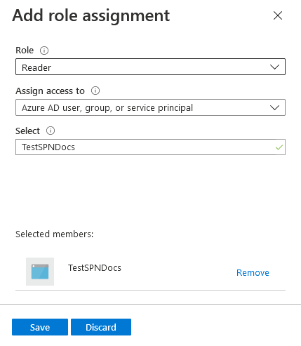

#### UKCloud Limited (“UKC”) and Virtual Infrastructure Group Limited (“VIG”) (together “the Companies”) – in Compulsory Liquidation

On 25 October 2022, the Companies were placed into Liquidation with the Official Receiver appointed as Liquidator and J Robinson and A M Hudson simultaneously appointed as Special Managers to manage the liquidation process on behalf of the Official Receiver.

Further information regarding the Liquidations can be found here: <https://www.gov.uk/government/news/virtual-infrastructure-group-limited-and-ukcloud-limited-information-for-creditors-and-interested-parties>

Contact details: 
For any general queries relating to the Liquidations please email <ukcloud@uk.ey.com> 
For customer related queries please email <ukcloudcustomers@uk.ey.com> 
For supplier related queries please email <ukcloudsuppliers@uk.ey.com>

# How to create a service principal name for Azure Stack Hub using the Azure portal

This document explains how to create a service principal name (SPN) to manage Azure and Azure Stack Hub using the Azure portal.

It will guide you through the creation of:

- An Azure application

- A service principal name

- Role assignment

- Permissions

## What is a service principal name?

An Azure SPN is a security identity used by user-created applications, services, and automation tools to access specific Azure resources. Think of it as a 'user identity' (username and password or certificate) with a specific role, and tightly controlled permissions. It only needs to be able to do specific things, unlike a general user identity. It improves security if you grant it only the minimum permissions level needed to perform its management tasks.

To log in and manage your resources via SPN you'll need to create an Azure application and then assign an SPN to it. Only then will you be able to perform tasks against your environment.

## Prerequisites

- 
An active Azure subscription

## Create an SPN

1. Log in to the [public Azure portal](https://portal.azure.com).

2. In the favourites panel, select **Azure Active Directory**.

    

3. In the *Azure Active Directory* blade, select **App registrations**.

4. On the *App registrations* page, click the **+ New registration** button.

    

5. In the *Register an application* blade, enter the following information:

   - **Name** - The name of the application. Should have a minimum of four characters.

   - **Supported account types** - Lets you decide who can use the service principal.

   - **Redirect URI (optional)** - The URL which the authentication response is sent to. In this instance, you can leave it blank.

    

6. Click **Register**.

## Gathering SPN credentials

1. On the blade that has now opened, copy the **Application (client) ID** and store it somewhere secure. This value is sometimes referred to as the SPN Client ID.

    

2. On the blade menu, click the **Certificates & secrets** button.

3. Under *Client secrets*, click the **+ New client secret** button.

    

4. Enter a description for the key, select a expiry duration, then click **Add**.

    

5. Copy the displayed value for the key and store it somewhere secure. This value is referred to as the SPN Client Secret.

    

    > [!IMPORTANT]
    > It is not possible to retrieve the secret value again after navigating away from this screen. Therefore, you should make sure you have taken a copy of it before moving on.

## Configure role-based access control for the SPN on Azure Stack Hub

1. Log in to the UKCloud Azure Stack Hub portal.

    For more detailed instructions, see the [*Getting Started Guide for UKCloud for Microsoft Azure*](azs-gs.md).

2. Navigate to the resource you want to give the SPN access to. In this example we are adding the SPN to the subscription resource to give it permission to all resources.

   1. View your subscription by clicking **All services** in the favourites panel, then selecting **Subscriptions** under the *General* section.

   2. Select your subscription.

   3. On your subscription's blade, select **Access Control (IAM)**.

3. On the *Access Control (IAM)* blade, click the **+ Add** button and then click **Add role assignment**

    

4. Select the role you want to add your SPN to.

5. Enter the name of the SPN in the **Select** field, select the SPN when it appears then click **Save**

    

The SPN will now have the appropriate permissions assigned to it and is ready for use.

## Feedback

If you find a problem with this article, click **Improve this Doc** to make the change yourself or raise an [issue](https://github.com/UKCloud/documentation/issues) in GitHub. If you have an idea for how we could improve any of our services, send an email to <feedback@ukcloud.com>.
