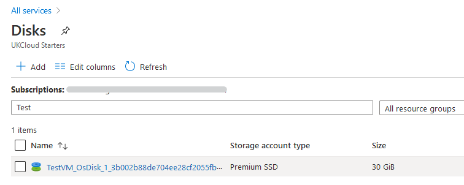
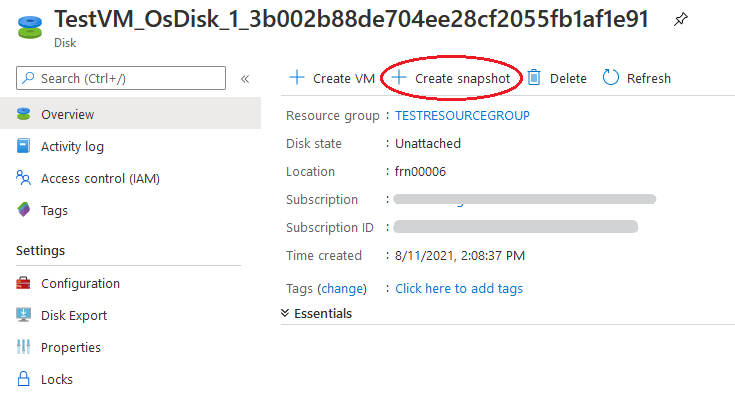
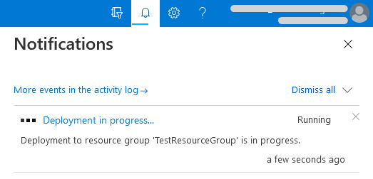
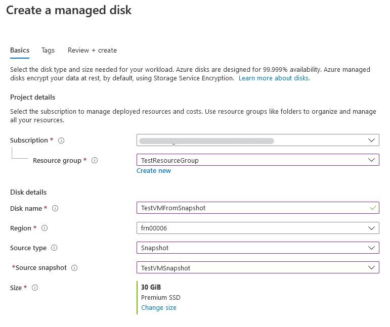

# How to create a virtual machine from a disk snapshot using the UKCloud Azure Stack Hub portal

## Overview

The UKCloud Azure Stack Hub portal allows you to create a snapshot of a managed disk. This snapshot can be used to create a new managed disk, which you can then create a virtual machine from. This article shows you how to take the snapshot, create a managed disk, and create a virtual machine.

### Intended audience

To complete the steps in this article, you must have appropriate access to a subscription in the Azure Stack Hub portal.

## Creating a snapshot from a disk

1. Log in to the Azure Stack Hub portal.

    For more detailed instructions, see the [*Getting Started Guide for UKCloud for Microsoft Azure*](azs-gs.md).

2. Click **All services** in the favourites panel, then select **Disks** under the *Compute* section.

    

3. From the list, select the disk that you would like to create a snapshot from.

    

    > [!NOTE]
    > Snapshots can only be created from managed disks.

4. In the new blade for the selected disk, click **Create snapshot**.

    

5. In the **Create snapshot** blade, enter the following information:

    - **Name** - The name of the snapshot.

    - **Subscription** - This will be your UKCloud for Microsoft Azure subscription.

    - **Resource group** - Select an existing resource group, or create a new one by typing a name for your new resource group.

    - **Location** - This will be the location of the Azure Stack Hub.

    - **Account type** - Choose either Standard (HDD) or Premium (SSD) storage.

    

6. When you're done, click the **Create** button to create the snapshot.

7. You can monitor the progress of the snapshot creation by clicking the **Notifications** icon.

    

## Creating a new managed disk from a snapshot

1. Click **All services** in the favourites panel, then select **Disks** under the *Compute* section.

    

2. On the **Disks** blade, click **Add**.

    

3. In the **Create managed disk** blade, enter the following information:

    - **Name** - The name of the disk.

    - **Subscription** - This will be your UKCloud for Microsoft Azure subscription.

    - **Resource group** - Select an existing resource group, or create a new one by typing a name for your new resource group.

    - **Location** - This will be the location of the Azure Stack Hub.

    - **Account type** - Choose either Standard (HDD) or Premium (SSD) storage.

    - **Source type** - Select *Snapshot* from the dropdown.
        - **Source snapshot** - Select the previously created snapshot.

    - **Size** - This will be set to the size of the source disk that the snapshot was created from. You can increase this if necessary, but you will not be allowed to decrease it below the original size.

    

4. When you're done, click the **Create** button to create the disk.

5. You can monitor the progress of the disk creation by clicking the **Notifications** icon.

    

## Creating a virtual machine from a managed disk

After you have the managed disk VHD that you want to use, you can create the VM in the portal:

1. From the Azure portal, on the left menu, select All services.

2. In the All services search box, enter disks and then select Disks to display the list of available disks.

3. Select the disk that you would like to use. The Disk page for that disk opens.

4. In the Overview page, ensure that DISK STATE is listed as Unattached. If it isn't, you might need to either detach the disk from the VM or delete the VM to free up the disk.

5. In the menu at the top of the page, select Create VM.

6. On the Basics page for the new VM, enter a Virtual machine name and either select an existing Resource group or create a new one.

7. For Size, select Change size to access the Size page.

8. Select a VM size row and then choose Select.

9. On the Networking page, you can either let the portal create all new resources or you can select an existing Virtual network and Network security group. The portal always creates a new network interface and public IP address for the new VM.

10. On the Management page, make any changes to the monitoring options.

11. On the Guest config page, add any extensions as needed.

12. When you're done, select Review + create.

13. If the VM configuration passes validation, select Create to start the deployment.

## Feedback

If you find a problem with this article, click **Improve this Doc** to make the change yourself or raise an [issue](https://github.com/UKCloud/documentation/issues) in GitHub. If you have an idea for how we could improve any of our services, send an email to <feedback@ukcloud.com>.
