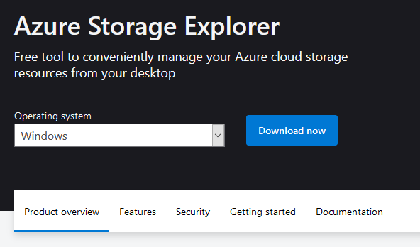
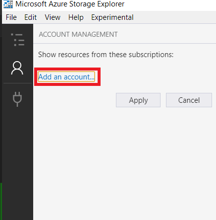
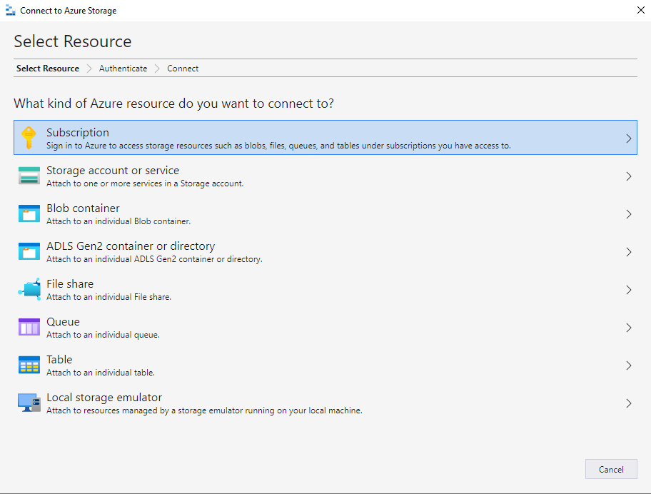
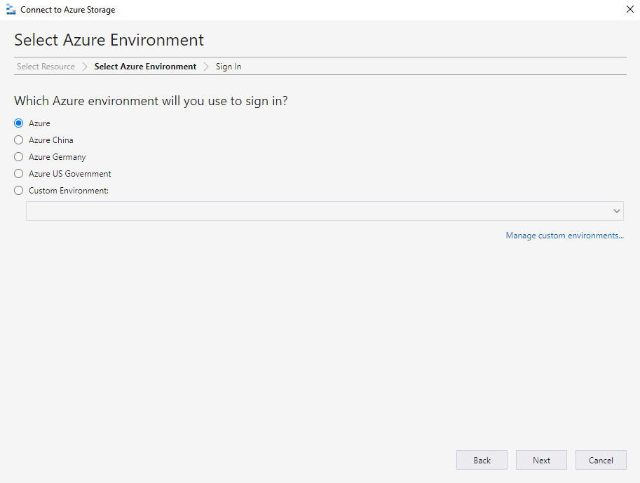
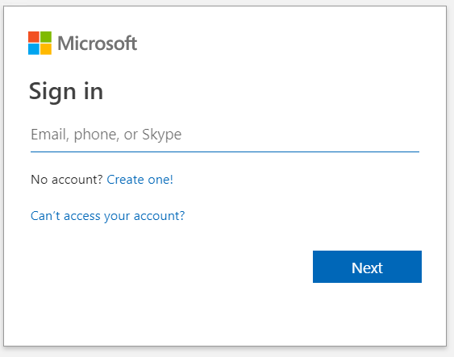

# How to link Azure Storage Explorer to Azure Stack Hub

## Overview

In this article, you will learn how to link Azure Stack Hub subscriptions to the Azure Storage Explorer. Azure Storage Explorer is a standalone application that allows you to easily work with Azure Stack Hub storage data on Windows, macOS and Linux. With this application, you can easily download and upload objects to Azure Stack Hub, which makes tasks such as downloading and uploading data disks to VMs very easy.

> [!IMPORTANT]
> Whilst the latest version of Storage Explorer works fine with Azure Stack Hub storage objects, it currently doesn't allow you to copy and paste objects from a container in Azure Stack Hub to a container in public Azure. For further information, see the [associated GitHub issue](https://github.com/microsoft/AzureStorageExplorer/issues/4464).
>
> If you need to copy and paste objects to public Azure, then you must install [v1.13.1 of Storage Explorer](https://github.com/microsoft/AzureStorageExplorer/releases/tag/v1.13.1).
>
> Note that the setup process for this version will differ slightly to the steps below.

## Microsoft documentation

- [Connect Storage Explorer to an Azure Stack Hub subscription with Azure AD](https://docs.microsoft.com/en-us/azure-stack/user/azure-stack-storage-connect-se?view=azs-2002#connect-to-an-azure-stack-hub-subscription-with-azure-ad)

## Installation and setup

1. Download and install Storage Explorer [here](https://azure.microsoft.com/en-us/features/storage-explorer/).

    

2. From the **Edit** menu, select **Target Azure Stack Hub APIs** then restart Storage Explorer.

    

3. Once re-launched navigate to accounts.

    

4. Select **Add an account...**

    

5. Select **Subscription**.

    

6. Select **Add an Azure Account** \> **Azure**, then click **Next**.

    

7. Sign in with your Azure Stack Hub credentials when prompted.

    

8. Click **Apply**.

    

Now that you've linked Storage Explorer to Azure Stack Hub, you can access all of your storage accounts.

## Feedback

 If you find a problem with this article, click **Improve this Doc** to make the change yourself or raise an [issue](https://github.com/UKCloud/documentation/issues) in GitHub. If you have an idea for how we could improve any of our services, send an email to <feedback@ukcloud.com>.
