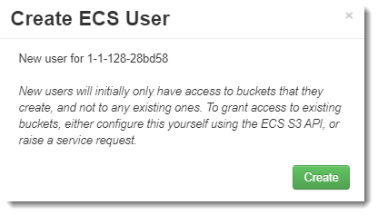
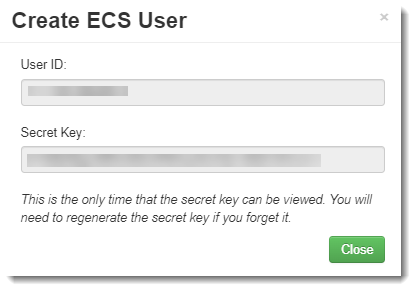

#### UKCloud Limited (“UKC”) and Virtual Infrastructure Group Limited (“VIG”) (together “the Companies”) – in Compulsory Liquidation

On 25 October 2022, the Companies were placed into Liquidation with the Official Receiver appointed as Liquidator and J Robinson and A M Hudson simultaneously appointed as Special Managers to manage the liquidation process on behalf of the Official Receiver.

Further information regarding the Liquidations can be found here: <https://www.gov.uk/government/news/virtual-infrastructure-group-limited-and-ukcloud-limited-information-for-creditors-and-interested-parties>

Contact details: 
For any general queries relating to the Liquidations please email <ukcloud@uk.ey.com> 
For customer related queries please email <ukcloudcustomers@uk.ey.com> 
For supplier related queries please email <ukcloudsuppliers@uk.ey.com>

# How to create a new Cloud Storage user in the UKCloud Portal

## Overview

Cloud Storage is UKCloud's object storage solution based on Dell EMC Elastic Cloud Storage (ECS). Although you'll mostly interact with Cloud Storage through the API, you can create new Cloud Storage users in the UKCloud Portal.

> [!NOTE]
> New users will initially only have access to buckets that they create, not to any existing buckets. To grant access to existing buckets, either configure this yourself using the ECS S3 API, or raise a Service Request.

### Intended audience

To complete the steps in this guide you must have been granted access to the relevant namespace.

## Creating a new Cloud Storage user

To create a new Cloud Storage user:

1. [*Log in to the UKCloud Portal*](../portal/ptl-gs.md#logging-in-to-the-ukcloud-portal) and select your account.

2. In the Portal navigation panel, expand the **Cloud Storage** option and select **ECS**.

   

3. On the *Storage* tab, click the **Users** button for the namespace in which you want to create the new user:

    

4. The **Users** tab lists the different user IDs associated with the namespace.

5. Click the **Add new user** button.

   

6. In the *Create ECS User* dialog box, click **Create**.

   

7. Make a note of the **User ID** and **Secret Key** and then click **Close**.

    > [!NOTE]
    > After you close this dialog box, you will not be able to see the secret key again in the UKCloud Portal. If you do not make a note of the secret key or if you forget or lose it, you will need to reset it again. For information about how to do this, see [*How to reset your Cloud Storage secret key*](cs-how-reset-secret-key.md).

    

## Next steps

In this article, you learned how to create a new Cloud Storage user. For more information about how to use the Cloud Storage service, see the following articles:

- [*Getting Started Guide for Cloud Storage*](cs-gs.md)

- [*How to view Cloud Storage information in the UKCloud Portal*](cs-how-view-info-portal.md)

- [*How to install Dell EMC GeoDrive*](cs-how-install-geodrive2-client.md)

- [*How to use file browsers with Cloud Storage*](cs-how-use-file-browsers.md)

## Feedback

If you find a problem with this article, click **Improve this Doc** to make the change yourself or raise an [issue](https://github.com/UKCloud/documentation/issues) in GitHub. If you have an idea for how we could improve any of our services, send an email to <feedback@ukcloud.com>.
