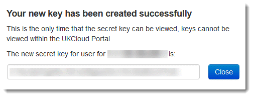

#### UKCloud Limited (“UKC”) and Virtual Infrastructure Group Limited (“VIG”) (together “the Companies”) – in Compulsory Liquidation

On 25 October 2022, the Companies were placed into Liquidation with the Official Receiver appointed as Liquidator and J Robinson and A M Hudson simultaneously appointed as Special Managers to manage the liquidation process on behalf of the Official Receiver.

Further information regarding the Liquidations can be found here: <https://www.gov.uk/government/news/virtual-infrastructure-group-limited-and-ukcloud-limited-information-for-creditors-and-interested-parties>

Contact details: 
For any general queries relating to the Liquidations please email <ukcloud@uk.ey.com> 
For customer related queries please email <ukcloudcustomers@uk.ey.com> 
For supplier related queries please email <ukcloudsuppliers@uk.ey.com>

# How to reset your Cloud Storage secret key

## Overview

Cloud Storage is UKCloud's object storage solution based on Dell EMC Elastic Cloud Storage (ECS).

Each user who can access Cloud Storage has an associated secret key to enable secure authentication. When attempting to access Cloud Storage, you must specify the appropriate secret key. If you forget the secret key for your user ID, you can reset it in the UKCloud Portal.

### Intended audience

To complete the steps in this guide you must have been granted access to the relevant namespace.

## Resetting your secret key

For security purposes, the UKCloud Portal does not display secret keys, if you forget your secret key, you must reset it to generate a new one.

1. [*Log in to the UKCloud Portal*](../portal/ptl-gs.md#logging-in-to-the-ukcloud-portal) and select your account.

2. In the Portal navigation panel, expand the **Cloud Storage** option and select **ECS**.

   

3. Click the **Users** button for the namespace for which you want to reset the secret key.

   

4. The **Users** tab lists the different user IDs associated with the namespace.

5. Click the **Reset Secret** button next to the appropriate user ID.

   

6. Click **OK** to confirm that you want to reset the secret key.

   

7. Stay on the current page until a popup dialog box displays the new secret key.

   

8. Make a note of the key and then click **Close**.

   > [!NOTE]
   > After you close this dialog box, you will not be able to see the secret key again in the UKCloud Portal. If you do not make a note of the secret key or if you forget or lose it, you will need to reset it again.

## Next steps

This guide has shown you how to reset your Cloud Storage secret key. For information about how to use the service, see the following articles:

- [*Getting Started Guide for Cloud Storage*](cs-gs.md)

- [*How to view Cloud Storage information in the UKCloud Portal*](cs-how-view-info-portal.md)

- [*How to create a new Cloud Storage user in the UKCloud Portal*](cs-how-create-user.md)

- [*How to install Dell EMC GeoDrive*](cs-how-install-geodrive2-client.md)

- [*How to use file browsers with Cloud Storage*](cs-how-use-file-browsers.md)

## Feedback

If you find a problem with this article, click **Improve this Doc** to make the change yourself or raise an [issue](https://github.com/UKCloud/documentation/issues) in GitHub. If you have an idea for how we could improve any of our services, send an email to <feedback@ukcloud.com>.
