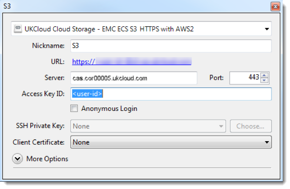
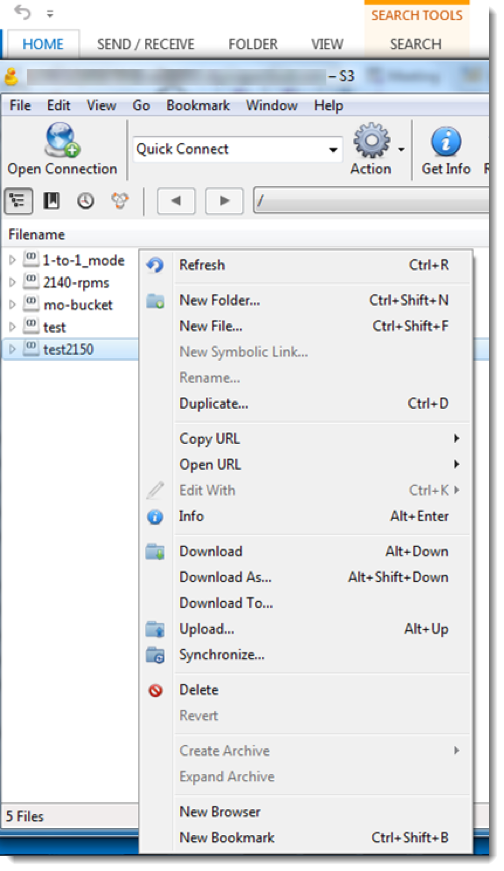

# How to use file browsers with Cloud Storage

## Overview

UKCloud's Cloud Storage service is an object storage solution based on Dell EMC Elastic Cloud Storage (ECS). Access is via a RESTful application programming interface (API).

Web applications can easily interact with the API, but the ability to browse the contents of the storage using a graphical client can be useful, as it provides a user friendly interface to the storage. This enables, for example:

- Verification by developers that their applications or scripts work as intended with the storage

- Bulk import or export of content by users

- Easy maintenance and housekeeping of the objects in the storage system

ECS provides an S3-compatible API that you can use to manage Cloud Storage.

> [!NOTE]
> The ECS Atmos API has been deprecated, we therefore suggest customers re-engineer their solutions to make use of the defacto S3-compatible API.

In this article, we'll look at a couple of the many applications that enable you to browse an object storage system.

The inclusion of applications in this article should not be taken as an endorsement or recommendation of them by UKCloud. However, we have tested them with our Cloud Storage service and verified that they work correctly.

### A note about S3 browser extensions

While there are S3 browser extensions available, none of them include the functionality to customise the server host name, which is a requirement for connecting to Cloud Storage. If we find S3 browser extensions that offer this functionality in the future, we'll update this article.

## API endpoints

Cloud Storage provides different API endpoints to access your storage, depending on the UKCloud site and connectivity type you are using. Make sure you use the correct endpoint to ensure the best possible performance for your solution.

S3 API endpoints:

- **Corsham (Assured)**

  - Internet: `cas.cor00005.ukcloud.com`

  - PSN Assured: `cas.cor00005.psnassured.ukcloud.com`

  - HSCN: `cas.cor00005.ukcloud.thirdparty.nhs.uk/`
  
- **Farnborough (Assured)**

  - Internet: `cas.frn00006.ukcloud.com`

  - PSN Assured: `cas.frn00006.psnassured.ukcloud.com`

  - HSCN: `cas.frn00006.ukcloud.thirdparty.nhs.uk/`

Contact UKCloud support if you are unsure which endpoint to use.

## Cyberduck

Cyberduck is an open source cross platform file browser for HTTP based object storage solutions. It utilises the S3 endpoints to establish connectivity with the ECS platform over HTTPS.

To install and configure Cyberduck:

1. Download [Cyberduck](https://cyberduck.io/) and install it using either the default settings or specifying your own configuration.

2. Raise a Service Request, using the **Other Service Request** template, to access the Cloud Storage Cyberduck profile.

   For more detailed instructions, see [*How to use My Calls to raise and monitor support tickets*](../portal/ptl-how-use-my-calls.md).

   > [!NOTE]
   > If you download this profile using a browser, ensure the file name is `.cyberduckprofile`.

3. Browse to the downloaded file and double click to open it.

   

4. Complete the fields in the new connection dialog box:

   - Ensure you enter the correct endpoint in the **Server** field, as shown in [API endpoints](#api-endpoints)

   - The **Access Key ID** is your User ID, which you can find in the *Storage* section of the UKCloud Portal

   - When you're done, click the **x** icon to close the dialog box

   

5. You can see the new connection in the Cyberduck UI.

   

6. Right-click the connection and select **Connect to server**.

   

7. In the *Login* dialog box, in the **Secret Access Key** field, enter your Cloud Storage secret key.

   If you've forgotten or don't know your secret key, you can reset it in the *Storage* section of the Portal.

   > [!NOTE]
   > Unless you want the password to be saved, deselect the **Save password** check box.

   

8. After you've authenticated yourself with your secret key, you can view, upload and download files as normal.

   

## S3 Browser

S3 Browser is a Windows client for Amazon S3 that you can easily configure to work with the S3 compatible API on Cloud Storage. It's free for personal use; a licence fee is payable for business use.

To install and configure S3 Browser:

1. Download [S3 Browser](https://s3browser.com/), execute the installer and follow the prompts in the wizard to complete the installation.

2. The first time you launch S3 Browser, you'll be prompted for your account credentials. Fill in the form with your Cloud Storage credentials:

   a. From the **Account Type** list, select **S3 Compatible Storage**.

   b. Ensure you enter the correct endpoint in the **REST Endpoint** field, as shown in [API endpoints](#api-endpoints).

   c. The **Access Key ID** is your User ID, which you can find in the *Storage* section of the Portal.

   d. The **Secret Access Key** is your secret key. If you've forgotten or don't know your secret key, you can reset it in the *Storage* section of the Portal.

   e. If you're using version 6.*x*.*x* of the browser, be sure to select **Use secure transfer (SSL/TLS)**. This option is not available or necessary for version 5.*x*.*x*.

   

3. When you're done, click **Save changes**. The application automatically connects to Cloud Storage and displays your buckets (if you have any).

4. For detailed usage instructions, see the documentation available on the S3 Browser web site.

   > [!NOTE]
   > Not all S3 features are implemented by the ECS S3 compatible API, so some functionality may not work. However, common file operations (create, read, write and delete) all work well.

## Next steps

This article has shown you how to browse Cloud Storage buckets using a couple of different applications. For more information about how to use the service, see the following articles:

- [*Getting Started Guide for Cloud Storage*](cs-gs.md)

- [*How to view Cloud Storage information in the UKCloud Portal*](cs-how-view-info-portal.md)

- [*How to create a new Cloud Storage user in the UKCloud Portal*](cs-how-create-user.md)

- [*How to install Dell EMC GeoDrive*](cs-how-install-geodrive2-client.md)

## Feedback

If you find a problem with this article, click **Improve this Doc** to make the change yourself or raise an [issue](https://github.com/UKCloud/documentation/issues) in GitHub. If you have an idea for how we could improve any of our services, send an email to <feedback@ukcloud.com>.
