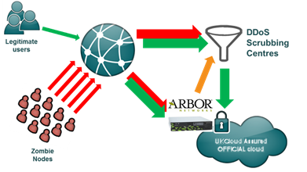

# Protection for Distributed Denial of Service (DDoS) attacks

## Overview

The UKCloud platform is designed to support and enable the government digital strategy and hosts citizen-facing solutions for a number of government departments. Some of these high-profile solutions inevitably attract undesirable attention from malicious actors. Unfortunately, if these malicious actors launch a Distributed Denial of Service (DDoS)^ attack of sufficient size, it's possible to overwhelm the capacity of the UKCloud internet connections and affect the ability for users to access other internet facing systems (including those not specifically targeted by the attack).

We protect the underlying internet-facing infrastructure used by all customers by focusing on mitigating broad, high-volume attacks, which are most likely to cause collateral damage and noisy neighbour characteristics. For mitigation of low-level application-specific attacks or advanced persistent threats, you should consider implementing additional customer-specific and customer-managed mitigation solutions, such as those provided by [*Neustar DDoS Protection from UKCloud*](conn-sd-ddosprotect.md)).

^ Distributed Denial of Service (DDoS) is a specific type of attack designed to cause the target system to become unavailable. Specifically, this type of attack is highly distributed as the attack traffic comes from a diverse global network of attackers. This is similar to the analogy 'death by a thousand daggers'.

## UKCloud implementation for DDoS mitigation

We've selected one of the leading global providers of DDoS mitigation services, which provides specialist DDoS mitigation capabilities to the largest online organisations worldwide. The service includes an array of DDoS mitigation technologies and specialist security analysts who operate a 24x7 security operations centre. This enables DDoS attacks to be detected and mitigated typically within five minutes.

If your system is the target of a DDoS attack, we'll notify you individually and work with you to provide the necessary information about the attack to submit into CERT-UK and GovCERT.

## How it works

We use the internet standard routing protocol BGP (border gateway protocol) to advertise preferred routes for our entire public IP address space to travel directly into our cloud platform via our multiple Tier 1 ISP connections. This ensures that all inbound traffic destined to workloads hosted on the UKCloud platform has a direct route into our platform and is not subjected to increased latency or additional network hops. Our Tier 1 ISPs pass traffic directly into specialist DDoS mitigation appliances (Netscout), which are hosted within each of the UKCloud data centres. Our local DDoS mitigation appliances are operated by our DDoS mitigation partner and so benefit from specialist 24x7 monitoring and management. 

All inbound traffic is inspected by the DDoS mitigation appliances, providing a first line of countermeasures and automatically signalling our DDoS mitigation partner. This configuration enables the DDoS mitigation partner to automatically and immediately detect when an attack is being mounted and implement appropriate countermeasures, including redirecting traffic through their terabit-scale scrubbing centres, as appropriate. These solutions typically begin mitigating DDoS attacks within five to ten minutes.

1. All inbound traffic is routed directly to UKCloud via BGP and passes through our onsite DDoS mitigation appliances.

2. The UKCloud DDoS mitigation appliances automatically alert our DDoS mitigation partner, who have specialist engineers, processes and additional DDoS-mitigation technology to detect and mitigate DDoS attacks.

3. Under attack conditions, traffic is re-routed via terabit-scale DDoS scrubbing centres.

4. Workloads on the UKCloud platform are protected from DDoS traffic. They only receive clean traffic and so the impact of the DDoS attack is contained.

DDoS attacks can be extremely sophisticated in nature and there may be a dependency for the DDoS solution to be tuned based on the type and volume of the attack. This tuning process can be performed only during the attack and while the attack type is identified. In some cases, this may require customer co-operation and assistance.

## Risks and considerations

It's important to note that the protection that we've implemented is designed to defend the community of our customers rather than any individual customer. We're able to mitigate volumetric network level DDoS attacks that not only affect the target solution, but many other internet-connected solutions too (this is sometimes referred to as noisy neighbour or collateral damage). Hence, during a sustained volumetric attack, the solution is designed to provide cleansing to ensure legitimate users can continue to access the application or service.

The solution is not designed to provide a comprehensive security solution for a specific application or service. This is important to understand because if your application or service needs to remain available regardless of the size of the DDoS attack, then an additional, application-tuned DDoS service will be required. Further, it should be noted that volumetric DDoS attacks are often used as a smokescreen for more targeted low-and-slow attacks and advanced persistent threats (APT) that exploit application vulnerabilities higher up the stack (for example, Layer 7 exploits such as cross-site scripting). We recommend that customers consider mitigating these application specific threat vectors via appropriate solutions such as Web Application Firewalls, Content Delivery Networks, robust domain name services, on so on. UKCloud customers can also procure an advanced DDoS mitigation solution (for more information, see the [*Neustar DDoS Protection from UKCloud Service Scope*](conn-sco-app-ddos.md)).

## More information

For more information about DDoS protection, see the following articles:

- [*DDoS Mitigation Service FAQs*](conn-faq-ddos.md)

- [*Neustar DDoS Protection from UKCloud Service Scope*](conn-sco-app-ddos.md)

- [*Neustar DDoS Protection from UKCloud FAQs*](conn-faq-app-ddos.md)

## Feedback

If you find a problem with this article, click **Improve this Doc** to make the change yourself or raise an [issue](https://github.com/UKCloud/documentation/issues) in GitHub. If you have an idea for how we could improve any of our services, send an email to <feedback@ukcloud.com>.
