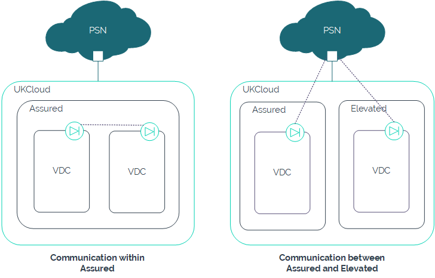

# PSN flattening

## Overview

The Public Services Network (PSN) has been flattened to converge PSN Assured and PSN Protected into a single network. Traffic can now flow between VMs in our Assured and Elevated security domains over the flattened PSN network.

The flattened PSN network enables better collaboration between local government, blue light services and central government departments, allowing for more joined-up services, including counter-terrorism initiatives and centralised intelligence, to improve the lives of UK citizens.

## PSN and CDSZ

Although it may now be possible to bypass the Cross Domain Security Zone (CDSZ) to communicate between Elevated and Assured environments using the flattened PSN, you should consider the following:

- The connection isn't a short hop in the way that you would create a connection between two environments in the same security domain, where communication uses private links to remain within the UKCloud boundary, even over an external network. Instead, traffic needs to leave UKCloud, go through the service provider gateways and then come back into UKCloud. This introduces multiple hops and increases latency. You also need to consider the security implications of traffic leaving the assured environment of the UKCloud platform.

    

- You can only use the PSN for specific functions, as approved by the PSN Authority by way of the different PSN Codes of Connection. If you want to use the PSN to communicate between Elevated and Assured, you would need to fully document the use case and request approval by the PSN Authority before you could implement it.

- You must have a PSN connection in your Elevated environment.

## Restricting access to PSN Protected services

It is possible to make your PSN Protected addresses unreachable to PSN Assured, if required. To do this, send a request via the [PSN team contact centre](https://publicservicesnetwork.zendesk.com/hc/en-us/requests/new?ticket_form_id=34591). If your request is successful, the PSN team will notify all PSN Protected providers.

In the event of your PSN Protected addresses being on the same subnet as another customer, the PSN team will decide what needs to be done to meet your request.

## More information

For more information about PSN flattening, see [Flattening obligations for PSN Protected network service providers](https://www.gov.uk/government/publications/flattening-obligations-for-psn-protected-network-service-providers/flattening-obligations-for-psn-protected-network-service-providers).

For an overview of the future of PSN, including updates about PSN flattening, see our blog posts, [The new future of PSN](https://ukcloud.com/hub/news/the-new-future-of-psn/).

## Feedback

If you find a problem with this article, click **Improve this Doc** to make the change yourself or raise an [issue](https://github.com/UKCloud/documentation/issues) in GitHub. If you have an idea for how we could improve any of our services, send an email to <feedback@ukcloud.com>.
