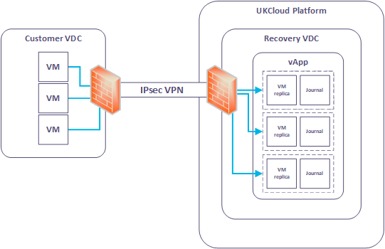
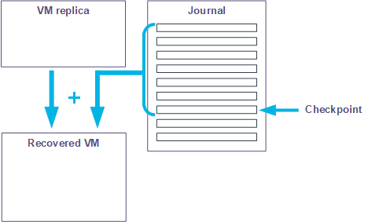

# Getting Started Guide for Disaster Recovery as a Service

## Overview

UKCloud's Disaster Recovery as a Service (DRaaS) is a powerful, self-service replication and recovery tool that can improve organisational resilience and enable seamless migration of applications between your local VMware or Hyper-V powered data centre and UKCloud's disaster recovery enabled regions. This means that in the event of a VM being compromised, for example, a local hardware failure, power outage, security incident (such as theft) or WAN connectivity disruption, you can quickly recover your VMs to the UKCloud platform and ensure that the disruption to your service is minimised.

DRaaS is powered by Zerto, a leading provider of disaster recovery software for the cloud.

This guide covers the tasks you need to perform to get DRaaS up and running in your environment.

### Intended audience

This guide is intended for any user who needs to set up DRaaS.

## Introduction to Disaster Recovery as a Service

If you provide services from your own data centre or on-site servers, DRaaS can help you achieve a robust and flexible replication and recovery service, with the UKCloud platform as the recovery site.

When you have set up DRaaS for your VMs, every write operation to the protected VMs is copied and stored in a journal on the recovery site. This means that in the event of a VM being compromised, you can quickly recover the VM to a point in time before the disaster took place.

You add disaster recovery protection to your VMs by adding them to a virtual protection group (VPG). Each VM in the VPG is synchronised to the recovery site on the UKCloud platform, and a journal is created. After this initial synchronisation, each subsequent write operation to the VM is processed as normal on the original site and a copy is asynchronously sent to the UKCloud site and written to the journal.

Each journal entry exists in the journal for 14 days (the journal history). When the journal history is reached, as new journal entries are created, older entries are written to the recovery VM's virtual disks.

Every few seconds, a checkpoint is written to every journal for each VM in the VPG to ensure crash-consistency between the VMs. If you need to recover a VM, you select a checkpoint to recover to. For example, in the case of a security incident, you could recover to a checkpoint from before the incident. During recovery, the VMs are created in a vApp on the recovery site and the recovery disks for each VM are attached to the recovered VM. Information in the journal is then promoted to the VM to bring it up to the date and time of the selected checkpoint.

Two terms you may hear in connection with disaster recovery are recovery point objective (RPO) and recovery time objective (RTO).

- The RPO indicates the amount of data you can afford to lose in the event of a disaster. For example, if your application data changes fairly infrequently, your RPO can be higher as the data remains fairly static. However, if your application data is constantly changing, you'll need your RPO to be smaller to avoid significant loss of data in the event of a disaster.

- The RTO is the amount of time you can tolerate your application being unavailable in the event of a disaster. For example, if your application provides critical functionality, you'll need to bring it back online very quickly. However, for a less critical application, you may be able to tolerate a longer outage.

Because of the use of regular checkpoints (every few seconds), our Zerto-powered DRaaS provides a minimal RPO. The ability to use recovered VMs even before all the journal data has been promoted provides a good RTO as well.

## Before you begin

When you order DRaaS, UKCloud provides you with:

- The IP address (from the IP range you provided to UKCloud) of the Zerto Cloud Connector (ZCC) deployed in your recovery VDC; you'll need this to complete the setup of the site-to-site VPN between your local environment and your recovery VDC

- A link to the appropriate version of the Zerto Virtual Manager (ZVM) for you to deploy in your local environment

- A ZORG ID to identify your Zerto environment within the UKCloud platform

- Access to the Zerto Self-Service Portal (ZSSP) in the appropriate UKCloud zone, where you can trigger a failover

You should consider the following:

- VMs must be powered on to be synchronised.

- The operating system used by the protected VMs must also be supported in the recovery site.

- Disaster Recovery as a Service captures every action. When a VM is deleted, the associated journal is also deleted.

- We provide a single default service profile. The details of this are available in the DRaaS Service Scope. We do not currently provide the option for you to create custom profiles.

### System requirements

To use DRaaS, you must have a valid, centrally managed vSphere or HyperV estate. A single hypervisor is not sufficient.

The following table lists the requirements for DRaaS, based on the currently deployed version of Zerto Virtual Replication (6.5U3) on the UKCloud platform:

Product | Supported Version
--------|------------------
**Management Plane** | &nbsp;
VMware vCenter | vCenter Server 5.0, 5.1, 5.5, 6.0, 6.5, 6.5U1, 6.5U2, 6.7, 6.7U1
Microsoft SCVMM | 2012 R2 and Server Core: Update Rollup 1-5, 6-11, 12-14 2012 R2 and Server Core: RTM 2016 and Server Core: RTM Rollup 3-5, 6
**Hosts** | &nbsp;
VMware ESXi | 5.0, 5.1, 5.5, 6.0, 6.5, 6.5U1, 6.5U2, 6.7, 6.7U1
Microsoft Hyper-V | 2012 R2 and Server Core Windows 2016 Server
**Virtual Machines Hardware Version** | &nbsp;
VMware | 7-11, 13, 14
Hyper-V | Generation 1 & 2
**Disaster Recovery as a Service** | &nbsp;
**Connectivity** | &nbsp;
Full duplex internet connection | 5Mb/s minimum
IPsec VPN | NA

For a complete list of hypervisor features supported when using DRaaS, see the [Interoperability Matrix for All Zerto Software Versions](https://s3.amazonaws.com/zertodownload_docs/Latest/Zerto%20Virtual%20Replication%20Operability%20Matrix.pdf).

## Getting Disaster Recovery as a Service up and running

To get DRaaS up and running in your environment, follow the steps below:

1. [Create a recovery VDC](#create-a-recovery-vdc)

2. [Set up your local environment](#set-up-your-local-environment)

3. [Configure networking on the recovery site](#configure-networking-on-the-recovery-site)

4. [Create a virtual protection group](#create-a-virtual-protection-group)

5. [Perform a failover test](#perform-a-test-failover)

### Create a recovery VDC

To recover your VMs to the UKCloud platform, you must have a VDC in the intended recovery site. If you already have a compute service in the UKCloud site, you can use an existing VDC or you can create a new one using:

- The UKCloud Portal (for more information see the [*Getting Started Guide for UKCloud for VMware*](../vmware/vmw-gs.md))

- The UKCloud Portal API (for more information see the [*How to use the UKCloud Portal API*](../portal/ptl-how-use-api.md))

If you don't already have a compute service in the UKCloud site or you'd prefer UKCloud to create the VDC for you, you can request this as part of your DRaaS Service Request.

### Set up your local environment

Before you can start using DRaaS, you need to prepare your local environment by:

- Installing the appropriate version of Zerto Virtual Manager (ZVM) in your local environment

- Creating a secure site-to-site VPN between your local environment and the UKCloud platform

For more information, see [*How to install and configure Zerto in your local environment*](../vmware/vmw-how-zerto-install-local.md).

### Configure networking on the recovery site

You must configure any internally and externally routed networks in your UKCloud recovery VDC to duplicate those in your local environment. You must also configure the edge gateway with the same firewall, NAT and other rules.

You'll create the mapping between these networks when you create your VPG (see [*How to create a virtual protection group*](../vmware/vmw-how-zerto-create-vpg.md)).

In the event of a failover, external access to the recovery VDC will be via a different IP address. You'll need to account for any required DNS changes and external connectivity configuration (such as VPNs), to ensure continued external access. Utilising UKCloud's VMware platform, you can configure this in advance. Alternatively, you can use load balancing technologies to manage a seamless switch between environments.

### Create a virtual protection group

A virtual protection group (VPG) is a collection of VMs that are grouped together for disaster recovery purposes. When you create a VPG, a replica of each VM disk is created on the recovery site. These replica virtual disks are then populated with the data in the protected VMs by synchronising the protected VMs with the recovery site replicas.

For more information, see [*How to create a virtual protection group*](../vmware/vmw-how-zerto-create-vpg.md).

### Perform a test failover

After you create your VPG, we recommend that you perform a test failover to confirm that your VMs will be recovered correctly in the event of a live failover.

You should also run test failovers periodically to ensure that your VMs can still be recovered successfully.

For more information, see [*How to perform a failover*](../vmware/vmw-how-zerto-perform-failover.md).

## Next steps

You have now performed all the steps needed to set up DRaaS.

If you experience a disaster, you can perform a live failover to recover your VMs on the UKCloud platform and continue operation as usual. For more information, see [*How to perform a failover*](../vmware/vmw-how-zerto-perform-failover.md).

## Glossary

This section provides a glossary of terms specific to UKCloud's DRaaS.

**failover**&nbsp;&nbsp;When an application switches to an alternative environment in order to ensure continued operation.

**journal**&nbsp;&nbsp;A repository of write operations performed on a protected VM after the initial synchronisation.

**protected site**&nbsp;&nbsp;The local site where your live VMs are located.

**recovery point objective (RPO)**&nbsp;&nbsp;The amount of data you can afford to lose in the event of a disaster.

**recovery site**&nbsp;&nbsp;The UKCloud site to which your VMs are replicated for protection. Sometimes also called the target site.

**recovery time objective (RTO)**&nbsp;&nbsp;The amount of time you can tolerate your application being unavailable in the event of a disaster.

**virtual protection group (VPG)**&nbsp;&nbsp;A collection of VMs that are grouped together for protection purposes.

**Virtual Replication Appliance (VRA)**&nbsp;&nbsp;Zerto software that manages the replication of virtual machines across sites.

**Zerto**&nbsp;&nbsp;The third-party software vendor used to power UKCloud's DRaaS.

**Zerto Cloud Connector (ZCC)**&nbsp;&nbsp;Zerto software that routes traffic between your network and the cloud replication network. It also facilitates the pairing of the on-premises Zerto Virtual Manager (ZVM) with UKCloud's DRaaS.

**Zerto Self-Service Portal (ZSSP)**&nbsp;&nbsp;The web-based graphical interface you use to create and manage your VPGs.

**Zerto Virtual Manager (ZVM)**&nbsp;&nbsp;Zerto software that is responsible for all the Zerto configuration for a site and performs the replication tasks.

## Feedback

If you find a problem with this article, click **Improve this Doc** to make the change yourself or raise an [issue](https://github.com/UKCloud/documentation/issues) in GitHub. If you have an idea for how we could improve any of our services, send an email to <feedback@ukcloud.com>.
