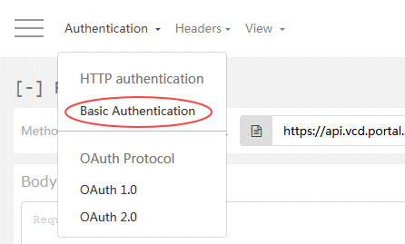
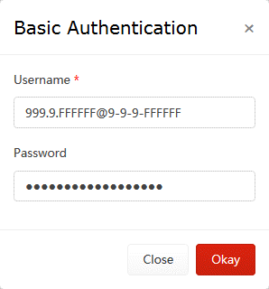
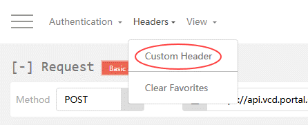
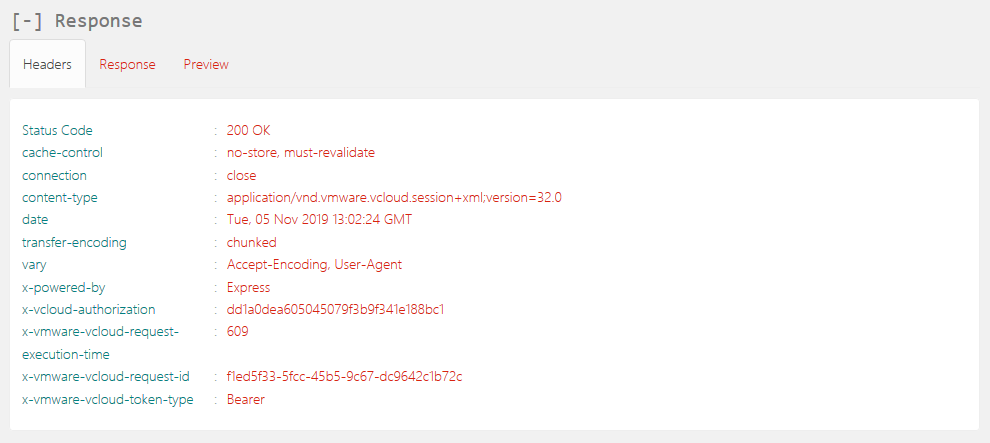
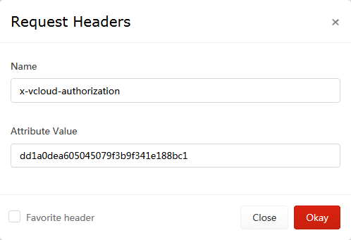

# How to migrate edge configuration data to another edge

## Overview

When moving VMware workloads between regions on the UKCloud platform, if you want to apply same edge configuration data to an edge in the new region, you need to export edge configuration data to an XML file and then migrate that data to the new edge. As part of the migration, some aspects of the environment may change, therefore you'll need to edit the exported XML file to make those changes before applying the configuration to the new edge.

While the migration of edge configuration is not a common process, there are certain activities that may require this to make the transition from one edge to another much simpler and quicker. The main reason this would likely be needed is when migrating workloads between regions, where, for the most part, the edge configuration needs to remain the same, but some amendments, such as a change in IP address, are required.

This article explains how to use the Cloud Director API to export configuration from an NSX edge, make the necessary amendments and then apply this configuration to a different edge.

## Before you begin

Before using the Cloud Director API to migrate edge configuration data, you should install a REST client to enable you to easily access the Cloud Director API and interact with the relevant endpoints. This example uses the RESTClient browser plug in, but you can use an alternative API client if you prefer.

You also need to obtain your API credentials. For more information, see [*How to access VMware Cloud Director through the Cloud Director API*](../vmware/vmw-how-access-vcloud-api.md).

## Obtaining an authorisation token

To start interacting with the Cloud Director API, you first need to obtain an `x-vcloud-authorization` token; to do this you need to adjust some settings in RESTClient.

1. In your browser, click the **RESTClient** icon.

    

2. From the **Method** menu, select **POST**.

    

3. In the **API** field, enter the API URL you recorded earlier and append the following:

    `/api/sessions`

    

4. Next, add a Basic Authentication header. To do this, from the **Authentication** menu at the top of the REST Client, select **Basic Authentication**.

    

5. In the *Basic Authentication* dialog box, in the **Username** field, enter your API username recorded earlier from the API page.

6. In the **Password** field enter your UKCloud Portal password and then click **Okay**.

    

7. The *Request* section now includes an Authorization header.

    

8. Next, add an Accept header. To do this, from the **Headers** menu, select **Custom Header**.

    

9. In the *Request Header* dialog box, in the **Name** field, enter `Accept`

10. In the **Value** field enter `application/*+xml;version=34.0` and then click **Okay**.

    

11. The *Headers* section should now be displayed, containing the Accept header.

    

12. The RESTClient has now got all the required settings in place to make a request to the Cloud Director API to obtain a `x-vcloud-authorization` token, so click the **Send** button.

13. When a response is received, the **Headers** tab in the *Response* section will be populated, including an `x-vcloud-authorization` token.

    

14. The `x-vcloud-authorization` token will replace the Basic Authentication header added earlier. To do this highlight and copy the string of characters displayed after the word `x-vcloud-authorization`.

    > [!NOTE]
    > If at any point while following the instructions in this guide, the output displayed in the REST Client does not look similar to that shown in the images, you can use the value of the **Status Code** field to determine what went wrong and needs investigation. In this case above, the **Status Code** received was `HTTP 200 OK`, which means that the request succeeded. For a list of HTTP response codes, see [HTTP Response Codes](https://developer.mozilla.org/en-US/docs/Web/HTTP/Status).

15. To add an `x-vcloud-authorization` header, from the **Headers** menu, select **Custom Header**.

16. In the *Request Header* dialog box, in the **Name** field enter `x-vcloud-authorization`.

17. In the **Value** field, paste the string of characters copied in the previous step, then click **Okay**.

    

18. Now that you've obtained an `x-vcloud-authorization` token, you can remove the Basic Authentication Header. Click the **x** in the upper right-hand corner of the header.

    

## Retrieving organisation details via the API

Now that you've obtained an `x-vcloud-authorization` token, you can call the Cloud Director API to retrieve the information that you need about your organisation to extract your edge configuration data.

1. Set the **Method** to **GET**.

    

2. In the *Response* section, select the **Preview** tab.

    This view lists the links that you can use to drill down into the various objects exposed via the Cloud Director API. Of interest in the output below is a link that will, when queried, return details about the organisation and the objects contained within it.

    

    The link should look something like:

    `https://<api_url>/api/org/<org_id>`

3. Copy the URL and paste it into the Request **URL** field.

    

4. Click **Send**.

    After a short amount of time the contents of the Response **Preview** tab will be updated to reflect the response from the Cloud Director API to your latest request, including links to each virtual data centre (VDC) in the organisation.

## Retrieving virtual data centre details via the API

When locating the VDC and exporting the edge configuration, perform this for both the existing environment and the new environment that you'll be migrating to.

To retrieve details about the VDCs in an organisation:

1. Copy the link for the VDC that contains the edge gateway.

    The link should look something like:

    `https>//<api_url>/api/vdc/<vdc_id>`

2. Click **Send**.

    The contents of the Response **Preview** tab will be updated again.

## Retrieving edge gateway configuration via the API

To retrieve details of the edge gateway configuration:

1. The response this time will probably be quite long. To easily locate a specific section in the response, use your browser's search utility. You can invoke this in Firefox by pressing **CTRL+F**. In the search dialog window at the bottom of the screen, enter `edgeGateways` and then click the down arrow button to locate a section that looks similar to the one shown below:

    `<Link rel="edgeGateways" href="https://<api_url>/api/admin/vdc/<vdc_id>/edgeGateways" type="application/vnd.vmware.vcloud.query.records+xml" />`

2. Copy the link ending in `/edgeGateways` and paste it into the URL field at the top of the RESTClient. Ensure that the **Method** drop down is set to **GET** and click **Send**.

    If this request is successful, the response will contain a link to the edge gateway which, when queried, will return the configuration of the edge gateway. Once you've received a response, use your browser's search utility to locate the `EdgeGatewayRecord` section within the response.

    `<EdgeGatewayRecord gatewayStatus="READY" haStatus="UP" isBusy="false" name="<edge_name>" numberOfExtNetworks="1" numberOfOrgNetworks="8" vdc="https://<api_url>/api/vdc/<vdc_id>" href="https://<api_url>/api/admin/edgeGateway/<edge_id>"     task="https://<api_url>/api/task/<task_id>" isSyslogServerSettingInSync="true" taskOperation="networkConfigureEdgeGatewayServices" taskStatus="success" taskDetails=" " />`

3. Within the `EdgeGatewayRecord` section of the above from the response, locate the link to the edge gateway that starts with the following:

    `https://<api_url>/api/admin/edgeGateway/`

4. At the end of the URL will be a unique identifier for the edge gateway within the VDC. Copy this link, paste it into the URL field and then click **Send**.

    After a short amount of time the current configuration of the edge gateway will be displayed in a block of XML.

## Reviewing and updating the edge gateway configuration

The edge configuration information is contained between `<Configuration>` and `</Configuration>` tags.

This block of XML is split into sections that detail the configuration settings applied to a specific item, function or service available on the edge gateway.

The example below shows a high‑level overview of the structure of the XML block returned:

```xml
<EdgeGateway>
   <Configuration>
      <GatewayBackingConfig>
      </GatewayBackingConfig>
      <GatewayInterfaces>
      </GatewayInterfaces>
      <EdgeGatewayServiceConfiguration>
         <FirewallService>
         </FirewallService>
         <NatService>
         </NatService>
         <GatewayIpsecVpnService>
         </GatewayIpsecVpnService>
         <StaticRoutingService>
         </StaticRoutingService>
         <LoadBalancerService>
         </LoadBalancerService>
      </EdgeGatewayServiceConfiguration>
   </Configuration>
</EdgeGateway\>
```

This is the configuration that you'll need to amend prior to posting it back to your new edge. Depending on your specific configuration and requirements, different sections of the configuration may or may not require editing. Copy and paste all of this configuration into a text editor, for example Notepad++, for editing.

### Configuration that must be changed

As you can see above, the edge XML configuration is split into each configurable item. When amending and applying the configuration, you may want to apply this section by section, rather than as a single XML block.

#### Firewall and NAT rules

When migrating configuration between edges, particularly when moving between regions, your external IP allocation will change. This means that any references to your externally assigned IP addresses within your edge configuration will need to be amended.

You'll be assigned the same amount of external addresses as before, so we'd recommend pairing a new IP with each of your old IP addresses and then performing a find and replace to ensure all IPs are updated correctly.

When you create NAT rules, they're applied to a single interface on the edge. Each interface is referenced within the configuration file as an `href` with its own interface ID. When applying the configuration to the new edge, these interface IDs will be different and will therefore need to be replaced. The interface name will also likely change. By exporting the configuration of the new edge as an XML file, you can identify the interface name and its `href` that the rules will need to be applied on.

Providing you keep your private address ranges the same as your original environment, you should not need to make any changes to these within the new configuration.

```xml
<NatService>
     <IsEnabled>true</IsEnabled>
         <NatRule>
             <Description></Description>
                 <RuleType></RuleType>
                 <IsEnabled></IsEnabled>
                 <Id></Id>
                 <GatewayNatRule>
                     <Interface href=https://<api_url>/api/admin/network/<interface-id> name="nft00xxxxx" type="application/vnd.vmware.admin.network+xml" />
                     <OriginalIp>x.x.x.x</OriginalIp>
                     <TranslatedIp>y.y.y.y</TranslatedIp>
                 </GatewayNatRule>
             </NatRule>
</NatService>
```

#### VPNs and load balancers

With your external IP allocation likely to change, this will also affect any configured VPNs and load balancers that you may have previously had on your original edge.

For VPN configuration, you'll need to replace the interface references and names for your **local** networks. For the load balancer configuration, you'll need to replace the **external** network interface reference and name. As above, each of these interfaces have their own ID and `href` that you'll need to add to the new configuration. Exporting the XML configuration of the new edge will provide you with the required information for these new interfaces.

Remember that when amending VPN configuration, and particularly the local endpoint IP address, you'll also need to make configuration changes on the peer side to mirror those amendments.

If you're using a Pre-Shared Key (PSK) for IPsec VPN authentication, the key will not be exported as part of this configuration. You can retrieve the key either through the VMware Cloud Director GUI or by querying an additional API endpoint (see [_How to obtain full IPsec VPN configuration via the vCloud API_](enbl-how-obtain-vpn-config.md)).

## Applying the new configuration

When you've amended the configuration with the necessary elements of the new edge gateway, you can apply it to the edge gateway.

To easily identify and resolve any possible issues when applying the configuration, posting the configuration to the edge in the individual configurable items may be easier. For example, apply the amended firewall rules, then apply the NAT rules and so on.

The steps below outline how to apply the amended configuration to your new edge gateway:

1. Enclose the new configuration in a pair of `<EdgeGatewayServiceConfiguration>` tags, for example:

    ```xml
    <?xml version="1.0" encoding="UTF-8" standalone="yes"?>
    <EdgeGatewayServiceConfiguration xmlns="http://www.vmware.com/vcloud/v1.5">

    <NatService>
        <IsEnabled>true</IsEnabled>
            <NatRule>
                <Description></Description>
                    <RuleType></RuleType>
                    <IsEnabled></IsEnabled>
                    <Id></Id>
                    <GatewayNatRule>
                        <Interface href=https://<api_url>/api/admin/network/<interface-id> name="nft00xxxxx" type="application/vnd.vmware.admin.network+xml" />
                        <OriginalIp>x.x.x.x</OriginalIp>
                        <TranslatedIp>y.y.y.y</TranslatedIp>
                    </GatewayNatRule>
            </NatRule>
    </NatService>

    </EdgeGatewayServiceConfiguration>
    ```

2. Copy and paste this configuration into the Request *Body* section of the RESTClient.

3. From the **Method** list, select **POST**.

4. Append the following to the URL of the **new** edge gateway in the **URL** field:

    `/action/configureServices`

    For example, if the original contents of the URL were:

    `https://<api_url>/api/admin/edgeGateway/<id>`

    The updated URL would be:

    `https://<api_url>/api/admin/edgeGateway/<id>/action/configureServices`

5. You must also add another header to the RESTClient prior to submitting the new configuration.

    From the **Headers** menu at the top of the RESTClient select **Custom Header**.

6. In the **Name** field, enter **Content-Type**.

7. In the **Attribute Value** field enter the following:

    `application/vnd.vmware.admin.edgeGatewayServiceConfiguration+xml`

8. Click **Okay**.

9. To submit the new configuration, click **Send**.

10. The status of the edge gateway as viewed from VMware Cloud Director will briefly show as **Updating Configuration**. Once this process has completed, click the edge gateway and select **Configure Services**.

11. In the *Configure Services* window, verify that the configuration has been applied successfully.

## Next steps

If you need any further assistance, or if you want to discuss any aspect of this service or settings specific to your domain, log a support ticket via the [My Calls](https://portal.skyscapecloud.com/support/ivanti) section of the UKCloud Portal.

## Feedback

If you find a problem with this article, click **Improve this Doc** to make the change yourself or raise an [issue](https://github.com/UKCloud/documentation/issues) in GitHub. If you have an idea for how we could improve any of our services, send an email to <feedback@ukcloud.com>.
