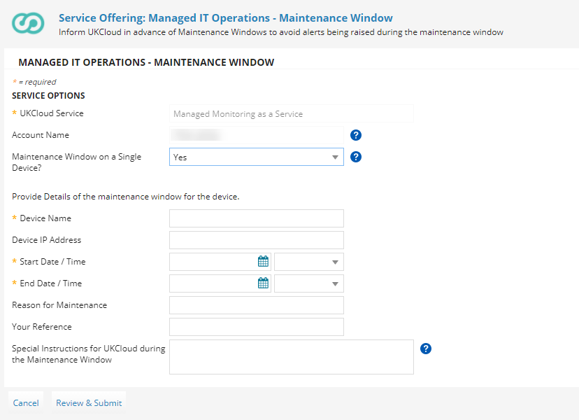
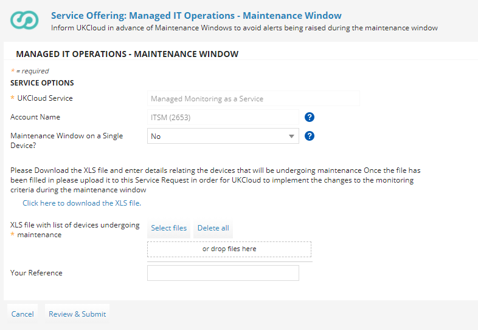

# How to provide notification of maintenance windows for Managed IT Operations

## Overview

If you're planning maintenance that will affect devices monitored as part of your Managed IT Operations service, it's important that you provide us with details of when the maintenance is taking place and any instructions for how we should deal with alerts that occur during that period.

## Providing notification of maintenance windows

### Providing notification of maintenance windows for a single device

If the maintenance window affects a single device, you can enter all the necessary details on the Managed IT Operations - Maintenance Window Service Request template.

1. In My Calls, raise a ticket using the **Managed IT Operations - Maintenance Window** template.

2. From the **Maintenance Window on a Single Device?** list, select **Yes**.

   

3. In the **Device Name** field, enter the name of the device to which the maintenance window applies.

4. In the **Device IP Address** field, enter the IP address of the device.

5. In the **Start Date / Time** field, use the date picker to specify the beginning of the maintenance window.

6. In the **End Date / Time** field, use the date picker to specify the end of the maintenance window.

7. In the **Reason for Maintenance** field, enter details of what kind of maintenance is taking place during the specified period.

8. In the **Special Instructions for UKCloud during the Maintenance Window** field, let us know how you want us to respond to alerts during the maintenance window.

9. When you're done, click **Review & Submit** then **Submit**.

### Providing notification of maintenance windows for multiple devices

If the maintenance window affects multiple devices, you'll need to fill out the Managed Monitoring - Maintenance Window Notification form (UKC-FRM-257), which you can download from the Managed IT Operations - Maintenance Window Service Request template

1. In My Calls, raise a ticket using the **Managed IT Operations - Maintenance Window** template.

2. From the **Maintenance Window on a Single Device?** list, select **No**.

   

3. You'll be provided with a link to the Managed Monitoring - Maintenance Window Notification form (UKC-FRM-257). Click the link to download the spreadsheet.

4. In the spreadsheet, for each affected device, in the **Item Name** column, enter the name of the device to which the maintenance window applies.

5. In the **Item IP** column, enter the IP address of the device.

6. In the **Start Date and Time** column, enter the beginning date and time of the maintenance window, using the `dd/mm/yy hh:mm` format.

7. In the **End Date and Time** column, enter the end date and time of the maintenance window, using the `dd/mm/yy hh:mm` format.

8. In the **Reason for Maintenance** column, enter details of what kind of maintenance is taking place during the specified period.

9. In the **Special Instructions for UKCloud** column, let us know how you want us to respond to alerts during the maintenance window.

10. In the **Your Reference** column, if you have any reference of your own that you'd like to record against the maintenance notification (for example, your own ticket number, project ID or change record number), you can record it here.

11. When you've finished completing the spreadsheet, in your My Calls ticket either click **Select files** and browse to the completed spreadsheet or drag the spreadsheet into the template.

12. Enter the date from which you want the changes to be effective.

13. When you're done, click **Review & Submit** then **Submit**.

## Related articles

- [*How to add devices to and remove devices from Managed IT Operations*](man-how-add-remove-device.md)

- [*How to change your service configuration for Managed Monitoring as a Service*](man-how-monitoring-change-config.md)

- [*How to define patching windows for Patching as a Service*](man-how-patching-define-window.md)

- [*How to update contact information for Managed IT Operations*](man-how-update-contact-info.md)

## Feedback

If you find a problem with this article, click **Improve this Doc** to make the change yourself or raise an [issue](https://github.com/UKCloud/documentation/issues) in GitHub. If you have an idea for how we could improve any of our services, send an email to <feedback@ukcloud.com>.
