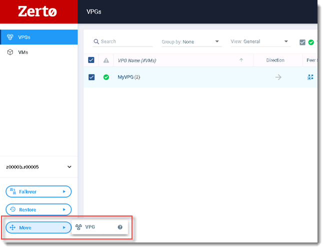
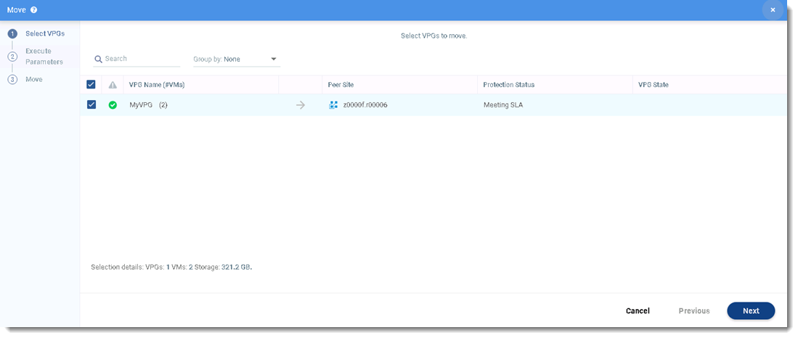
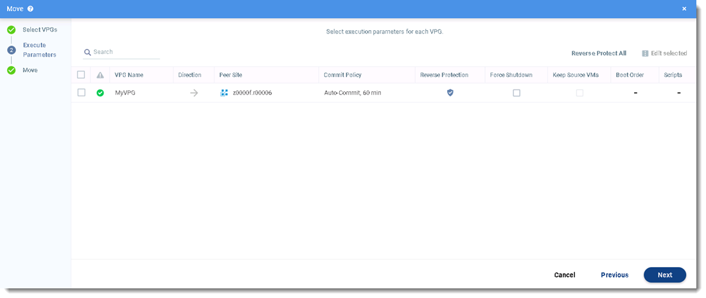

# How to migrate your workloads to the UKCloud platform

## Overview

UKCloud makes it easy for you to seamlessly migrate your existing workloads from a local VMware or Hyper-V powered data centre to our cloud platform.

Our Workload Migration service is powered by Zerto, a leading provider of disaster recovery software for the cloud.

### Intended audience

This article is intended for users who want to migrate their workloads onto the UKCloud platform.

## Before you begin

When you request Workload Migration, UKCloud provides you with:

- The IP address (from the IP range you provided to UKCloud) of the Zerto Cloud Connector (ZCC) deployed in your target VDC; you'll need this to complete the setup of the site-to-site VPN between your local environment and your UKCloud target VDC

- A link to the appropriate version of the Zerto Virtual Manager (ZVM) for you to deploy in your local environment

- A ZORG ID to identify your Zerto environment within the UKCloud platform

- Access to the Zerto Self-Service Portal (ZSSP) in the appropriate UKCloud zone

You should consider the following:

- VMs must be powered on to be synchronised

- The operating system used by the source VMs must also be supported in the target site

### System requirements

To use our Workload Migration service, you must have a valid, centrally managed vSphere or HyperV estate. A single hypervisor is not sufficient.

The following table lists the requirements for Workload Migration, based on the currently deployed version of Zerto Virtual Replication (8.5U2) on the UKCloud platform:

Product | Supported Version
--------|------------------
**Management Plane** | &nbsp;
VMware vCenter | vCenter Server 6.0, 6.5, 6.5 U1, 6.5 U2, 6.5 U3, 6.7, 6.7 U1, 6.7 U2, 6.7 U3, 7.0, 7.0 U1
Microsoft SCVMM | 2016 and Server Core: RTM Rollup 3-5, 6, 7, 8, 2019 and Server Core: RTM Rollup 1
**Hosts** | &nbsp;
VMware ESXi | 6.0, 6.5, 6.5 U1, 6.5 U2, 6.5 U3, 6.7, 6.7 U1, 6.7 U2, 6.7 U3, 7.0, 7.0 U1
Microsoft Hyper-V | Windows 2016 Server, Microsoft Hyper-V Server 2019
**Virtual Machines Hardware Version** | &nbsp;
VMware | 7-9, 10-11, 13, 14, 15, 17, 18
Hyper-V | Generation 1 & 2
**Migration to the Cloud** | &nbsp;
**Connectivity** | &nbsp;
Full duplex internet connection | 5Mb/s minimum
IPsec VPN | NA

For a complete list of hypervisor features supported when using Workload Migration, see the [Interoperability Matrix for All Zerto Software Versions](https://s3.amazonaws.com/zertodownload_docs/Latest/Zerto%20Virtual%20Replication%20Operability%20Matrix.pdf).

## Migrating workloads to UKCloud

1. [Create a target VDC](#create-a-target-vdc)

2. [Set up your local environment](#set-up-your-local-environment)

3. [Configure networking on the target site](#configure-networking-on-the-target-site)

4. [Create a virtual protection group](#create-a-virtual-protection-group)

5. [Migrate your workloads](#migrate-your-workloads)

### Create a target VDC

To migrate your workloads to the UKCloud platform, you must have a VDC in the intended target site. If you already have a compute service in the UKCloud site, you can use an existing VDC or you can create a new one using:

- The UKCloud Portal (see the [*Getting Started Guide for UKCloud for VMware*](../vmware/vmw-gs.md))

- The UKCloud Portal API (see the [*How to use the UKCloud Portal API*](../portal/ptl-how-use-api.md))

If you don't already have a compute service in the UKCloud site or you'd prefer UKCloud to create the VDC for you, you can request this as part of your Workload Migration Service Request.

### Set up your local environment

Before you can start migrating your workloads to UKCloud, you need to prepare your local environment by:

- Installing the appropriate version of Zerto Virtual Manager (ZVM) in your local environment

- Creating a secure site-to-site VPN between your local environment and the UKCloud platform

For more information, see [*How to install and configure Zerto in your local environment*](../draas/draas-how-zerto-install-local.md).

### Configure networking on the target site

You must configure any internally and externally routed networks in your UKCloud target VDC to duplicate those in your local environment. You must also configure the edge gateway with the same firewall, NAT and other rules. You'll create the mapping between these networks when you create your VPG.

When you migrate your workloads, external access to the UKCloud VDC will be via a different IP address. You'll need to account for any required DNS changes and external connectivity configuration (such as VPNs), to ensure continued external access. Utilising UKCloud's VMware cloud, you can configure this in advance. Alternatively, you can use load balancing technologies to manage a seamless switch between environments.

### Create a virtual protection group

A virtual protection group (VPG) is a collection of VMs that are grouped together for migration. When you create a VPG, a replica of each VM disk is created on the target UKCloud site. These replica virtual disks are then populated with the data in the source VMs by synchronising the source VMs with the target site replicas.

For more information, see [*How to create a virtual protection group*](../vmware/vmw-how-zerto-create-vpg.md).

### Migrate your workloads

Within Zerto, you have two options for migrating your workloads:

- Move the VPG to the target site. This method performs an end-to-end migration, including removing the VMs from the source site after they have been moved. For more information, see the steps below.

- Perform a live failover. This method provides more flexibility for you to control what happens on the source site after you move the VMs to the target site. For more information, see [*How to perform a failover*](../vmware/vmw-how-zerto-perform-failover.md).

To move a VPG:

1. [*Login to the ZSSP*](../vmware/vmw-how-zerto-access-zssp.md).

   Use the ZSSP login link for the zone in which your target VDC is located.

2. At the bottom of the page, select **Move**, then **VPG**.

   

3. In the *Move* wizard, on the *Select VPGs* page, select one or more VPGs that you want to move then click **Next**.

   

   > [!NOTE]
   > When you move a VPG, you cannot select which checkpoint to use. Zerto uses the most recent checkpoint.

4. On the *Execute Parameters* page, the commit policy gives you the opportunity to check the integrity of the migrated VMs before committing the move. To change the commit policy, click the **Commit Policy** field and select:

   - **Auto-Commit** if you want to automatically commit the move after a specified amount of time if there is no user interaction. Set the amount of time in the **After** field, up to a maximum of 1440 minutes (24 hours). If you want the move to be immediately committed, enter 0.

   - **Auto-Rollback** if you want to automatically roll back the move after a specified amount of time if there is no user interaction. Set the amount of time in the **After** field, up to a maximum of 1440 minutes (24 hours). If you want the move to be immediately rolled back, enter 0.

   - **None** if you do not want to apply a commit policy. You must manually commit or roll back the move.

5. The source VMs must be powered off before they can be migrated. If the VMs cannot be gracefully shut down, you can force a shutdown. To force shutdown, select the **Force Shutdown** check box. If you do not select this option and the VMs cannot be gracefully shut down, the move process fails.

6. Reverse protection ensures that when the source VMs are migrated to the target site, the source site becomes the new target site. Reverse protection is enabled by default, but you can disable it by clicking the **Reverse Protection** field and deselecting the **Reverse** check box.

   

7. Click **Next**.

8. On the *Move* page, review the diagram to see the number of VPGs and VMs included in the move and where they will be moved to, then click **Start Move**.

   The move process creates the VMs in the target site.

   > [!NOTE]
   > If a VM already exists on the target site with the same name as one of the source VMs, a number is added to the end of the target VM name to ensure that it's unique.

9. If you set a commit policy with a time greater than zero, you can check the integrity of the migrated VMs before committing (or rolling back) the migration. When you've finished testing, you can either wait for the time to elapse before the auto commit or auto rollback, or on the *VPGs* tab, click the **VPG Name** and then click the **Commit** or **Rollback** icon as required.

   After the migrated VMs are up and running and committed in the target site, the powered off VMs in the source site are removed from the source site and data from the journal is promoted to the migrated VMs. If you enabled reverse protection, the migrated VMs are protected on the source site.

## Next steps

To see what you can do with your application now that it's on the UKCloud platform, see the [*Getting Started Guide for UKCloud for VMware*](../vmware/vmw-gs.md).

If you used failover to migrate your workloads, when you've determined that the migration has been successful, you should remove the original VMs from the source site to remove any workloads that are no longer required.

## Feedback

If you find a problem with this article, click **Improve this Doc** to make the change yourself or raise an [issue](https://github.com/UKCloud/documentation/issues) in GitHub. If you have an idea for how we could improve any of our services, send an email to <feedback@ukcloud.com>.
