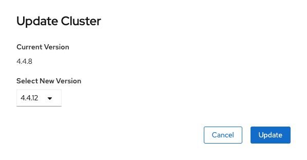

# Supported customer update strategy for version 4 clusters

### Update Information

In OpenShift version 4 updates of the cluster and operating system of the nodes has been exposed to the customer through the cluster. Clusters can be updated through the UI and the cluster will then deal with updating the relevant operator components and the OS version of the RHCOS nodes running as masters, infras and workers. The OS version of the nodes are tied to the version of the cluster and are thoroughly tested by Red Hat pipelines prior to release.

### Supported Strategy

There are three update channels available to choose from:

* Candidate - This is an unsupported channel which will provide release candidate z stream releases. Do not update via this channel or the cluster will be unsupportable by both UKCloud and Red Hat.

* Fast - This channel is fully supported. Updates are released to this channel after performing well in the candidate channel.

* Stable - This is the recommended channel for production clusters. Updates are released to this channel after data has been collected by Red Hat from customers running updates from the fast channel and stability of the updates have been confirmed.

> [!NOTE]
> UKCloud would ask that all customers remain on the stable channel for production clusters. We reccommend only using the fast channel if there are specific bug fixes/security patches you require.

### How to Upgrade

#### Prerequisites

* You must be a cluster admin user

* You must contact UKCloud support and ask for an etcd backup to be taken to ensure there is a restore point in case of corruption during the update.

#### Process

In the UI navigate to Administration > Cluster Settings.

Ensure the correct channel is selected. If an update is available there will be a large blue 'Update Now' button. 

Click the 'Update Now' button and you can choose a dropdown of available versions and set off an update as shown below:

### Further information

Below are some useful OpenShift documentation pages regarding upgrading a cluster:

https://docs.openshift.com/container-platform/4.5/updating/updating-cluster.html

## Feedback

If you find a problem with this article, click **Improve this Doc** to make the change yourself or raise an [issue](https://github.com/UKCloud/documentation/issues) in GitHub. If you have an idea for how we could improve any of our services, send an email to <feedback@ukcloud.com>.
