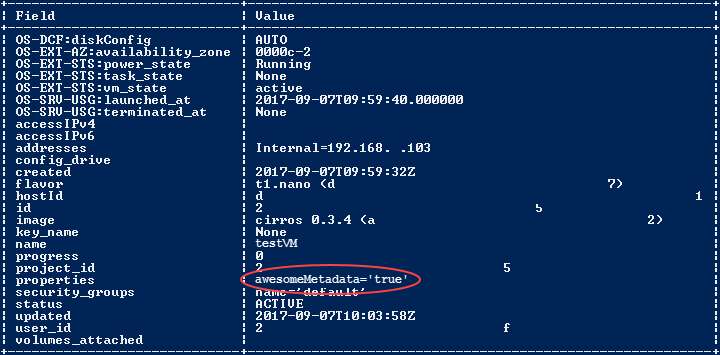
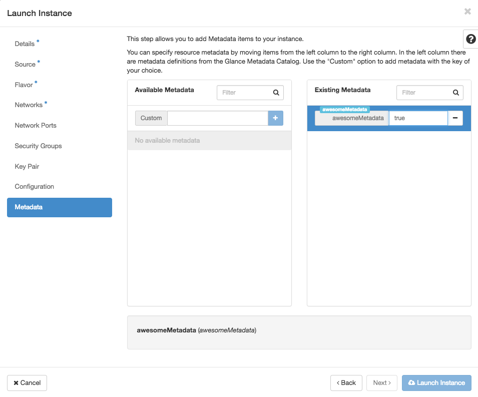
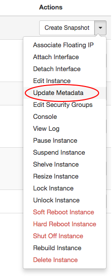

# How to use OpenStack instance metadata

## Overview

In your UKCloud for OpenStack environment, it's useful to be able to track instances and take programmatic actions based on metadata. For example, you might want to list the instances associated with a particular project team in your organisation to extract billing information. Or maybe you want to access metadata during the deployment of a cluster to know which nodes are masters or slaves.

This article shows you how to add metadata to an instance and how to retrieve instance metadata.

## Using the API

### Creating an instance with metadata (API)

When you create a new instance using the OpenStack API, use the `property` flag to include metadata:

    -- property <key>=<value

For exmaple:

    openstack server create --nic net-id=internet --image cirros --flavor t1.tiny --property awesomeMetadata=true testVM

### Setting metadata on an existing instance (API)

You can also use the `property` flag to set metadata for an existing instance, for example:

    openstack server set --property coolMetadata=true testVM

### Retrieving instance metadata (API)

You can retrieve instance metadata by querying the show command, for example:

    openstack server show testVM

The output returned by the command includes any metadata in the `properties` section, for example:

## Using Horizon

### Creating an instance with metadata (Horizon)

When you create an instance using Horizon, you can include metadata on the **Metadata** tab of the *Launch Instance* dialog box.

### Setting metadata on an existing instance (Horizon)

To add metadata to an existing instance in Horizon, select **Update Metadata** from the **Actions** menu on the *Instances* page.

## Using HEAT templates

Heat supports metadata tagging. For more information, see:

<https://docs.openstack.org/developer/heat/template_guide/openstack.html#OS::Nova::Server-prop-metadata>

## Using configuration management tools

You can also use configuration management tools, such as Ansible, to set instance attributes. For more information, see:

<https://docs.ansible.com/ansible/os_server_module.html>

## Feedback

If you find an issue with this article, click **Improve this Doc** to suggest a change. If you have an idea for how we could improve any of our services, visit the [Ideas](https://community.ukcloud.com/ideas) section of the [UKCloud Community](https://community.ukcloud.com).
