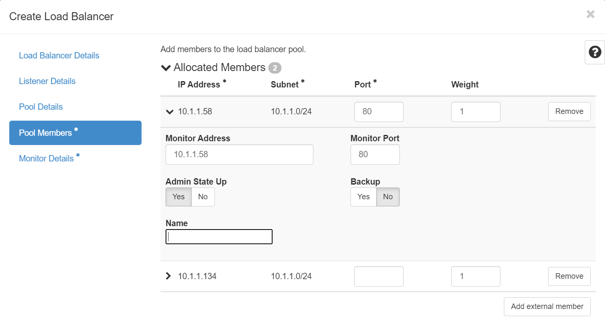
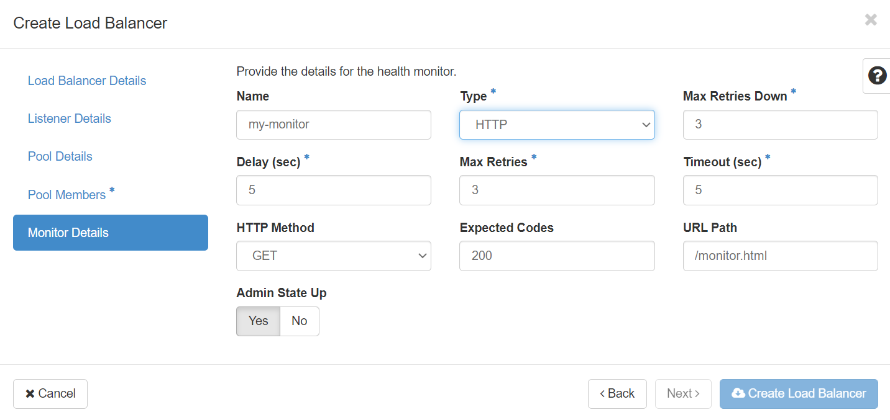

# Using Octavia Load Balancing as a Service (LBaaS)
> [!NOTE]
> TBD: region restrictions
## Overview

Octavia is the OpenStack Load Balancing as a Service (LBaaS) solution and forms part of the solution to availability and scaling that modern systems require.

Octavia currently supports a number of configurations:

- TCP, HTTP, HTTPS, Terminated HTTP and UDP support
- Source IP, Round-Robin and Least Connections balancing
- Health monitoring using Ping, HTTP, TLS-Hello and UDP

## Prerequisites

### If you intend to manage with the OpenStackCLI

- Octavia uses port 13876 for communication. This port will need to be open to manage Octavia.
- A recent version of the OpenStackCLI

## Use Cases

Use cases for Octavia include:

- Scaling out web-site traffic by balancing it over multiple servers
- Increasing availability of a service with active-standby or active-active pools

## Octavia components

Octavia consists of a number of service components that need to be configured as follows:

### Load Balancer

At the top of the Octavia component stack is the Load Balancer. The Octavia Load Balancer connects to an OpenStack network and provides the entry point for traffic. A Load Balancer may be assigned a Floating IP to connect it to internet traffic.

### Listener

An Octavia Listener defines an IP protocol and service that the Load Balancer will accept. This can be TCP, UDP, HTTP or HTTPS (direct or terminated). Each Load Balancer may have multiple listeners to support more than one service (e.g. HTTP and HTTPS).

### Pool

An Octavia Pool defines a list of servers that will accept the traffic from the Listener. As with the Listener the protocol for the Pool to use is selected.

### Member

Each Octavia Pool needs to contain a number of Members. These will specify the IP address and port of the servers (or services) that will be used to service the requests. A separate monitoring IP and port can also be defined distinct from the request ones if needed.

### Health Monitor

The Health Monitor defines how Octavia can check that the Member resources are online and available, automatically removing or re-adding from the list of Members in a Pool should it be required. The type of check performed is configurable, as is the frequency of checks, timeout and number of failed (or successful) checks required for the status of a Member to be changed.

## Examples

### Assumptions

The requirement is to create an HTTP Load Balancer across existing servers.

- An existing OpenStack Router 
- An existing OpenStack Network and Subnet
- Two servers providing HTTP over port 80.
- The servers respond to a request for /monitor.html with a valid page

### CLI Example

#### Create a Load Balancer

    openstack loadbalancer create --name "my-lbaas" --vip-network-id NETWORK-ID-STRING
    +---------------------+--------------------------------------+
    | Field               | Value                                |
    +---------------------+--------------------------------------+
    | admin_state_up      | True                                 |
    | availability_zone   |                                      |
    | created_at          | 2021-07-29T09:13:40                  |
    | description         |                                      |
    | flavor_id           | None                                 |
    | id                  | 5e815730-8cde-4d31-8761-f50422767c49 |
    | listeners           |                                      |
    | name                | my-lbaas                             |
    | operating_status    | OFFLINE                              |
    | pools               |                                      |
    
#### Create a Listener

    openstack loadbalancer listener create --name "my-lbaas-listener-http"  --protocol HTTP --protocol-port 80 5e815730-8cde-4d31-8761-f50422767c49
    +-----------------------------+--------------------------------------+
    | Field                       | Value                                |
    +-----------------------------+--------------------------------------+
    | admin_state_up              | True                                 |
    | connection_limit            | -1                                   |
    | created_at                  | 2021-07-29T09:17:01                  |
    | default_pool_id             | None                                 |
    | default_tls_container_ref   | None                                 |
    | description                 |                                      |
    | id                          | 20f6ceda-b77f-433f-b171-fbc93668c536 |
    | insert_headers              | None                                 |
    | l7policies                  |                                      |
    | loadbalancers               | 5e815730-8cde-4d31-8761-f50422767c49 |
    | name                        | my-lbaas-listener-http               |

#### Create a Pool

    openstack loadbalancer pool create --name "my-lbaas-pool-http" --protocol HTTP --listener 20f6ceda-b77f-433f-b171-fbc93668c536 --lb-algorithm ROUND_ROBIN
    +----------------------+--------------------------------------+
    | Field                | Value                                |
    +----------------------+--------------------------------------+
    | admin_state_up       | True                                 |
    | created_at           | 2021-07-29T10:23:56                  |
    | description          |                                      |
    | healthmonitor_id     |                                      |
    | id                   | 0ca45218-23a5-44f3-8de5-50cd7984ae4d |
    | lb_algorithm         | ROUND_ROBIN                          |
    | listeners            | 20f6ceda-b77f-433f-b171-fbc93668c536 |
    | loadbalancers        | 5e815730-8cde-4d31-8761-f50422767c49 |
    | members              |                                      |
    | name                 | my-lbaas-pool-http                   |

#### Add two Members to the Pool

    openstack loadbalancer member create --name "my-lbaas-member-1" --address 10.1.1.134 --protocol-port 80 0ca45218-23a5-44f3-8de5-50cd7984ae4d
    +---------------------+--------------------------------------+
    | Field               | Value                                |
    +---------------------+--------------------------------------+
    | address             | 10.1.1.134                           |
    | admin_state_up      | True                                 |
    | created_at          | 2021-07-29T10:27:20                  |
    | id                  | e6cd5dc2-b44a-440e-bae0-45dfa1cd9490 |
    | name                | my-lbaas-member-1                    |
    
    openstack loadbalancer member create --name "my-lbaas-member-2" --address 10.1.1.58 --protocol-port 80 0ca45218-23a5-44f3-8de5-50cd7984ae4d
    +---------------------+--------------------------------------+
    | Field               | Value                                |
    +---------------------+--------------------------------------+
    | address             | 10.1.1.58                            |
    | admin_state_up      | True                                 |
    | created_at          | 2021-07-29T10:27:54                  |
    | id                  | b835edce-8157-4802-bce2-33817cf9354f |
    | name                | my-lbaas-member-2                    |

#### Create a Health Monitor

    openstack loadbalancer healthmonitor create --name "my-lbaas-monitor" --http-method GET --type HTTP  --url-path /monitor.html --delay 5 --timeout 5 --max-retries 3 0ca45218-23a5-44f3-8de5-50cd7984ae4d
    +---------------------+--------------------------------------+
    | Field               | Value                                |
    +---------------------+--------------------------------------+
    | project_id          | 665575955ea34177bb9f7105bcc9782d     |
    | name                | my-lbaas-monitor                     |
    | admin_state_up      | True                                 |
    | pools               | 0ca45218-23a5-44f3-8de5-50cd7984ae4d |
    | created_at          | 2021-07-29T10:32:15                  |
    | provisioning_status | PENDING_CREATE                       |
    | updated_at          | None                                 |
    | delay               | 5                                    |
    | expected_codes      | 200                                  |
    | max_retries         | 3                                    |
    | http_method         | GET                                  |
    | timeout             | 5                                    |
    | max_retries_down    | 3                                    |
    | url_path            | /monitor.html                        |
    | type                | HTTP                                 |
    | id                  | d7007382-43e1-40d2-9439-ebd9b0418931 |

### Horizon Example

#### Create a Load Balancer

#### Create a Listener

#### Create a Pool

#### Add two Members to the Pool

Note: For each member you add, click on the ">" next to the IP address to open up the monitor details and enter the IP address and port for the Health Monitor to use (which may be the same details as the member IP and port).

#### Create a Health Monitor

## Feedback

If you find a problem with this article, click **Improve this Doc** to make the change yourself or raise an [issue](https://github.com/UKCloud/documentation/issues) in GitHub. If you have an idea for how we could improve any of our services, send an email to <feedback@ukcloud.com>.
