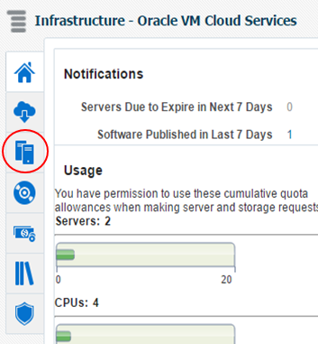
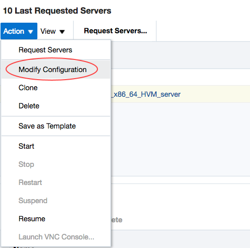

#### UKCloud Limited (“UKC”) and Virtual Infrastructure Group Limited (“VIG”) (together “the Companies”) – in Compulsory Liquidation

On 25 October 2022, the Companies were placed into Liquidation with the Official Receiver appointed as Liquidator and J Robinson and A M Hudson simultaneously appointed as Special Managers to manage the liquidation process on behalf of the Official Receiver.

Further information regarding the Liquidations can be found here: <https://www.gov.uk/government/news/virtual-infrastructure-group-limited-and-ukcloud-limited-information-for-creditors-and-interested-parties>

Contact details: 
For any general queries relating to the Liquidations please email <ukcloud@uk.ey.com> 
For customer related queries please email <ukcloudcustomers@uk.ey.com> 
For supplier related queries please email <ukcloudsuppliers@uk.ey.com>

# How to enable high availability for your Oracle VMs

> [!IMPORTANT]
> UKCloud for Oracle Software has been retired from sale by UKCloud. We'll continue to support all existing customers who are using this service, however, we are no longer providing this service for new workloads. This article provides existing UKCloud for Oracle Software customers with access to support documentation and we'll continue to update it as required. For new Oracle requests, contact your Client Director or Service Delivery Manager.

## Overview

Owing to the nature of Oracle workloads and the need to pin them to processor cores, workloads will be automatically moved in the event of a host failure only if you've enabled the high availability (HA) feature
on each VM.

> [!NOTE]
> If you do not enable the HA feature for your VMs, if a failure occurs, UKCloud will need to manually move the Oracle VM to a new host, at which point you'll be notified to restart your application.

This article describes how to enable HA for your Oracle VMs.

### Intended audience

To complete the steps in this guide you must have access to Oracle Enterprise Manager Cloud Control.

## Enabling high availability for a VM

To enable HA:

1. Log in to the Oracle Enterprise Manager Cloud Control console at:

    <https://ecco.r00006.frn.ukcloud.com/em>

    If you need more detailed instructions, see the [*Getting Started Guide for UKCloud for Oracle Software*](orcl-gs.md).

2. On the *Infrastructure -- Oracle VM Cloud Services* page, click the **Servers** icon.

    

3. The *Servers* page lists the servers (VMs) you've requested.

    

4. Select the VM for which you want to enable HA.

5. From the **Action** menu, select **Modify Configuration**.

    

6. On the *Modify Configuration* page, select **Enable High Availability**.

    

7. Click **OK**.

## Next steps

For more information about UKCloud for Oracle Software, see:

- [*Getting Started Guide for UKCloud for Oracle Software*](orcl-gs.md).

- [*How to build an Oracle virtual machine*](orcl-how-build-vm.md)

- [*UKCloud for Oracle Software FAQs*](orcl-faq.md)

## Related videos

- [*Oracle Enterprise Manager Cloud Control console overview video*](orcl-vid-overview.md)

## Feedback

If you find a problem with this article, click **Improve this Doc** to make the change yourself or raise an [issue](https://github.com/UKCloud/documentation/issues) in GitHub. If you have an idea for how we could improve any of our services, send an email to <feedback@ukcloud.com>.
