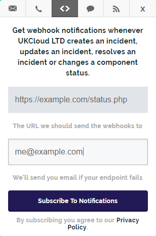

# How to use webhooks to receive service status notifications

## Overview

The [UKCloud Service Status page](https://status.ukcloud.com) enables you to subscribe to updates using webhook notifications. To use these notifications, you need to set up an endpoint to receive and process these notifications. For more information about webhooks, see the Atlassian Statuspage documentation: [Webhook Notifications](https://help.statuspage.io/help/webhook-notifications).

This article provides sample PHP code that processes webhook HTTP POST updates from the UKCloud Service Status page in a JSON object.

> [!IMPORTANT]
> Input directly from the internet should never be trusted! Before implementing this code please ensure you have safely sanitized all user input and taken the relevant security precautions to prevent yourself from being hacked. UKCloud takes no responsibility for any damage caused to any system by use of this code.

After you upload the file containing your code to your public web server, you can use the endpoint to subscribe to webhook notifications on the UKCloud Service Status page. For more information, see [*Understanding the UKCloud Service Status page*](other-ref-status-page.md).



## Sample code

```php
<?php

//Input directly from the internet should never be trusted!
//Before implementing this please ensure you have safely sanitized all user input
//and taken the relevant security precautions to prevent yourself from being hacked.
//UKCloud takes no responsibility for any damage caused to any system by use of this code.

$input = file_get_contents('php://input');

$statusObject = json_decode($input);

if(json_last_error() !== JSON_ERROR_NONE){
  die('Invalid JSON');
}

if(!isset($statusObject->page->status_description)){
  die('Invalid Input');
}

//Status page general information
echo "<br><br>Status Description: " . $statusObject->page->status_description;
echo "<br>Status Indicator: " . $statusObject->page->status_indicator;

//The below if statement catches component status changes
if(isset($statusObject->component_update)){
  echo "<br><br>Component Name: " . $statusObject->component->name;
  echo "<br>Old Status: " . $statusObject->component_update->old_status;
  echo "<br>New Status: " . $statusObject->component_update->new_status;
}

//The below if statement catches incident status changes
if(isset($statusObject->incident)){
  echo "<br><br>Incident Name: " . $statusObject->incident->name;
  echo "<br>Incident Impact: " . $statusObject->incident->impact;
  echo "<br>Incident Status: " . $statusObject->incident->status;
  echo "<br>Created At: " . $statusObject->incident->created_at;
  echo "<br>Updated At: " . $statusObject->incident->updated_at;
  echo "<br>Monitoring At: " . $statusObject->incident->monitoring_at;

  echo "<br><br>Incident Updates: ";

  //The below foreach loop goes through each component status update
  foreach ($statusObject->incident->incident_updates as $indUpdate){
    echo "<br><br>Incident Update Body: <br>" . $indUpdate->body;
    echo "<br>Incident Update Created At: " . $indUpdate->created_at;
    echo "<br>Incident Update Updated At: " . $indUpdate->updated_at;
    echo "<br>Incident Update Displayed At:  " . $indUpdate->display_at;
    echo "<br>Incident Update Status: " . $indUpdate->status;
  }

  //The below switch statement allows you to perform your actions when an
  //incident notification is updated
  switch($statusObject->incident->status){
    case "investigating":
    case "identified":
    case "monitoring":
    case "resolved":
      echo "<br><br>This is an incident!";
      break;
  }

  //The below switch statement allows you to perform your actions when an
  //maintenance notification is updated
  switch($statusObject->incident->status){
    case "scheduled":
    case "in_progress":
    case "verifying":
    case "completed":
      echo "<br><br>This is a maintenance piece!";
      break;
  }
}

?>
```

## Feedback

If you find a problem with this article, click **Improve this Doc** to make the change yourself or raise an [issue](https://github.com/UKCloud/documentation/issues) in GitHub. If you have an idea for how we could improve any of our services, send an email to <feedback@ukcloud.com>.
