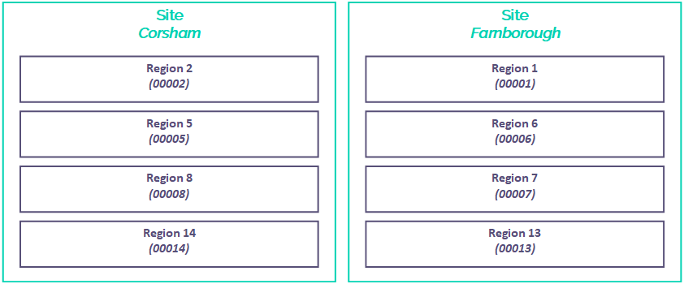
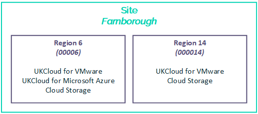
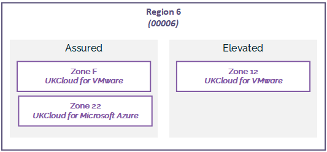

# Understanding sites, regions and zones

## Introduction

This article explains how we've designed the UKCloud platform using sites, regions and zones to support scalability and resilience. The diagram below shows the relationship between sites, regions and zones and provides a broad indication as to the purpose of each.

We've engineered our cloud platform to tolerate inevitable failures at or below the infrastructure layer (for example, hardware failures and power or cooling interruptions) to ensure that the platform remains available. To ensure your applications and the services they deliver are highly available, we encourage you to design for failure and build disaster recovery capabilities into your applications. For more information, see [*High availability on the UKCloud platform*](other-ref-high-availability.md).

For specific services, such as UKCloud for OpenStack or UKCloud for VMware, we provide more detailed articles to explore the design choices you have with our platform. Additionally, you can always engage a Cloud Architect who can work with you to deploy the right architecture on our platform.

## Understanding sites

A site is a geographically specific location. UKCloud has two UK‑based sites, separated by over 100 km, in Farnborough and Corsham.

Sites provide:

- Independent power, security, geography and infrastructure

- Independent WAN connections from multiple service providers

- Local maintenance and platform support teams

- Shared UKCloud service support and management teams

The geographical diversity provided by multiple sites offers resilience against scenarios such as natural disasters, targeted terrorist attacks or mass WAN failure. If an event affects a particular site, your system can continue running on the other site. The separation of UKCloud's two sites aligns with the NCSC's published guidance on architecting for disaster avoidance.

We strongly encourage you to consider designing your solutions across our two sites as part of your disaster recovery strategy. However, you should consider that, although we operate secure, high‑bandwidth and low‑latency interconnects between our sites, the latency of transporting data within the same site will always be lower. If you deploy your solution across sites, you should always perform thorough testing to ensure that any increase in latency (particularly storage latency) is within tolerable levels and does not impede the performance of your solution under heavy load.

## Understanding regions

A region provides a set of services within a site. Each region is physically segregated and has its own power infrastructure, management services and networking components.

Each region provides a particular subset of UKCloud services, for example UKCloud for VMware, UKCloud for Microsoft Azure or Cloud Storage, so the regions that you can use for your solution depend on where your selected (and prospective) UKCloud services are available. For example, in the diagram below you can see that UKCloud for VMware is provided in regions 6 and 14 of our Farnborough site, however UKCloud for Microsoft Azure is provided only in region 6.

Additionally, certain product features may be available only in certain regions. Check [*UKCloud services by region*](other-ref-services-by-region.md) for further details.

## Understanding zones

A zone is a distinct hardware installation within a region that hosts a particular UKCloud service (for example, UKCloud for VMware or UKCloud for Microsoft Azure). Each zone utilises common networking infrastructure but has independent server and storage infrastructure.

Each zone resides in a particular security domain: either Assured OFFICIAL or Elevated OFFICIAL. Within a region there's usually only one service zone per security domain.

## Feedback

If you find a problem with this article, click **Improve this Doc** to make the change yourself or raise an [issue](https://github.com/UKCloud/documentation/issues) in GitHub. If you have an idea for how we could improve any of our services, send an email to <feedback@ukcloud.com>.
