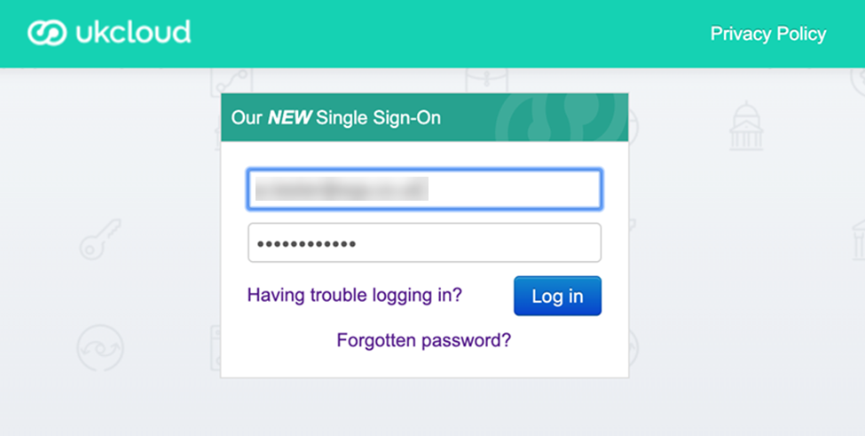

# How to manage My Calls users

## Overview

My Calls is the one‑stop place, accessed via the UKCloud Portal, to raise new support tickets (incidents and requests) with UKCloud and monitor existing tickets.

This article shows how to create new My Calls users and how to manage permissions for those users.

### Intended audience

This article is intended for Portal administrators who want to provide Portal users with access to My Calls and manage the permission levels of those users. To perform the tasks in this article you must be able to log in to the UKCloud Portal with the *My Calls Admin* My Calls permission.

## Setting up a new My Calls user

You can grant an existing Portal user access to My Calls.

> [!TIP]
> To create a new Portal user, see [*How to create a new user*](ptl-how-create-users.md).

1. Log in to the UKCloud Portal.

    For more detailed instructions, see the [*Getting Started Guide for the UKCloud Portal*](ptl-gs.md).

2. In the Portal navigation panel, expand the **Contacts** option and select **All Contacts**.

    

3. Locate the user to whom you want to grant My Calls permissions and click the **Edit** button.

    

4. Select the **My Calls Permissions** tab.

    

    > [!NOTE]
    > If you receive an error message, contact UKCloud Support at <support@ukcloud.com>.

5. Select **My Calls access for this User** and click **Save**.

    

    > [!NOTE]
    > To be able to access My Calls, the user must have logged into the Portal previously.

The user should now be able to access My Calls with the permission level *My Tickets*. To change their permission level, see [Managing My Calls user permissions](#managing-my-calls-user-permissions).

## Managing My Calls user permissions

You can manage the My Calls permission level for Portal users across your account.

- *My Tickets* - Users with this permission level can raise support tickets and view and update the tickets that they have raised

- *Account Tickets* - Users with this permission level can raise support tickets and view and update any ticket raised against the account (including those raised by other users)

- *My Calls Admin* - Users with this permission level can raise support tickets, view and update any ticket raised against the account (including those raised by other users) and manage the My Calls permission levels of other users

1. In the Portal navigation panel, expand the **Support** option and select **My Calls**.

    

2. Click **Go to My Calls Portal**.

3. For additional security, re-enter your UKCloud Portal user credentials to access My Calls.

    

    If two-factor authentication (2FA) has been enabled for your account, you'll be prompted to enter a six digit code. Use your 2FA app to generate the code and enter it here.

4. Select the **Role Administration** tab.

    

5. From the list of users, select the user that you want to edit.

    

    > [!TIP]
    > You can filter the list of users or use the search field to find a specific user.

6. Select the permission level you want to apply to the user: *My Tickets*, *Account Tickets* or *My Calls Admin*.

    The options offered will depend on the current role assigned to the user. Each user can have only one permission level, so the option you select here replaces any previous permissions.

    

7. When you're done, click **Save**.

## Disabling a new My Calls user

If you need to disable a user on your account from accessing My Calls:

1. In the UKCloud Portal navigation panel, expand the **Contacts** option and select **All Contacts**.

    

2. Locate the user for whom you want to disable My Calls access and click the **Edit** button.

    

3. Select the **My Calls Permissions** tab.

    

    > [!NOTE]
    > If you receive an error message, contact UKCloud Support at <support@ukcloud.com>.

4. Deselect **My Calls access for this User** and click **Save**.

    

The user will no longer be able to access My Calls.

## Next steps

- For information about raising support tickets for incidents and service requests, see [*How to use My Calls in the UKCloud Portal*](ptl-how-use-my-calls.md)

- For more information about the UKCloud support process, see [*How to raise and escalate incidents and service requests*](ptl-how-raise-escalate-service-request.md)

- For information about what else you can do in the UKCloud Portal, see the [*Getting Started Guide for the UKCloud Portal*](ptl-gs.md)

## Feedback

If you find a problem with this article, click **Improve this Doc** to make the change yourself or raise an [issue](https://github.com/UKCloud/documentation/issues) in GitHub. If you have an idea for how we could improve any of our services, send an email to <feedback@ukcloud.com>.
