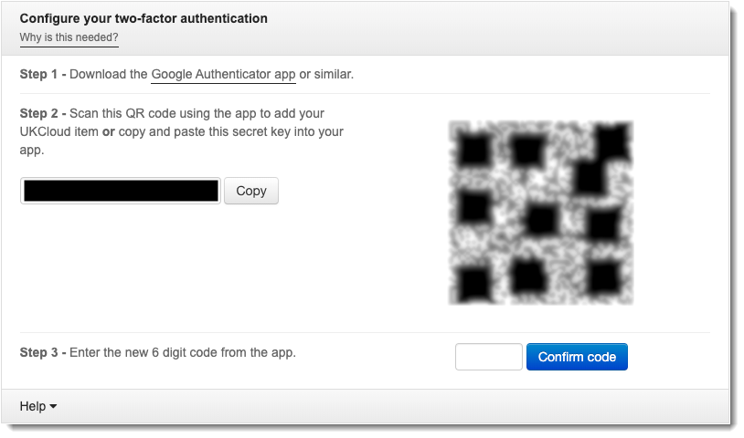

# How to set up two-factor authentication for a user account

## Overview

If your Portal administrator has enabled two-factor authentication (2FA) for a UKCloud Portal customer account, you must enter a randomly generated code, as well as your user name and password, when logging in to the Portal to access the account.

The first time you log into the Portal after 2FA is enabled for the account, you'll need to set up 2FA for your user account by registering your account with an authenticator app, such as Google Authenticator.

> [!NOTE]
> If you need to reset 2FA on your user account, for example if you lose or replace your phone, contact your Portal administrator. After your administrator resets your 2FA, the next time you log in to the Portal, you'll need to set up 2FA again. For more information, see [*How to reset two-factor authentication for a user account*](ptl-how-reset-2fa.md).

### Intended audience

This article is intended for any Portal user who needs to set up 2FA to log in to the Portal.

## Setting up 2FA

When you first log in to a Portal account that has 2FA enabled, you'll be prompted to set up 2FA:

1. Install an authenticator app, if you don't already have one, that is compatible with the UKCloud Portal.

   We've tested 2FA with Google Authenticator, which is a smart phone app, and Authy, which is available as a smart phone app, desktop app or Chrome plug-in. Other authenticator apps may also be compatible but have not been tested.

2. [*Log in to the UKCloud Portal*](ptl-gs.md#logging-in-to-the-ukcloud-portal), providing your user name and password as usual.

3. Using your authenticator app, scan the QR code or enter the security key shown in *Step 2* of the *Configure your two-factor authentication* dialog box.

   This is a one-off set up task that you will not need to repeat as part of the normal Portal login process.

   

4. Enter the 6 digit code provided by your authenticator app in *Step 3* of the *Configure your two-factor authentication* dialog box and click **Confirm code** to log in to the Portal.

5. For future logins to the Portal, use your authenticator app to generate a 2FA code to confirm your identity and complete the log in process.

## Related articles

- [*How to reset two-factor authentication for a user account*](ptl-how-reset-2fa.md)

- [*How to enable two-factor authentication in the UKCloud Portal*](ptl-how-enable-2fa.md)

## Feedback

If you find a problem with this article, click **Improve this Doc** to make the change yourself or raise an [issue](https://github.com/UKCloud/documentation/issues) in GitHub. If you have an idea for how we could improve any of our services, send an email to <feedback@ukcloud.com>.
