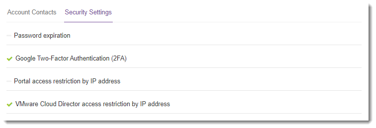

#### UKCloud Limited (“UKC”) and Virtual Infrastructure Group Limited (“VIG”) (together “the Companies”) – in Compulsory Liquidation

On 25 October 2022, the Companies were placed into Liquidation with the Official Receiver appointed as Liquidator and J Robinson and A M Hudson simultaneously appointed as Special Managers to manage the liquidation process on behalf of the Official Receiver.

Further information regarding the Liquidations can be found here: <https://www.gov.uk/government/news/virtual-infrastructure-group-limited-and-ukcloud-limited-information-for-creditors-and-interested-parties>

Contact details: 
For any general queries relating to the Liquidations please email <ukcloud@uk.ey.com> 
For customer related queries please email <ukcloudcustomers@uk.ey.com> 
For supplier related queries please email <ukcloudsuppliers@uk.ey.com>

# UKCloud Portal security settings

The UKCloud Portal provides various settings to enable you to provide additional security to your accounts.

> [!TIP]
> A green tick next to a section indicates that particular security setting has been enabled.
> 
> 

- **Password expiration** - Set passwords to expire after a specified number of days. This ensures that users change their passwords frequently.

- **Google Two-Factor Authentication (2FA)** - Add an extra level of authentication whereby users provide a security code from an authenticator app (such as Google Authenticator or Authy) as well as their password to confirm their identity.

- **Portal access restriction by IP address** - Restrict access so that users can only log in to the Portal from specific IP addresses.

- **VMware Cloud Director access restriction by IP address** - Restrict access so that users can only access VMware Cloud Director from specific IP addresses.

To change Portal security settings:

1. [*Log in to the UKCloud Portal*](ptl-gs.md#logging-in-to-the-ukcloud-portal) as an administrator.

2. If necessary, [*switch to the account*](ptl-how-switch-account.md) for which you want to change the security settings.

3. In the navigation panel, select **Settings**.

    

4. On the *Settings* page, select the **Security Settings** tab.

    

5. Click a section to expand it, make changes as required:

   - [*How to set up password expiration*](ptl-how-setup-password-expiration.md)

   - [*How to enable two-factor authentication in the UKCloud Portal*](ptl-how-setup-2fa.md)

   - [*How to restrict access to the Portal*](ptl-how-restrict-access-portal.md)

   - [*How to restrict access to VMware Cloud Director*](ptl-how-restrict-access-vcloud-api.md)

6. When you're done, click **Save**.

## Feedback

If you find an issue with this article, click **Improve this Doc** to suggest a change. If you have an idea for how we could improve any of our services, visit [UKCloud Ideas](https://ideas.ukcloud.com). Alternatively, you can contact us at <products@ukcloud.com>.
