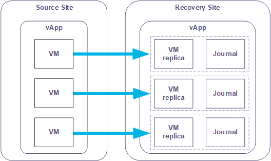
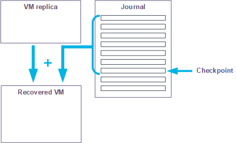

 **UKCloud Limited (“UKC”) and Virtual Infrastructure Group Limited (“VIG”) (together “the Companies”) – in Compulsory Liquidation**

On 25 October 2022, the Companies were placed into Liquidation with the Official Receiver appointed as Liquidator and J Robinson and A M Hudson simultaneously appointed as Special Managers to manage the liquidation process on behalf of the Official Receiver.

Further information regarding the Liquidations can be found here: <https://www.gov.uk/government/news/virtual-infrastructure-group-limited-and-ukcloud-limited-information-for-creditors-and-interested-parties>

Contact details: 
For any general queries relating to the Liquidations please email <ukcloud@uk.ey.com> 
For customer related queries please email <ukcloudcustomers@uk.ey.com> 
For supplier related queries please email <ukcloudsuppliers@uk.ey.com>

# Getting Started Guide for Journaling Protection

## Overview

Journaling Protection is a powerful, self-service replication and recovery tool that can help you improve your organisational resilience. By adopting UKCloud's Journaling Protection solution, you can protect your UKCloud for VMware applications by replicating them to another UKCloud for VMware‑enabled zone. This ensures that you can meet your disaster recovery requirements --- including any aggressive recovery point or recovery time objectives.

Our Journaling Protection solution is powered by Zerto, a leading provider of disaster recovery software for the cloud.

This guide covers the tasks you need to perform to get Journaling Protection up and running in your environment.

### Intended audience

This guide is intended for any user who needs to create and manage Journaling Protection for UKCloud for VMware. To complete the steps in this guide you need to have access to the Zerto Self-Service Portal.

## Introduction to Journaling Protection

You can protect your VMs by adding Journaling Protection to the vApp that contains those VMs. When you add Journaling Protection to a vApp, if a VM in that vApp is compromised, for example by a virus attack or bad software update, you can quickly recover the VM to a point in time before that attack or update took place.

You enable Journaling Protection by adding the vApp to a virtual protection group (VPG). Each VM in the protected vApp is synchronised to the recovery site and a journal is created. After this initial synchronisation, each subsequent write operation to the VM is processed as normal on the source site and a copy is asynchronously sent to the recovery site and written to the journal.

Each journal entry exists in the journal for a specified number of days (the journal history). When the journal history is reached, as new journal entries are created, older entries are written to the recovery VM's virtual disks.

Every few seconds, a checkpoint is written to every journal for each VM in the VPG to ensure crash-consistency between the VMs. If you need to recover a VM, you select a checkpoint to recover to. For example, in the case of a virus, you could recover to a checkpoint from before the attack. During recovery, the vApp and its VMs are created on the recovery site and the recovery disks for each VM are attached to the recovered VM. Information in the journal is then promoted to the VM to bring it up to the date and time of the selected checkpoint.

Two terms you may hear in connection with Journaling Protection are recovery point objective (RPO) and recovery time objective (RTO).

- The RPO indicates the amount of data you can afford to lose in the event of an outage. For example, if your application data changes fairly infrequently, your RPO can be higher as the data remains fairly static. However, if your application data is constantly changing, you'll need your RPO to be smaller to avoid significant loss of data in the event of an outage.

- The RTO is the amount of time you can tolerate your application being unavailable in the event of an outage. For example, if your application provides critical functionality, you'll need to bring it back online very quickly. However, for a less critical application, you may be able to tolerate a longer outage.

Because of the use of regular checkpoints (every few seconds), our Zerto‑powered Journaling Protection option provides a minimal RPO. The ability to use recovered VMs even before all the journal data has been promoted provides a good RTO as well.

## Before you begin

When you request Journaling Protection for your VMs, UKCloud provides you with:

- A ZORG ID to identify your environment within Zerto

- Access to the Zerto Self-Service Portal (ZSSP), where you can create and manage your VPGs

You should consider the following:

- Journaling Protection is provided on a vApp basis (not for individual VMs). When designing your application, you should use vApps to group related VMs together to ensure crash consistency between VMs in the event of a failover.

- VMs must be powered on to be synchronised.

- The operating system used by the protected VMs must also be supported in the recovery site.

- Our Journaling Protection service option captures every action. When a VM is deleted from your vApp, the associated journal is also deleted. If you want to keep historic records of VMs that are no longer running on the platform, consider UKCloud's Snapshot Protection service option.

- We provide service profiles for 2, 7, 14 and 28 day retention. The details of these are available in the [*Journaling Protection Service Scope*](vmw-sco-journaling-protection.md). We do not currently provide the option for you to create custom profiles.

## Getting Journaling Protection up and running

To get Journaling Protection up and running for your VMs, follow the steps below:

1. [Create a recovery VDC](#create-a-recovery-vdc)

2. [Configure networking on the recovery site](#configure-networking-on-the-recovery-site)

3. [Create a virtual protection group](#create-a-virtual-protection-group)

4. [Perform a test failover](#perform-a-test-failover)

### Create a recovery VDC

To recover your VMs to a different UKCloud site, you must have a VDC in the intended recovery site. If you already have a compute service in the recovery site, you can use an existing VDC or you can create a new one using:

- The UKCloud Portal (for more information see the [*Getting Started Guide for UKCloud for VMware*](vmw-gs.md))

- The UKCloud Portal API (for more information see the [*How to use the UKCloud Portal API*](../portal/ptl-how-use-api.md))

If you don't already have a compute service in the recovery site or you'd prefer UKCloud to create the VDC for you, you can request this as part of your Journaling Protection Service Request.

### Configure networking on the recovery site

You must configure any internally and externally routed networks in your recovery site to duplicate those in the source site. You must also configure the edge gateway with the same firewall, NAT and other rules.

You'll create the mapping between these networks when you create your VPG (see [*How to create a virtual protection group*](vmw-how-zerto-create-vpg.md)).

In the event of a failover, external access to the recovery site will be via a different IP address. You'll need to account for any required DNS changes and external connectivity configuration (such as VPNs), to ensure continued external access. Utilising UKCloud's VMware cloud, you can configure this in advance. Alternatively, you can use load balancing technologies to manage a seamless switch between environments.

You do not need to configure vApp networks in advance as they will be replicated within the VPG.

### Create a virtual protection group

A virtual protection group (VPG) is a collection of VMs that are grouped together for protection purposes. The UKCloud Journaling Protection service option protects VMs on a vApp basis. When you create a VPG, you specify the vApp to protect and all the VMs in that vApp are protected.

For example, in a standard three-tier application, you will likely have three VMs: one for your application, one for the database and one for the web server. As best practice, you should create these three related VMs in a single vApp, which you can then add to a VPG so that all the VMs are replicated (and recovered) together.

For more information, see [*How to create a virtual protection group*](vmw-how-zerto-create-vpg.md).

### Perform a test failover

After you create your VPG, we recommend that you perform a test failover to confirm that your VMs will be recovered correctly in the event of a live failover.

You should also run test failovers periodically to ensure that your VMs can still be recovered successfully.

For more information, see [*How to perform a failover*](vmw-how-zerto-perform-failover.md).

## Next steps

You have now performed all the steps needed to set up Journaling Protection for your VMs.

If you experience a disaster, such as a virus attack, you can perform a live failover to recover your VMs to a specific point in time before the disaster occurred and continue operation as usual. For more information, see [*How to perform a failover*](vmw-how-zerto-perform-failover.md).

## Glossary

This glossary provides definitions of terms specific to Journaling Protection.

**failover**&nbsp;&nbsp;When an application switches to an alternative environment in order to
ensure continued operation.

**journal**&nbsp;&nbsp;A repository of write operations performed on a protected VM after the
initial synchronisation.

**source site**&nbsp;&nbsp;The UKCloud site where your live VMs are located.

**recovery point objective (RPO)**&nbsp;&nbsp;The amount of data you can afford to lose in the event of an outage.

**recovery site**&nbsp;&nbsp;The UKCloud site to which your VMs are replicated for protection.
Sometimes also called the target site.

**recovery time objective (RTO)**&nbsp;&nbsp;The amount of time you can tolerate your application being unavailable in the event of an outage.

**virtual protection group (VPG)**&nbsp;&nbsp;A collection of VMs that are grouped together for protection purposes.

**Zerto**&nbsp;&nbsp;The third party software vendor used by UKCloud to power our Journaling
Protection solution.

**Zerto Self-Service Portal (ZSSP)**&nbsp;&nbsp;The web-based graphical interface you use to create and manage your VPGs.

## Feedback

If you find a problem with this article, click **Improve this Doc** to make the change yourself or raise an [issue](https://github.com/UKCloud/documentation/issues) in GitHub. If you have an idea for how we could improve any of our services, send an email to <feedback@ukcloud.com>.
