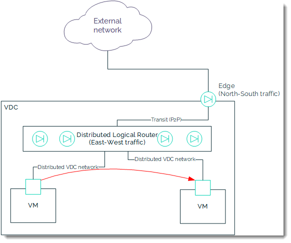

# How to configure a Distributed Logical Router

## Overview

UKCloud for VMware provides Distributed Logical Router (DLR) functionality as part of its Advanced Management bundle (additional charges apply). DLR optimises the routing of east-west traffic within your VDCs, using a hypervisor on the source VM to limit traffic flow to a maximum of two hosts (the source and a destination), without the need to route traffic back through the edge gateway. As well as providing much better performance, DLR can scale up to 1000 routed logical networks (rather than the 10 logical network limit imposed by traditional edge gateway routing).

## Before you begin

Before enabling DLR, consider the following:

- You must have purchased the Advanced Management bundle for your UKCloud for VMware service
- Your advanced gateway must have one free interface for DLR to use for the transit (P2P) network
- IPv6 is not supported with DLR
- L2 VPN is not supported on a distributed VDC network
- vApp routed networks are not supported
- You can only have one DLR instance per VDC edge gateway
- You can create up to 1000 distributed networks per edge gateway
- You cannot distribute a VLAN-based network
- Your local subnets should not overlap with the transit network (`10.255.255.248/30`)
- You cannot modify the transit connection between the edge gateway and DLR
- You can change auto-generated DHCP and static route configurations on the edge gateway
- To disable DLR on the edge gateway, you must first remove all distributed networks
- You can migrate existing VDC networks to distributed network without service disruption
- You cannot run more than one routing protocol on each DLR (BGP or OSPF)
- If you use OSPF, you cannot run it on more than one DLR uplink
- Dynamic routing protocols are only supported on uplink interfaces

## Enabling distributed routing for Distributed Logical Router

To enable distributed routing, you must use the vCloud Director Web Console.

1. In the top-right corner of the vCloud Director Tenant UI, click your user name, then select **Legacy UI**.

    

2. Select the **Administration** tab.

    

3. Double-click your VDC, then select the **Edge Gateways** tab.

    

4. Right click the edge gateway for which you want to enable DLR and select **Enable Distributed Routing**.

    

5. Click **Yes** to confirm your selection.

6. To return to the Tenant UI, click **Try the new portal** at the top of the page.

    

## Creating a distributed network

After you've enabled distributed routing, you can create your distributed networks. You can create up to 1000 distributed networks per edge gateway.

# [In vCloud Director 9.7](#tab/tabid-1)

1. In the vCloud Director *Virtual Datacenters* dashboard, select your VDC.

2. In the left navigation panel, select **Networks**.

    

3. Click **Add**.

    

4. In the *Network Type* page of the *New Organization VDC Network* dialog box, select **Routed** then click **Next**.

    

5. On the *General* page, enter a **Name** and **Description** for the network.

6. In the **Gateway CIDR** field, the gateway address for the network.

7. Select the **Shared** option to make the network available to other VDCs within the same region.

    

8. Click **Next**.

9. On the *Edge Connection* page, select the edge gateway that you want your network to connect to.

    > [!NOTE]
    > The edge must be an advanced gateway and must have distributed routing enabled.

10. From the **Interface Type** list, select **Distributed**.

    

11. Click **Next**.

12. Complete the remaining fields in the dialog box as you would for any other routed network.

    For more detailed instructions, see [*How to create a routed VDC network*](vmw-how-create-routed-network.md).

13. When you're done, click **Finish**.

# [In vCloud Director 9.1](#tab/tabid-2)

1. In the vCloud Director *Virtual Datacenters* dashboard, select your VDC.

2. In the left navigation panel, select **Network**.

    

3. Click **Add**.

    

4. In the *Add Org VDC Network* dialog box, select **Routed network connecting to an existing edge gateway**.

    

5. Select the **Edge Gateway** that you want your network to connect to.

    > [!NOTE]
    > The edge must be an advanced gateway and must have distributed routing enabled.

6. From the **Interface type** list, select **Distributed**.

    

7. Complete the remaining fields in the dialog box as you would for any other routed network.

    For more detailed instructions, see [*How to create a routed VDC network*](vmw-how-create-routed-network.md).

8. When you're done, click **Save**.

***

## Feedback

If you find an issue with this article, click **Improve this Doc** to suggest a change. If you have an idea for how we could improve any of our services, visit the [Ideas](https://community.ukcloud.com/ideas) section of the [UKCloud Community](https://community.ukcloud.com).
