# How to create a catalog

## Overview

UKCloud provides a public catalog for you to use that contains standard virtual machine (VM) sizes and operating systems. The public catalog is a good place to start when you first deploy VMs into the UKCloud platform. However, you may want to create your own catalogs, containing specific applications or gold images, which you can then use to deploy VMs quickly.

## Creating a catalog

The first step is to create an empty catalog:

1. In the VMware Cloud Director top menu, select **Libraries**.

   

2. In the left navigation panel, under *Content Libraries*, select **Catalogs**.

   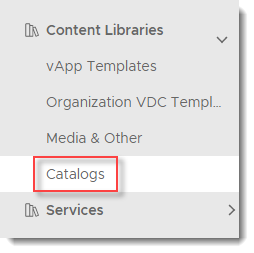

3. On the *Catalogs* page, click **New** to create a new catalog.

   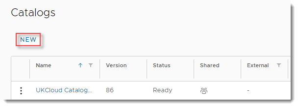

4. In the *Create Catalog* dialog box, enter a **Name** for the catalog and give it a **Description** if needed.

   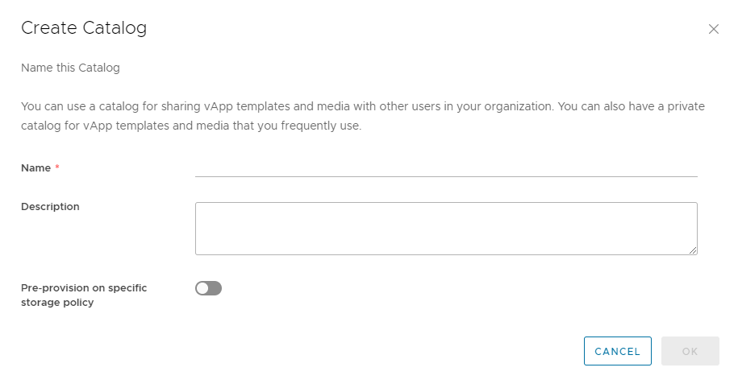

5. To specify a particular storage policy for the catalog, select the **Pre-provision on specific storage policy** option. Select the appropriate **Org VDC**, then select the **Storage Policy**.

   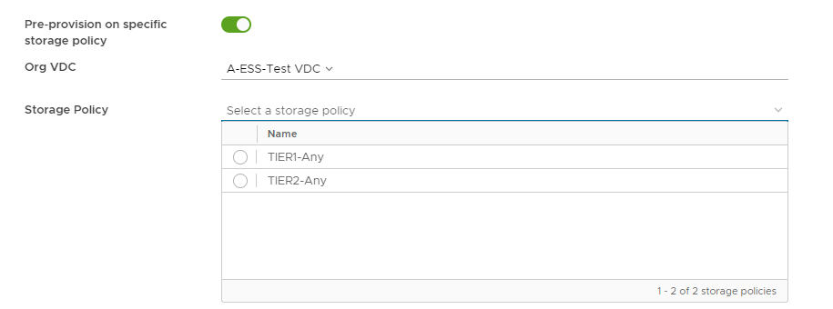

6. When you're done, click **OK**.

7. To make the catalog visible to others within your organisation, click catalog menu (three vertical dots) and select **Share**.

   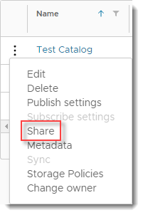

8. In the *Share Catalog* dialog box, from the **Share with** radio buttons, select:

    - **All Users and Groups** to share the catalog with everyone in the organisation.

    - **Specific Users and Groups** to share the catalog with individual users or groups of users. Select the users and groups from the list below by selecting the appropriate check boxes and selecting the appropriate access level (**Read Only**, **Read/Write** or **Full Control**) from the **Access Level** list.

      - **Read Only** to view the contents of the catalog

      - **Read/Write** to view the contents of the catalog and add content to the catalog

      - **Full Control** to have full control of the catalog's content and settings

    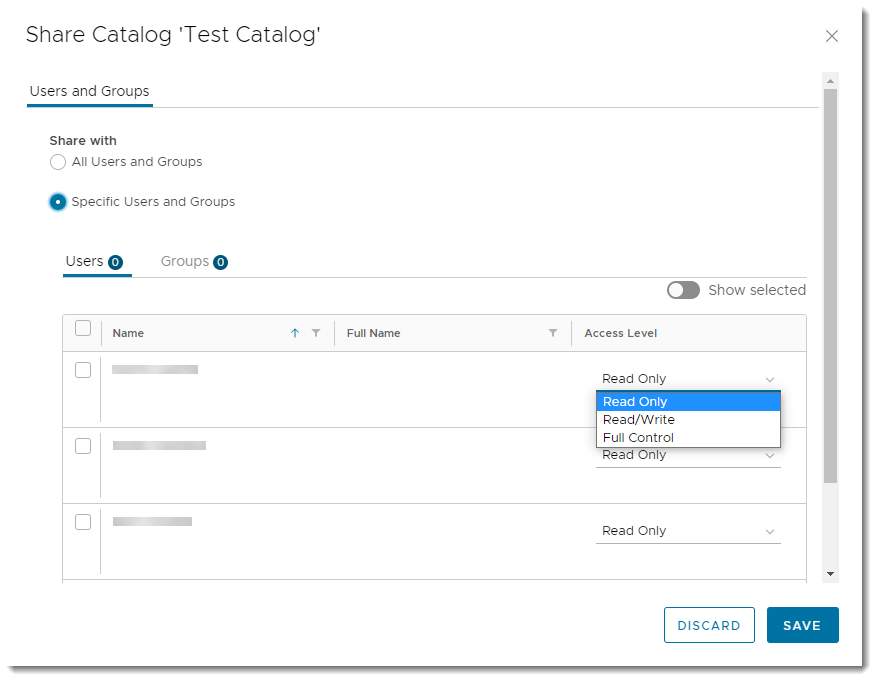

9. When you've added all the people who you want to access the catalog, click **Save**.

## Populating a catalog

There are two ways to populate a catalog:

- [*Create a template from an OVF package*](#creating-a-template-from-an-ovf-package)

- [*Create a template from an existing vApp*](#adding-an-existing-vapp)

### Creating a template from an OVF package

You can add items to a catalog by creating a vApp template from an OVF package.

> [!NOTE]
> Depending on the file size and network speed, the upload of the OVF file may take some time.

1. In the VMware Cloud Director top menu, select **Libraries**.

   

2. In the left navigation panel, under *Content Libraries*, select **vApp Templates**.

   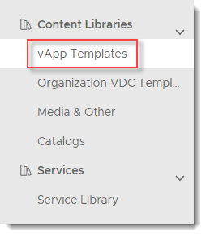

3. On the *vApps Templates* page, click **New**.

    

4. In the *Create vApp template from OVF* dialog box, select the source of the OVF either by entering a **URL** or clicking the **Browse** icon to locate the file on your computer.

    

    > [!TIP]
    > You can select multiple files by pressing the CTRL key and selecting additional files.

5. Click **Next**.

6. On the *Review Details* page, confirm the details of the OVF template and then click **Next**.

7. On the *Select vApp Template Name* page, enter a **Name** and **Description** for the template.

8. From the **Catalog** list, select the catalog to which you want to add the template, then click **Next**.

    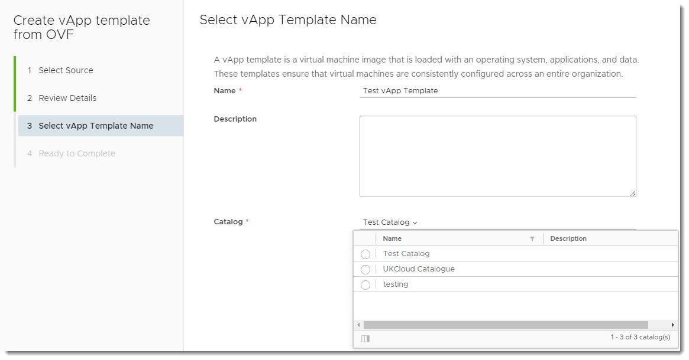

9. On the *Ready to Complete* page, review the details of the vApp template and when you're done, click **Finish** to deploy.

### Creating a template from an existing vApp

You can also add content to a catalog by creating a vApp template from an existing vApp.

1. In the VMware Cloud Director *Virtual Data Center* dashboard, select the VDC that contains the vApp you want to use for the template.

2. In the left navigation panel, select **vApps**.

   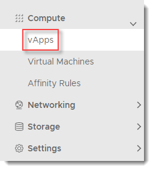

3. In the card for the vApp that you want to use for the template, select **Actions** then **Create Template**.

   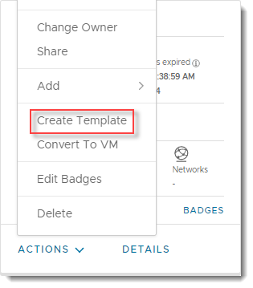

   > [!NOTE]
   > You can use both running and stopped vApps to create a template, although it's worth noting that creating a template from a running vApp could affect performance.

4. In the *Add to Catalog* dialog box, from the **Catalog** list, select the catalog you want to add the vApp template to.

   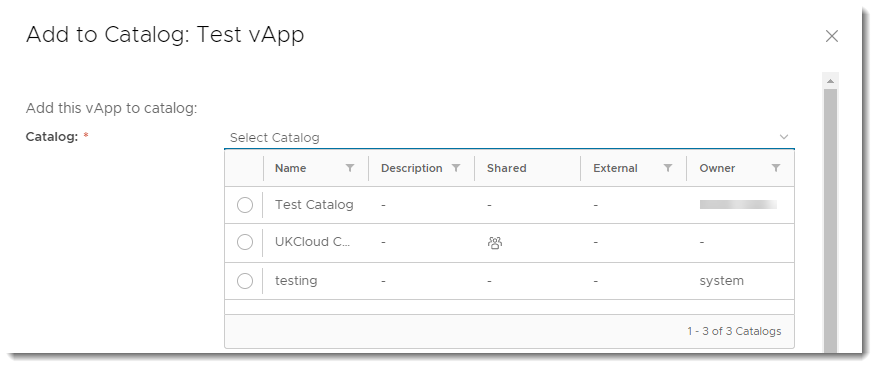

5. You can overwrite an existing template in the catalog by selecting **Overwrite catalog item** then selecting the item to overwrite. If the catalog you're adding the vApp to is published externally, you'll see a warning.

   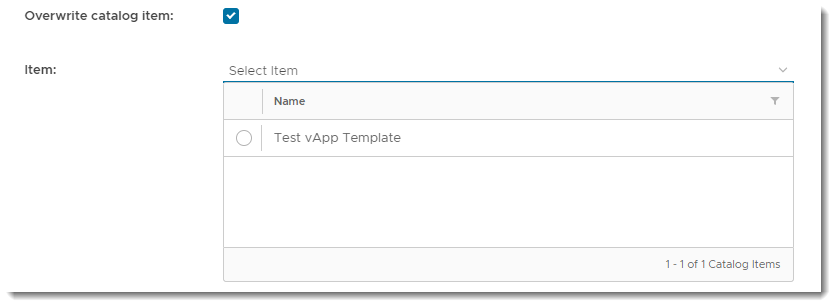

6. Give the vApp template a **Name** and **Description**.

   > [TIP]
   > If you've chosen to overwrite an existing catalog item, the name will be taken from that existing item and the **Name** field will not be available.

7. From the **When using this template** radio button, select what should happen when a vApp is created from this template:

   - **Make identical copy** creates an identical copy of the vApp on which the template is based

   - **Customize VM settings** enables customisation of the VM settings

   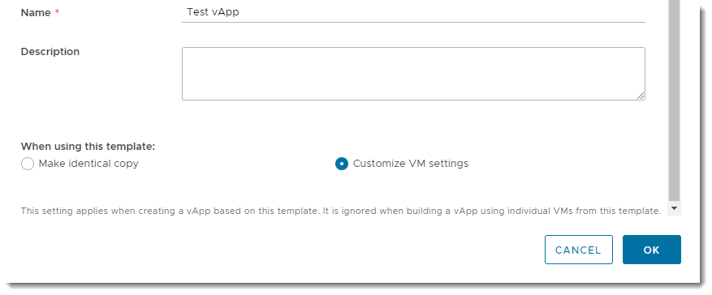

8. When you're done, click **OK**.

   You can check the progress by expanding the *Recent Tasks* section at the bottom of the VMware Cloud Director interface.

## Feedback

If you find a problem with this article, click **Improve this Doc** to make the change yourself or raise an [issue](https://github.com/UKCloud/documentation/issues) in GitHub. If you have an idea for how we could improve any of our services, send an email to <feedback@ukcloud.com>.
