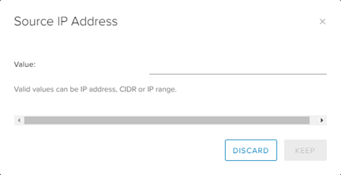
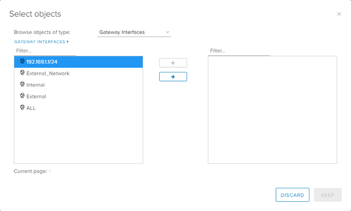
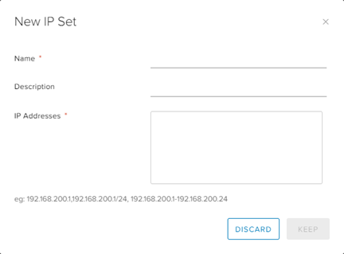
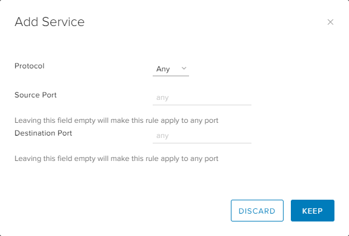

#### UKCloud Limited (“UKC”) and Virtual Infrastructure Group Limited (“VIG”) (together “the Companies”) – in Compulsory Liquidation

On 25 October 2022, the Companies were placed into Liquidation with the Official Receiver appointed as Liquidator and J Robinson and A M Hudson simultaneously appointed as Special Managers to manage the liquidation process on behalf of the Official Receiver.

Further information regarding the Liquidations can be found here: <https://www.gov.uk/government/news/virtual-infrastructure-group-limited-and-ukcloud-limited-information-for-creditors-and-interested-parties>

Contact details: 
For any general queries relating to the Liquidations please email <ukcloud@uk.ey.com> 
For customer related queries please email <ukcloudcustomers@uk.ey.com> 
For supplier related queries please email <ukcloudsuppliers@uk.ey.com>

# How to create firewall rules

## Overview

VMware Cloud Director provides a fully featured layer 3 firewall to control transit from inside to outside security boundaries, and within the various VDC networks you create.

When you specify networks or IP addresses, you can use:

- An individual IP address

- IP ranges separated by a dash (`-`)

- A CIDR, for example, `192.168.2.0/24`

- The keywords `internal`, `external` or `any`

> [!NOTE]
> For security reasons, you should ensure that the firewall is always enabled.

## Creating firewall rules

To create a firewall rule:

1. In the VMware Cloud Director *Virtual Data Center* dashboard, select the VDC that contains the edge gateway in which you want to create the firewall rules.

2. In the left navigation panel, under *Networking*, select **Edges**.

    

3. On the *Edge Gateways* page, select the edge that you want to configure and click **Services**.

    

4. On the *Edge Gateway* page, select the **Firewall** tab.

    

5. On the *Firewall Rules* page, click the **+** button to add a new row to the firewall rules table.

    

6. In the row for your new rule, select the **Name** field and enter a name for the rule.

    

    > [!NOTE]
    > When you first create a rule, it's set to Any, Any, Any, Accept, as shown above. We strongly advise that you do not use these default settings for any firewall rule as this allows all traffic through.

7. Select the **Source** and **Destination** fields and specify the source and destination addresses for the firewall rule.

    - To specify an IP address or range, click **IP** and enter the appropriate **Value**. When you're done, click **Keep**.

        

    - To specify a group of VMs or IP addresses, click **+** and select the desired objects. When you're done, click **Keep**.

        

      > [TIP]
      > If you're likely to reuse the same group of source or destination IP addresses in multiple rules, select the **Grouping Objects** tab and click **+** to create an IP set. You can then select this IP set in the *Select objects* dialog box.
      >
      >    

8. Select the **Service** field and click **+**.

9. In the *Add Service* dialog box, specify the **Protocol**, **Source Port** and **Destination Port** for the rule. When you're done, click **Keep**.

    

10. Select the **Action** field, and from the list select whether the rule is an **Accept** or **Deny** rule.

11. If you have a syslog server configured, select the **Enable logging** check box.

    For more information about syslog servers, see [*How to access syslog data for your edge gateway*](vmw-how-access-syslog-data-adv.md).

12. Click **Save changes**.

    

## Example

A common use case for a firewall rule is to allow SSH through from the internet. The following example uses allocated public IP addresses.

- For VDCs in the Assured OFFICIAL security domain, you're assigned five public IP addresses

- For VDCs in the Elevated OFFICIAL security domain, you're assigned three PSN IP addresses

In the example below, the source is `any` (any IP address within the VDC). The source port is also `any`. The destination is a public IP address and the destination port is `443` for HTTPS.

## Next steps

In this article you've learned how to create firewall rules. For other edge gateway configuration tasks, see:

- [*How to create NAT rules*](vmw-how-create-nat-rules.md)

- [*How to create a DHCP pool*](vmw-how-create-dhcp-pool.md)

- [*How to configure IPsec VPN*](vmw-how-configure-ipsec-vpn.md)

- [*How to configure a load balancer*](vmw-how-configure-load-balancer.md)

- [*How to create a static route*](vmw-how-create-static-route.md)

## Feedback

If you find a problem with this article, click **Improve this Doc** to make the change yourself or raise an [issue](https://github.com/UKCloud/documentation/issues) in GitHub. If you have an idea for how we could improve any of our services, send an email to <feedback@ukcloud.com>.
