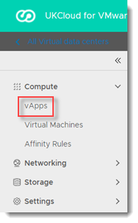
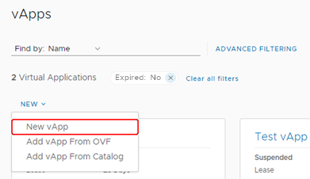
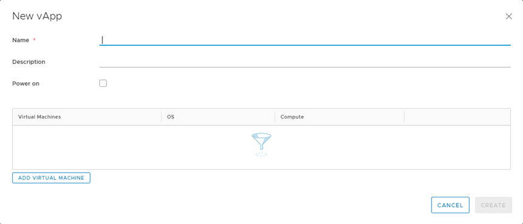

# How to create a vApp

## Overview

vCloud Director/VMware Cloud Director uses vApps to make virtual machine (VM) creation and management easy and flexible. vApps are essentially containers for VMs and can be used in many ways. One of the most common uses of a vApp is to group similar VMs together for easy management. Or you can put VMs that form a multi-tier application into the same vApp for greater control. You can create up to 128 vApps within a virtual data centre (VDC) and intelligently network them to create complex architectures that can be managed easily.

In this article we'll look at how to create a vApp from scratch.

### [vCloud Director 9.7](#tab/tabid-a)

1. In the vCloud Director *Virtual Datacenters* dashboard, select the VDC in which you want to create the vApp.

2. In the left navigation panel, select **vApps** to view a list of vApps within the VDC.

    

3. Click **New vApp**.

    

4. In the *New vApp* dialog box, enter a **Name** and **Description** for your vApp. The name should be something that will easily identify it if you're building a large environment with multiple vApps.

    

5. You can now click **Add Virtual Machine** to populate the vApp with VMs. There are several ways to create a VM:

    - From an existing template (see [*How to create a VM from a template*](vmw-how-create-vm-from-template.md)).

        Catalog creation is covered in [*How to create a catalog*](vmw-how-create-catalog.md).

    - From scratch, without using a template (see [*How to create a virtual machine from scratch*](vmw-how-create-vm-from-scratch.md)).

6. When you've finished creating your vApp, click **Create**.

7. When your vApp has finished deploying, in the card for the vApp, select **Actions** then **Power On** to power it on.

### [VMware Cloud Director 10.1](#tab/tabid-b)

1. In the VMware Cloud Director *Virtual Data Center* dashboard, select the VDC in which you want to create the vApp.

2. In the left navigation panel, under *Compute*, select **vApps** to view a list of vApps within the VDC.

    

3. In the *vApps* page, click **New**, then select **New vApp**.

    

4. In the *New vApp* dialog box, enter a **Name** and **Description** for your vApp.

    The name should be something that will easily identify it if you're building a large environment with multiple vApps.

5. Select the **Power on** check box if you want the vApp to start up as soon as you finish creating it.

    

6. Click **Add Virtual Machine** to populate the vApp with VMs.

7. In the *New VM* dialog box, select:

    - **New** to create a VM from scratch, without using a template (see [*How to create a virtual machine from scratch*](vmw-how-create-vm-from-scratch.md)).

    - **From Template** to create a VM from an existing template (see [*How to create a VM from a template*](vmw-how-create-vm-from-template.md)).

8. When you've finished adding VMs to your vApp, in the *New vApp* dialog box, click **Create**.

***

## Feedback

If you find a problem with this article, click **Improve this Doc** to make the change yourself or raise an [issue](https://github.com/UKCloud/documentation/issues) in GitHub. If you have an idea for how we could improve any of our services, send an email to <feedback@ukcloud.com>.
