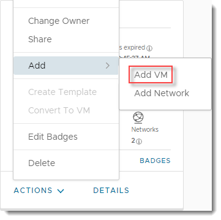
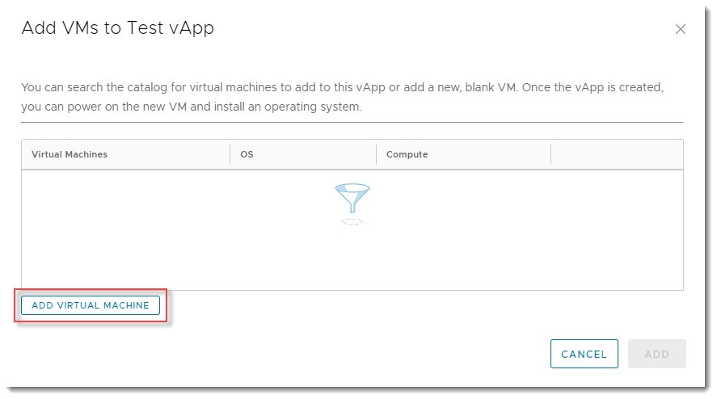
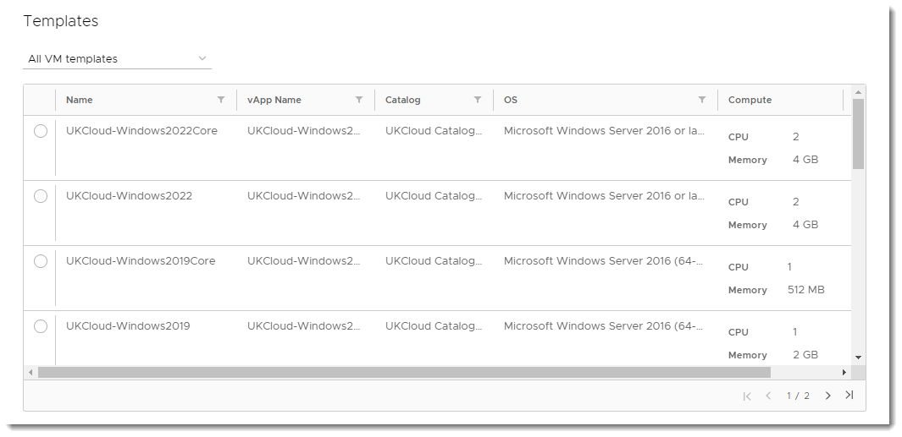

# How to create a virtual machine from a template

## Overview

To simplify the process of creating a virtual machine (VM), you can use a pre-built VM template from a catalog.

For information about catalogs, see [*How to create a catalog*](vmw-how-create-catalog.md). For information about creating a VM from scratch, see [*How to create a VM from scratch*](vmw-how-create-vm-from-scratch.md).

## Creating a VM from a template

1. In the VMware Cloud Director *Virtual Data Center* dashboard, select the VDC that contains the vApp in which you want to create the VM.

2. In the left navigation panel, under *Compute*, select **vApps** to view a list of vApps within the VDC.

   

   > [!TIP]
   > To create a standalone VM, in the left navigation panel, select **Virtual Machines**, then click **New VM**.

3. In the card for the vApp in which you want to create the VM, select **Actions** > **Add** > **Add VM**.

   

   > [!TIP]
   > To create a new vApp, see [*How to create a vApp*](vmw-how-create-vapp.md).

4. In the *Add VMs* dialog box, click **Add Virtual Machine**.

   

5. In the *New VM* dialog box, enter a **Name**, **Computer Name** and **Description** for your VM.

   > [!NOTE]
   > **Name** is a name to identify the VM, **Computer Name** is the host name of the VM.
   >
   > The **Computer Name** is copied from the **Name** field but can contain only alphanumeric characters and hyphens so you may need to edit it if your VM **Name** contains spaces or special characters.

6. From the **Type** radio buttons, select **From Template**.

   

7. In the *Templates* section, select the template that you want to use for your VM, depending on your required operating system and VM size.

    

    > [!TIP]
    > For information about creating vApp catalogs, see [*How to create a vApp catalog*](vmw-how-create-catalog.md)

8. In the *Storage* section, set the **Storage Policy** for the VM.

   

9. In the *NICs* section, you can set the **IP Mode** to determine how IP addresses are assigned:

    - **DHCP** Cloud Director interacts with the OS via VMware Tools to use DHCP rather than static IPs. You'll need to define a DHCP server on your edge gateway. Check with UKCloud or your organisation administrator that this is set up before you use it.

    - **IP Pool** is the usual method, which injects an IP address into the VM via VMware Tools from a list of available IP addresses. The address may vary with each boot, but there is a check box to keep IP address assignments elsewhere within the UI once the VMs are
    created.

    - **Manual IP** is similar to IP Pool, but you need to enter a valid **IP Address** from the pool, which the VM will then keep.

    

    > [!NOTE]
    > We recommend using the VMXNET3 network adapter where possible. The VMXNET virtual network adapter has no physical counterpart and is optimised for performance in a VM. Because operating system vendors don't provide built-in drivers for this card you must install VMware Tools to have a driver for the VMXNET network adapter available.
    >
    > If you want a more comprehensive guide on network adapter types, see the VMware documentation for [Network Adapter Basics](https://docs.vmware.com/en/VMware-vSphere/7.0/com.vmware.vsphere.vm_admin.doc/GUID-AF9E24A8-2CFA-447B-AC83-35D563119667.html).

10. When you're done, click **OK**.

11. Back in the *Add VMs* dialog box, you can create more VMs or click **Add** when you're done.

## Next steps

After you initially create your VM, you may want to edit some of the properties to finish setting it up. For more information, see [*How to view and update virtual machine settings*](vmw-how-update-vm-settings.md).

If you haven't already, you may want to create networks to enable your VMs to communicate with each other and the outside world. For more information, see [*How to create a routed VDC network*](vmw-how-create-routed-network.md) and [*How to create an isolated VDC network*](vmw-how-create-isolated-network.md).

You may also want to create rules to enable traffic into and out of your VMs. For more information, see [*How to create firewall rules*](vmw-how-create-firewall-rules.md) and [*How to create NAT rules*](vmw-how-create-nat-rules.md).

## Feedback

If you find a problem with this article, click **Improve this Doc** to make the change yourself or raise an [issue](https://github.com/UKCloud/documentation/issues) in GitHub. If you have an idea for how we could improve any of our services, send an email to <feedback@ukcloud.com>.
