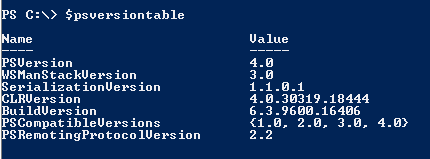
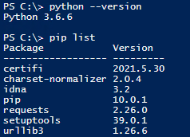
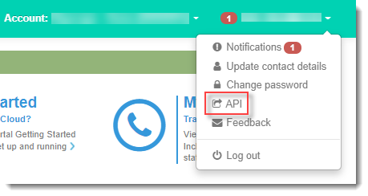

# How to interact with the Cloud Director REST API using PowerShell and Python

## Pre Work

### Useful Links

You can find the schema reference for version 34.0 of the Cloud Director API here:

<https://code.vmware.com/apis/912/vmware-cloud-director>

### PowerShell

With PowerShell, you'll need v3 or higher. To check this, open PowerShell and enter `$psversiontable` at the prompt. You should see something like the following:



If `PSVersion` is less than 3.0, you'll need to upgrade. The v4 package is available here: <https://www.microsoft.com/en-gb/download/details.aspx?id=40855>.

### Python

Install Python 3.10: <https://www.python.org/downloads>

Then, install the package: <https://pypi.org/project/requests/>

You can check your version of Python and whether the requests package is installed by typing the following commands:



### Getting your credentials

The first thing you'll need to do is log in to the Portal and get your API credentials:



Select API from the menu on the top right, you'll then get all of the credentials for each of the Cloud Director organisations that you have access to. Note down the **API URL** and **API Username** for the organisation you want to interact with.

For more detailed instructions, see [*How to access VMware Cloud Director through the Cloud Director API*](vmw-how-access-vcloud-api.md).

## Getting Started

### PowerShell

1. Copy and paste the following script into a .psm1 file:

   ```none
   $Global:SkyscapeURL = "https://<api-url>/api"

   $Global:Authorization = ""

   $Global:Accept = "application/*+xml;version=34.0"

   $Global:xvCloudAuthorization = ""

   Function New-vCloudLogin($Username,$Password)

   {

       $Pair = "$($Username):$($Password)"

       $Bytes = [System.Text.Encoding]::ASCII.GetBytes($Pair)

       $Base64 = [System.Convert]::ToBase64String($Bytes)

       $Global:Authorization = "Basic $base64"

       $headers = @{ Authorization = $Global:Authorization; Accept = $Global:Accept}

       $Res = Invoke-WebRequest -Method Post -Headers $headers -Uri "$($Global:SkyscapeURL)/sessions"

       $Global:xvCloudAuthorization = $res.headers["x-vcloud-authorization"].tostring()

   }

   Function Get-vCloudRequest($EndPoint)

   {

       $headers = @{"Accept" = $Global:Accept; "x-vcloud-authorization" = $Global:xvCloudAuthorization}

       [xml]$Response = Invoke-WebRequest -Method Get -Headers $headers -Uri "$($Global:SkyscapeURL)/$EndPoint"

       Return $Response

   }
   ```

    You'll now have two new functions available to you; `New-vCloudLogin` and `Get-vCloudRequest`.

2. In a new PowerShell window, run the following command to import the file:

    `Import-Module <Path to .psm1 file>`

3. To log in enter:

   `New-vCloudLogin –Username "myuser@org" –Password "yourportalpassword"`

4. Use the username that you copied from the Portal earlier and your Portal password. This will log in to Cloud Director and add your authorisation header to a global variable for use in the next function:

   `$VMS = Get-vCloudRequest –EndPoint "query?type=vm"`

5. This will get the first 25 VMs in your Org and store them in `$VMS` as an XML output, which you can inspect or export as you want.

#### Other examples

`$VMS = Get-vCloudRequest –EndPoint "query?type=vm&pageSize=128"` Returns 128 VMs rather than 25

`$VMS = Get-vCloudRequest –EndPoint "query?type=vm&page=2"` Returns the second page of 25 VMs

`$VAPPS = Get-vCloudRequest –EndPoint "query?type=vApp"` Returns the first 25 vApps in an Org

`$VDC = Get-vCloudRequest –EndPoint "query?type=orgVdc"` Returns the first 25 VDCs in an Org

### Python

1. Save the following into a file, for example: `c:\vcloud_demo.py`:

    ```none
   import base64

   import requests

   SkyscapeURL = "https://<api-url>/api"

   Authorization = ""

   Accept = "application/*+xml;version=34.0"

   xvCloudAuthorization = ""

   def New_vCloudLogin(username,password):

       global Authorization

       global Accept

       global SkyscapeURL

       global xvCloudAuthorization

       Pair = "{username}:{password}".format(username=username,password=password)

       {{EncodedPair }}= base64.b64encode(Pair.encode('utf-8')).decode()

       Authorization = "Basic %s" % str(EncodedPair)

       apiheaders = {"Authorization" : Authorization, "Accept" : Accept}  

       res = requests.post(SkyscapeURL + '/sessions',headers=apiheaders, verify=False)

       xvCloudAuthorization = res.headers['x-vcloud-authorization']

    def Get_vCloudRequest(endpoint):

       global Authorization

       global Accept

       global SkyscapeURL

       global xvCloudAuthorization

       apiheaders = {"Accept" : Accept, "x-vcloud-authorization" : xvCloudAuthorization}  

       res = requests.get(SkyscapeURL + '/' + endpoint,headers=apiheaders, verify=False)

       return (res.content)

    # login to Cloud Director

    New_vCloudLogin("user@org","mypassword")

    # demo query, get all VMs and print them to screen

    data = Get_vCloudRequest("query?type=vm")

    print data
    ```

2. Now, click **Start** and enter `cmd`. This will bring up a command prompt.

3. You can run this script by entering:

    `C:\python310\python.exe c:\vcloud_demo.py`

    The above example will log you into Cloud Director and return an XML representation of the first 25 VMs in your VDC. You can adjust the script to use the same parameters as the examples in the PowerShell script above.

## Feedback

If you find a problem with this article, click **Improve this Doc** to make the change yourself or raise an [issue](https://github.com/UKCloud/documentation/issues) in GitHub. If you have an idea for how we could improve any of our services, send an email to <feedback@ukcloud.com>.
