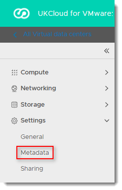

# How to locate your virtual data centre on the UKCloud platform

## Overview

Each virtual data centre (VDC) exists in a particular location within the UKCloud platform. UKCloud stores metadata against each VDC to indicate where within the platform the VDC resides. Using this metadata, you can locate your VDC by site, region and zone. For more information about the organisation of the UKCloud platform, see [*Understanding sites, regions and zones*](../other/other-ref-sites-regions-zones.md).

Knowing where your VDCs are located can be useful for:

- Determining how resilient your applications are

- Determining how Planned or Emergency Maintenance or an unplanned outage may affect your applications

- Providing additional information to help with support call resolution

This article describes how to find out where your VDC is within the UKCloud platform. You can use the VMware Cloud Director Tenant Portal or the API.

The information provided by the VDC metadata is read-only. If you want to change the location of a VDC, raise a Support Request from the [My Calls](https://portal.skyscapecloud.com/support/ivanti) section of the UKCloud Portal.

## Finding the location of a VDC (Tenant Portal)

You can view a VDC's metadata in the VMware Cloud Director Tenant Portal to find out where the VDC is located.

1. In the VMware Cloud Director *Virtual Data Center* dashboard, select the VDC that you want to locate.

2. In the left navigation panel, under *Settings*, select **Metadata**.

    

3. The following fields indicate the location of your VDC:

    - **provider-site** - indicates the site in which your VDC is located: **Farnborough** or **Corsham**

    - **provider-region** - indicates the region in which your VDC is located, for example **1** or **5**.

    - **provider-zone** - indicates the zone in which your VDC is located, for example **1(AF2)** or **B**

    

### A note about Synchronous Protection

> [!NOTE]
> Synchronous Protection is no longer available as a protection option for UKCloud for VMware. UKCloud offers two alternative data protection solutions: [Jounaling Protection (Zerto)](vmw-sco-journaling-protection.md) and [Snapshot Protection](vmw-sco-snapshot-protection.md). Contact your Service Delivery Manager for more information.
>
> We will continue to provide support to customers who previously added Synchronous Protection to their environment, although we would encourage considering using Journaling Protection instead.

If you set up your VDC to use Synchronous Protection, then the VDC is stretched across multiple sites. The metadata indicates this as follows:

- **provider-protection-synchronous** is **Yes**

- **provider-site** - indicates that your VDC is stretched across both sites: **Farnborough or Corsham**

- **provider-region** - indicates that your VDC is stretched across multiple regions, for example **1 or 2**

- **provider-zone** - indicates that your VDC is stretched across multiple zones, for example **1(AE1) or 2(AE2)**

## Finding the location of a VDC (Cloud Director API)

You can also find the location of your VDC by calling the Cloud Director API. For more information about the Cloud Director API, see the [VMware Cloud Director API
](https://code.vmware.com/apis/1232/vmware-cloud-director).

For example, to retrieve all the metadata for a specified VDC, call the `GET /vcd/<id>/metadata` endpoint.

## Feedback

If you find a problem with this article, click **Improve this Doc** to make the change yourself or raise an [issue](https://github.com/UKCloud/documentation/issues) in GitHub. If you have an idea for how we could improve any of our services, send an email to <feedback@ukcloud.com>.
