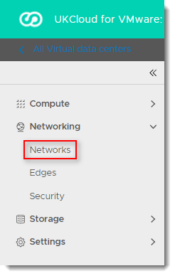
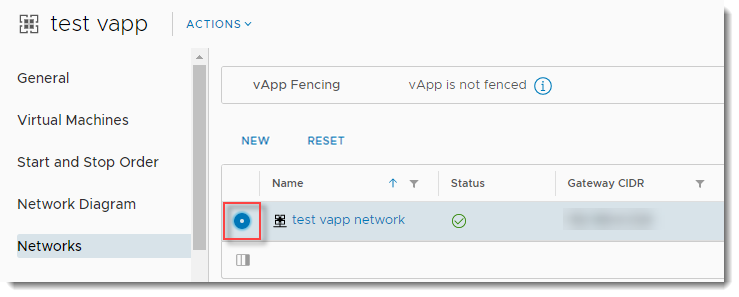
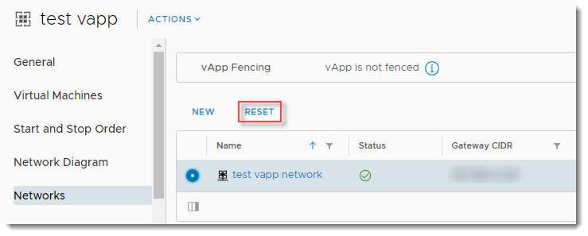

#### UKCloud Limited (“UKC”) and Virtual Infrastructure Group Limited (“VIG”) (together “the Companies”) – in Compulsory Liquidation

On 25 October 2022, the Companies were placed into Liquidation with the Official Receiver appointed as Liquidator and J Robinson and A M Hudson simultaneously appointed as Special Managers to manage the liquidation process on behalf of the Official Receiver.

Further information regarding the Liquidations can be found here: <https://www.gov.uk/government/news/virtual-infrastructure-group-limited-and-ukcloud-limited-information-for-creditors-and-interested-parties>

Contact details: 
For any general queries relating to the Liquidations please email <ukcloud@uk.ey.com> 
For customer related queries please email <ukcloudcustomers@uk.ey.com> 
For supplier related queries please email <ukcloudsuppliers@uk.ey.com>

# How to upgrade your edge gateway

## Overview

It's important to keep your edge gateways up to date to ensure that you benefit from the latest features and enhancements.

This article shows you how to upgrade your edge gateway to the latest available version. If you need any assistance with the upgrade process, contact UKCloud Support by raising a Service Request in the [My Calls](https://portal.skyscapecloud.com/support/ivanti) section of the UKCloud Portal.

### Different types of edge

VMware Cloud Director uses NSX edge services gateways in three main areas. These are all identical at the virtual network level, however feature exposure in VMware Cloud Director varies. Due to this, there are differences in the method to upgrade these underlying devices.

#### Organisation edge gateways

These are commonly referred to as edge gateways, and are by far the most widely understood. They provide VPN, NAT, firewall and routing functionality, and appear as the object **Edge Gateway** in VMware Cloud Director. These edges are referred to as edge gateways throughout this article.

To upgrade an organisation edge gateway, see [*Upgrading an organisation edge gateway*](#upgrading-an-organisation-edge-gateway).

#### Isolated organisation network edges

When you create an isolated organisation network in a VDC in VMware Cloud Director, DHCP services are enabled by default with a DHCP pool of any remaining IP addresses not used by any static IP pools specified for the network. A small NSX edge services gateway is deployed on the network to manage DHCP traffic. If you disable the DHCP service after creation of the network, the edge is removed.

To upgrade an isolated organisation network edge, see [*Upgrading an isolated network edge*](#upgrading-an-isolated-network-edge).

#### vApp network edges

vApps and vApp networks have some optional capabilities that require the use of an NSX edge services gateway in the underlying network. This is often due to the vApp being configured as *fenced*, requiring you to use NAT to communicate outside of the vApp. If you've configured a vApp network with any of the following, an NSX edge services gateway is required:

- NAT

- Firewall

- DHCP Scope

- Connection into an organisation network

To upgrade a vApp network edge, see [*Upgrading a vApp network edge*](#upgrading-a-vapp-network-edge).

## Intended audience

To complete the steps in this guide you must have access to the UKCloud Portal and VMware Cloud Director.

## Upgrading an organisation edge gateway

> [!IMPORTANT]
> Before you begin the upgrade process, bear in mind that this process requires downtime as a new VM needs to be deployed for the edge gateway. There will also be a brief network disruption for the networks that are used by the edge gateway instance. You should make sure that you have planned for this downtime before proceeding.

To upgrade an organisation edge gateway you need to redeploy the edge:

1. In the VMware Cloud Director *Virtual Data Center* dashboard, select the VDC that contains the edge gateway you want to upgrade.

2. In the left navigation panel, under *Networking* select **Edges**.

   

3. On the *Edge Gateways* page, select the edge that you want to configure.

   

4. Click **Redeploy**.

   

5. In the *Confirm Redeploy* dialog box, click **OK**.

## Upgrading an isolated network edge

To upgrade an isolated network edge, you need to reset the network. This forces a redeployment of the edge used for the DHCP service.

> [!IMPORTANT]
> Before you begin the upgrade process, bear in mind that this process will disrupt DHCP server operations whilst the underlying edge is redeployed.

1. In the VMware Cloud Director *Virtual Data Center* dashboard, select the VDC that contains the network edge you want to upgrade.

2. In the left navigation panel, select **Networks**.

   

3. On the *Networks* page, select the isolated network that contains the edge you want to upgrade.

   

4. Click **Reset**.

   

5. In the *Reset Network* dialog box, click **OK**.

## Upgrading a vApp network edge

An edge will be present on your vApp network if the network is:

- Connected to an organisation network

- Configured for NAT and/or firewall services

- Configured to supply DHCP services (disabled by default)

To upgrade a vApp network edge you can either reset the network or shut down the vApp and restart it.

### Resetting the network

One way to upgrade a vApp network edge is to reset the vApp network.

>[!IMPORTANT]
> Before you begin the upgrade process, bear in mind that this process will disrupt any traffic flowing into or out of the vApp network and DHCP services will be interrupted.

1. In the VMware Cloud Director *Virtual Data Center* dashboard, select the VDC that contains the vApp with the network edge you want to upgrade.

2. In the left navigation panel, select **vApps**.

    

3. On the *vApps* page, in the card for the vApp, click **Details**.

   

4. On the vApp details page, select the **Networks** tab.

5. Select the vApp network that contains the edge you want to upgrade.

   

6. Click **Reset**.

    

7. In the *Reset Network* dialog box, click **OK**.

### Shutting down and restarting the vApp

Another way to upgrade a vApp network is to shut down the vApp and restart it. Restarting the vApp in this way recreates any networks in the virtual network space and deploys fresh vApp edges with the configuration held in VMware Cloud Director.

>[!IMPORTANT]
> Before you begin the upgrade process, bear in mind that all the vApp resources will be unavailable until the vApp restarts.

1. In the VMware Cloud Director *Virtual Data Center* dashboard, select the VDC that contains the vApp with the network edge you want to upgrade.

2. In the left navigation panel, select **vApps**.

    

3. On the *vApps* pages, in the card for the vApp, select **Actions**, then **Power Off** or **Stop**.

    > [!NOTE]
    > You must shut down the vApp itself to trigger the deployment of fresh vApp edges; it is not enough to just power off all VMs inside the vApp.

4. After the vApp has shut down, in the vApp card, select **Actions** then **Power On**.

    After the vApp has powered on, the vApp network edge will have been upgraded to the latest version.

## Feedback

If you find a problem with this article, click **Improve this Doc** to make the change yourself or raise an [issue](https://github.com/UKCloud/documentation/issues) in GitHub. If you have an idea for how we could improve any of our services, send an email to <feedback@ukcloud.com>.
