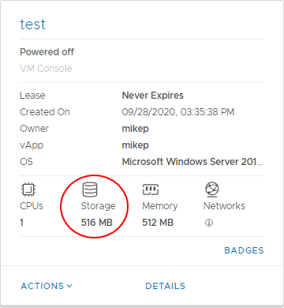

# How to view storage profile usage

## Overview

Before allocating more disk space in your UKCloud for VMware account, it's useful to check how much of your allocated space has been used.

## Viewing a VDC's storage usage (Tenant Portal)

In the VMware Cloud Director Tenant Portal, you can see how much storage a VDC is currently using.

1. In the VMware Cloud Director *Virtual Data Center* dashboard, find the card for the VDC.

2. The *Storage* section shows how much storage the VDC is currently using as well as the amount of allocated storage.

    

## Viewing a VM's storage usage (Tenant Portal)

In the VMware Cloud Director Tenant Portal, you can see how much storage an individual VM is currently using.

1. In the VMware Cloud Director *Virtual Data Center* dashboard, select the VDC that contains the VM.

2. Find the card for the VM.

3. The *Storage* section shows how much storage the VM is currently using.

    

## Viewing a VDC's storage usage (Cloud Director API)

To check your storage profile usage programmatically, you need to call the appropriate Cloud Director REST API endpoint.

> [!NOTE]
> Before calling this endpoint, you must first authenticate your session as described in [*How to access VMware Cloud Director through the Cloud Director API*](vmw-how-access-vcloud-api.md).

We've provided some sample code to show how to make this call on our [GitHub repository](https://github.com/ukcloud/knowledge_centre/tree/master/StorageProfileUsage).

The `using_curl.md` page provides an example of how to use CURL to call the REST API. The example assumes that you have set up the following three environment variables to hold your user credentials:

- `VCD_ORG`

- `VCD_USERNAME`

- `VCD_PASSWORD`

The example makes two calls to the API. The first call authenticates the session:

``` curl
curl -u %VCD_USERNAME%@%VCD_ORG%:%VCD_PASSWORD%  -H "Accept: application/*+xml;version=5.6" -X POST -i https://api.vcd.portal.skyscapecloud.com/api/sessions
```

> [!TIP]
> On Linux, use `$VCD_USERNAME` instead of `%VCD_USERNAME%`.

Having authenticated successfully and received an `x-vcloud-authorisation` header in the response, the second call passes the authentication token as a header on the request:

``` curl
curl -H "x-vcloud-authorization: a1b2c3d4e5f6a7b8c9d0e1f2a3b4c5d6" -H "Accept: application/*+xml;version=5.6" -i  https://api.vcd.portal.skyscapecloud.com/api/query?type=orgVdcStorageProfile
```

This call returns an XML structure, in which you can see an `OrgVdcStorageProfileRecord` element containing the following properties:

``` none
storageLimitMB="512000" storageUsedMB="65536"
```

The GitHub repository also provides a ruby example. Again, the script assumes the above environment variables have been set up with your user credentials.

You can use the ruby script by running:

``` none
ruby storage_profile.rb
```

The output will look similar to the following:

``` none
Name        Used GB   Total GB   Percent   VDC
BASIC-Any   192       500        38.5%     XXXX
```

## Feedback

If you find a problem with this article, click **Improve this Doc** to make the change yourself or raise an [issue](https://github.com/UKCloud/documentation/issues) in GitHub. If you have an idea for how we could improve any of our services, send an email to <feedback@ukcloud.com>.
