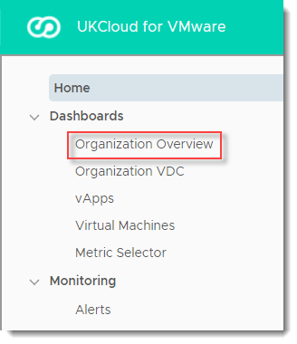
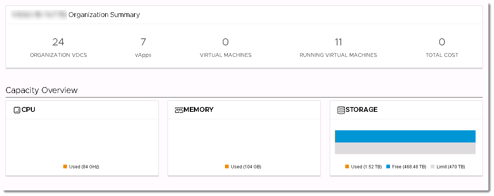
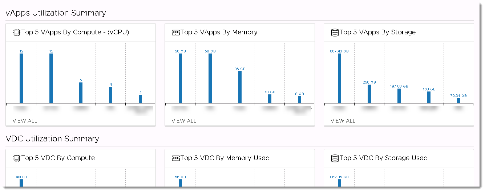
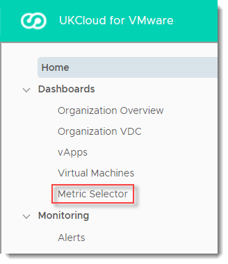
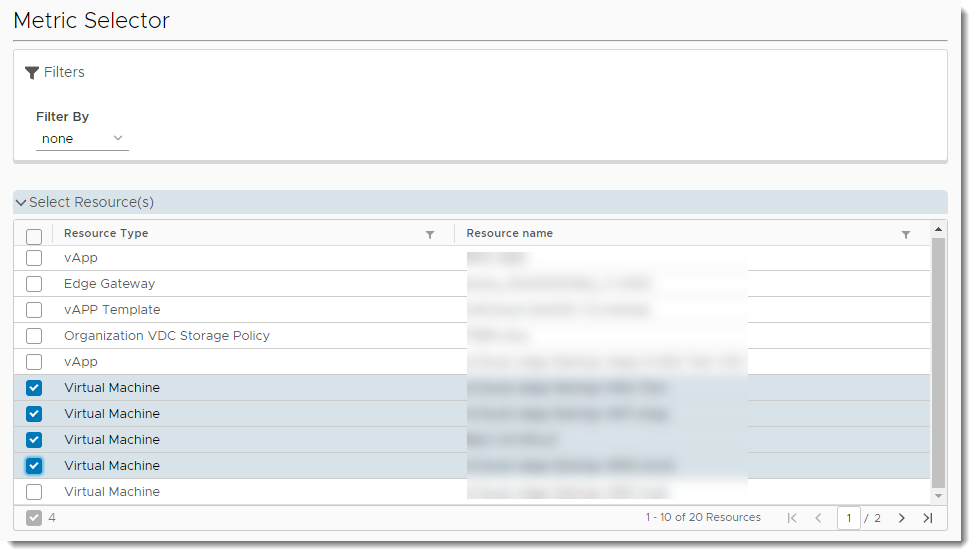
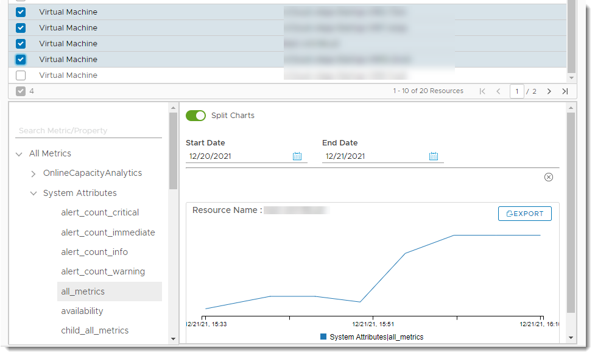
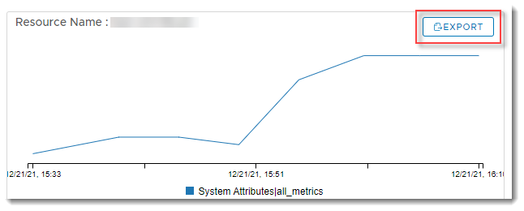
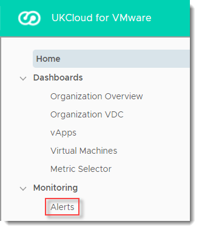
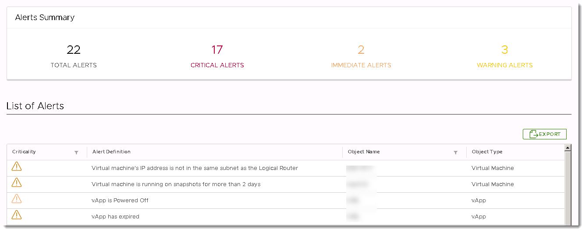

# How to access advanced monitoring using the vRealize Operations Tenant Appliance

## Overview

UKCloud for VMware provides advanced monitoring, powered by the vRealize Operations (vROps) Tenant Appliance, as part of its Advanced Management bundle (additional charges apply). Using advanced monitoring, you can view metrics and reports relating to your UKCloud for VMware environment.

Advanced monitoring enables you to:

- Monitor and manage workloads - Over 400 different metrics available for CPU, memory and storage

- Identify workload optimisation options - Use analytics displaying the overall health of the platform to optimise your workloads

- Rightsize your VMs - Identify if your VMs can be resized to reduce costs or improve performance

- View optimisation history - Identify issues over a given time frame and make adjustments as necessary

### Intended audience

To access advanced monitoring you must be a VMware Cloud Director administrator.

## Accessing advanced monitoring metrics

To access advanced monitoring metrics:

1. In VMware Cloud Director, in the top menu, select **More**, then **Operations Manager**.

   

2. In the left navigation panel, under *Dashboards*, select **Organization Overview**

    

3. In the *Organization Overview* dashboard you can view basic metrics and reporting for your organisation, including CPU, memory and storage.

    

    The overview dashboard also provides:

    - A summary of VDC, vApp and VM metrics

    - A list of recent alerts that have been generated

    - A set of key metrics

    

    You can drill down into any of these for further details.

4. In the left navigation panel, select a different dashboard to drill down into metrics for:

    - Organization VDCs

    - vApps

    - Virtual Machines

    Click a VDC, vApp or VM to view metrics for a specific resource.

## Creating custom reports using the Metric Selector

The vRealize Operations Tenant Appliance provides several out-of-the-box charts to get you started and provide the basic information you need to monitor your environment. However, to fully leverage the hundreds of metrics collected by vRealize Operations, you can create your own custom charts to view the exact information you need.

To create custom reports:

1. In the left navigation panel of the *Operations Manager*, under *Dashboards*, select **Metric Selector**.

    

2. At the top of the *Metric Selector*, choose the resources to include in your custom chart.

    

3. In the bottom half of the *Metric Selector*, in the left panel, select the metrics that you want to show for your selected resources.

4. Above the chart, select a **Start Date** and **End Date** to apply to your selected metrics.

    

5. To export your custom chart, click the **Export** button.

    

## Viewing monitoring alerts

If objects in your environment are not behaving as expected, vRealize Operations creates alerts to inform you of potential issues so that you can take steps to remediate them.

To view monitoring alerts:

1. In the left navigation panel of the *Operations Manager*, under *Monitoring*, select **Alerts**.

    

2. The *Alerts* dashboard provides an overview of the alerts raised against your organisation.

    

    You can drill down into any of these alerts for further details.

## Accessing advanced monitoring metrics via the vRealize Operations API

vRealize Operations provides a REST API that you can use to programmatically interact with the collected metrics. The entry point URL for the API is:

`https://<vrops-ip>/suite-api/api`

For more information about the vRealize Operations API, see the [vRealize Operations Manager API Programming Guide](https://docs.vmware.com/en/vRealize-Operations-Manager/8.1/com.vmware.vcom.api.doc/GUID-79DD20A4-2F38-4EAB-94BF-771DF2C596B1.html).

For a useful blog showing how to use the vRealize Operations API, see <https://blogs.vmware.com/management/2019/02/extracting-data-from-vrealize-operations-with-the-rest-apis.html>.

## Next steps

If you encounter any problems accessing monitoring metrics and reports, see [*Troubleshooting the vRealize Operations Tenant Appliance for advanced monitoring*](vmw-ref-vrops-trouble.md).

## Feedback

If you find a problem with this article, click **Improve this Doc** to make the change yourself or raise an [issue](https://github.com/UKCloud/documentation/issues) in GitHub. If you have an idea for how we could improve any of our services, send an email to <feedback@ukcloud.com>.
