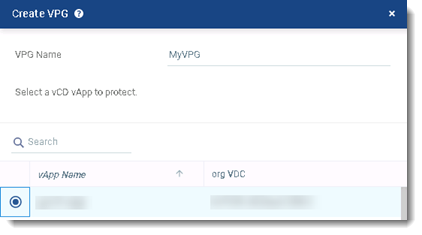
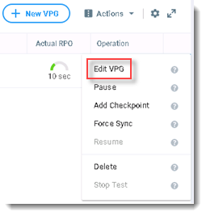
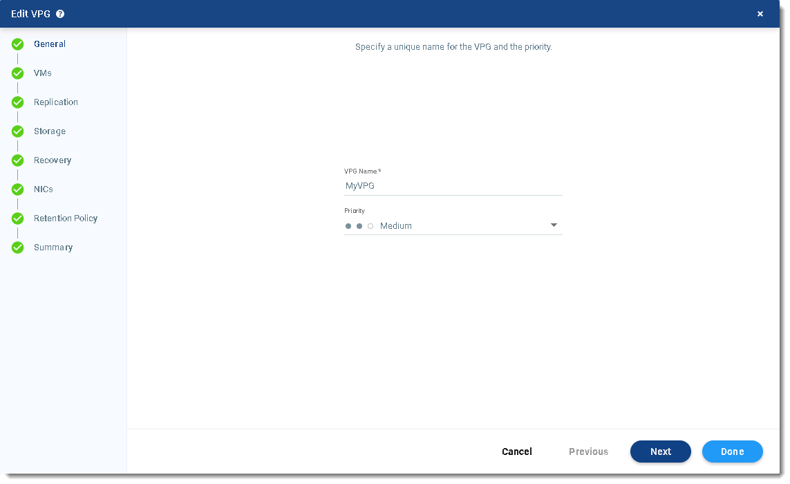
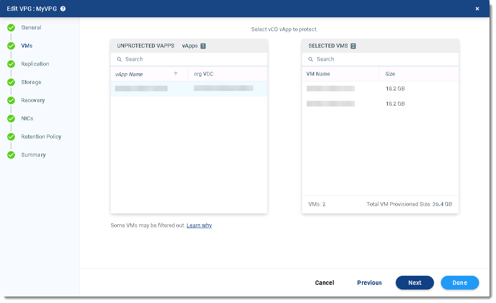
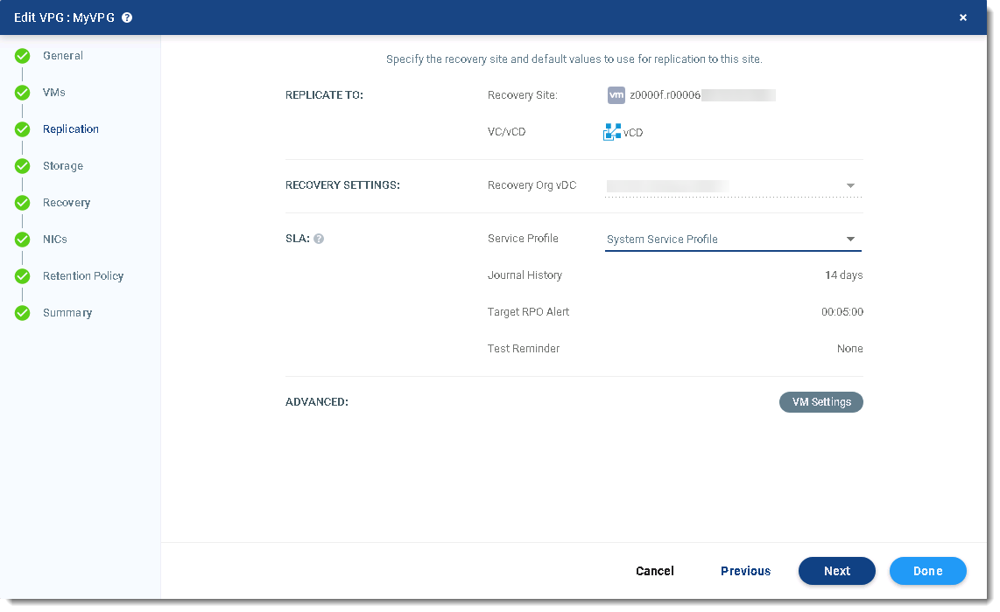
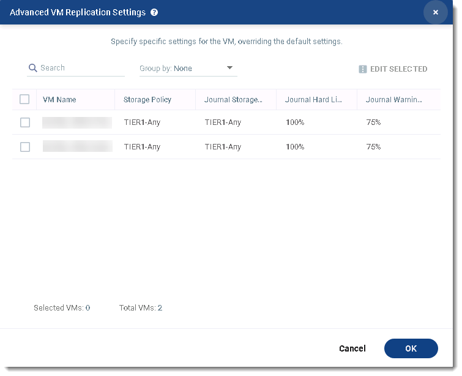
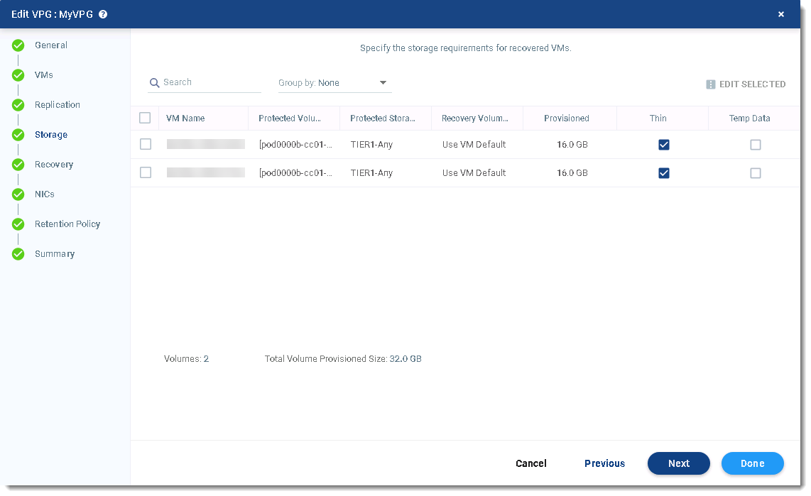
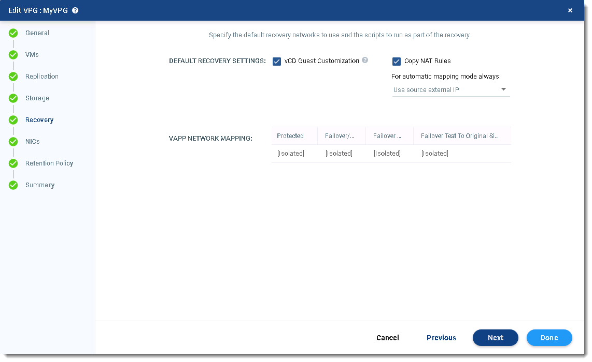
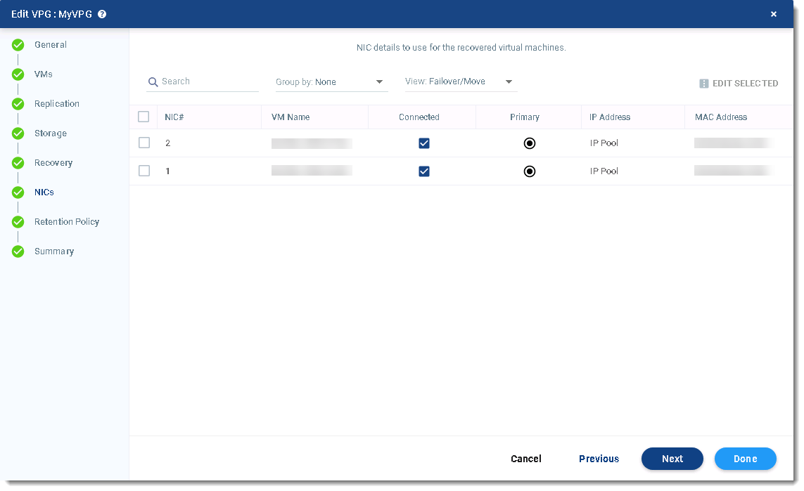

# How to create a virtual protection group

## Overview

A virtual protection group (VPG) is a collection of virtual machines (VMs) that are grouped together for some purpose, for example data protection, disaster recovery or workload migration. When you create a VPG, a replica virtual disk is created on the target site (for recovery or migration) for each VM in the VPG. These replica disks are then populated with the data in the source VMs by synchronising the VMs with the target site replicas.

After the initial synchronisation completes, any writes to disk from the VMs in the source site are sent to the target site. These writes are stored in the target site in journals.

> [!NOTE]
> We recommend that you do not power off a protected VM. If Zerto attempts to access the powered off VM, it could cause replication of all the VMs in the VPG to cease.
>
> If you make configuration changes to a VM, for example to add or extend disks or change the networking, you should do this while the VM is powered on if possible. If you must power off the VM, after powering it back on check the VPG to make sure there are no errors.

### Intended audience

This guide is intended for users who are:

- Setting up Disaster Recovery as a Service

- Setting up Journaling Protection

- Migrating workloads onto the UKCloud platform

For Journaling Protection, you must have access to the Zerto Self-Service Portal in the UKCloud zone in which the VMs that you want to protect are located.

For Disaster Recovery as a Service or Migration to the Cloud, you must have access to the Zerto Virtual Manager Web Client in the local environment in which the VMs that you want to protect or migrate are located.

## Creating a virtual protection group in the Zerto Self-Service Portal (Journaling Protection)

To create a VPG for Journaling Protection, use the Zerto Self-Service Portal. You must first create the initial VPG to specify the vApp to protect and the recovery site to use. After the initial creation, you can then edit the VPG to specify what happens during the recovery process.

### Creating a virtual protection group

If you're creating a VPG for Journaling Protection, you specify the vApp to protect and all the VMs in that vApp are included in the VPG.

1. [*Log in to the ZSSP*](vmw-how-zerto-access-zssp.md).

   Use the ZSSP login link for the zone in which the VMs that you want to protect are located.

2. Select the *VPGs* tab and then click **New VPG**.

   

3. In the *Create VPG* dialog, specify the **VPG Name**.

    The name must be unique and contain no more than 80 characters.

4. Select the vApp that contains the VMs that you want to protect.

    

5. From the **Recovery Site** list, select your target site.

6. From the **Org vDC** list, select the VDC in which you want to replicate the VMs.

7. From the **Service Profile** list, select one of the Journaling Protection service profiles, depending on the level of retention you require:

   - Journaling Protection 2 Day Retention

   - Journaling Protection 7 Day Retention

   - System Service Profile (for 14-day Journaling Protection)

     If your environment is in the Elevated OFFICIAL security domain, the service profile to use for 14-day Journaling Protection is called UKCloud Service Profile.

   - Journaling Protection 28 Day Retention

   

8. Click **Save**.

   At this point, the selected VMs are synchronised to the target site. This synchronisation between the source site and target site may take some time, depending on the size of the VMs.

   After the initial synchronisation, all the VMs in the VPG are fully protected and all write operations to those VMs are sent to the journal.

## Editing virtual protection group properties

After the initial creation of your VPG, you need to edit it to determine what happens during recovery.

1. In the *VPGs* tab of the Zerto Self-Service Portal, select your VPG then click the three dots.

   

2. Select **Edit VPG**

   

3. On the *General* page of the *Edit VPG* dialog box, from the **Priority** list, choose the priority of transferring data from the source site to the target site for this VPG when there is limited bandwidth and more than one VPG is defined on the source site.

   - **High** - Updates from VPGs with high priority are passed over the WAN first

   - **Medium** - Updates from VPGs with medium priority use whatever bandwidth is left after the high priority VPGs have used it

   - **Low** - Updates from VPGs with low priority use whatever bandwidth is left after the medium VPGs have used it

   

4. Click **Next**.

5. On the *VMs* page, you can see the VMs that are included in the VPG.

   

6. Click **Next**.

7. On the *Replication* page, you can see the options you selected for the **Recovery Site** and **Recovery Org vDC**.

   

8. To change the **Storage Profile** used for the VMs in the VPG, click **VM Settings**.

   You cannot change the **Journal Hard Limit** or **Journal Warning Threshold**.

   

9. When you're done, click **OK** then click **Next**.

10. The *Storage* page displays the storage used for the VM data (by default, this is the same storage as that used for the VM definition).

    

    If you want to edit the storage settings for a VM, select the VM and then click **Edit Selected**.

    > [!NOTE]
    > Make sure that the **Thin** checkbox is selected for all VMs.

11. When you've finished setting the options for each of the VMs, click **Next**.

12. On the *Recovery* page, from the **Failover/Move Network** list, choose the network to use in the target site for a live failover.

13. From the **Failover Test Network** list, choose the network to use in the target site for a test failover of VMs.

    If you select **Isolated**, the network interface controller (NIC) will not be connected to the VM when it's brought up in the target site.

14. **vCD Guest Customization** controls whether the failed‑over VM is subject to guest customization to set its IP address inside its operating system.

    

15. Click **Next**.

16. On the *NICs* page, specify the network interface controller (NIC) to use for the VMs after a live or test failover.

    > [!NOTE]
    > If you specify different IP addresses (or use **IP Pool**) for the IP addresses here, you must enable **vCD Guest Customization** on the *Recovery* page.

    

17. Click **Next**.

18. The UKCloud service profiles do not permit Long Term Retention Services, so click **Next** again.

19. On the *Summary* page, review the options you've selected for the VPG and click **Done** to create the VPG.

## Creating a virtual protection group in Zerto Virtual Manager (Disaster Recovery as a Service and Migration to the Cloud)

If you're creating a VPG for Disaster Recovery as a Service or Migration to the Cloud, use the ZVM Web Client in your local environment. When you create the VPG, you specify the individual VMs that you want to protect or migrate.

1. Log in to the ZVM Web Client.

2. Select the **VPGs** tab and then click **New VPG**.

3. On the *New VPG* page of the *Create VPG* dialog, specify the **VPG Name**.

4. From the **Priority** list, choose the priority of transferring data from the source site to the target site for this VPG when there is limited bandwidth and more than one VPG is defined on the source site.

   - **High** - Updates from VPGs with high priority are passed over the WAN first

   - **Medium** - Updates from VPGs with medium priority use whatever bandwidth is left after the high priority VPGs have used it

   - **Low** - Updates from VPGs with low priority use whatever bandwidth is left after the medium VPGs have used it

5. Click **Next**.

6. On the *VMs* page, select the VMs that you want to protect or migrate and then click **Next**.

7. On the *Replication* tab, from the **Recovery Site** list, choose your UKCloud target site.

8. From the **Recovery Org vDC** list, choose the VDC in which you want to replicate the VMs.

9. From the **Service Profile** list, select one of the service profiles, depending on the service and level of retention you require:

   - DRaaS 2 Day Retention

   - DRaaS 7 Day Retention

   - DRaaS 14 Day Retention

   - DRaaS 28 Day Retention

   - Migration to the Cloud 1 Day Retention

10. To change the **Storage Profile** used for the VMs in the VPG, click **VM Settings**.

11. When you're done, click **OK** then click **Next**.

12. The *Storage* page displays the storage used for the VM data (by default, this is the same storage as that used for the VM definition).

13. If you want to edit the storage settings for a VM, select the VM and then click **Edit Selected**.

    > [!NOTE]
    > Make sure that the **Thin** checkbox is selected for all VMs.

14. When you've finished setting the options for each of the VMs, click **Next**.

15. In the *Recovery* page, from the **Failover/Move Network** list, choose the network to use in the target site for a live failover or move operation.

16. From the **Failover Test Network** list, choose the network to use in the target site for a test failover of VMs.

17. Click **Next**.

18. In the *NICs* page, specify the network interface controller (**NIC**) to use for the VMs after a live or test failover, or a move operation.

    > [!NOTE]
    > If you encounter issues with MAC addresses, edit each VM and set the **MAC Address** to **Reset** for both the **Failover/Move** and **Test** networks to assign a new address on failover or move.

19. At this point, you can click **Done** to create the VPG.

## Next steps

For Disaster Recovery as a Service and Journaling Protection, we recommend that you run a test failover to verify that, in the case of an actual disaster, your VMs can be recovered successfully. For information about how to do this, as well as how to perform an actual failover, see [*How to perform a failover*](vmw-how-zerto-perform-failover.md).

For Migration to the Cloud, you can now migrate your selected VMs to the UKCloud platform. For more information, see [*How to migrate your workloads to the UKCloud platform*](../migration/migr-how-zerto-migrate-to-ukcloud.md).

## Feedback

If you find a problem with this article, click **Improve this Doc** to make the change yourself or raise an [issue](https://github.com/UKCloud/documentation/issues) in GitHub. If you have an idea for how we could improve any of our services, send an email to <feedback@ukcloud.com>.
