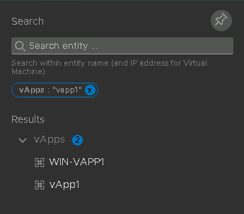

 **UKCloud Limited (“UKC”) and Virtual Infrastructure Group Limited (“VIG”) (together “the Companies”) – in Compulsory Liquidation**

On 25 October 2022, the Companies were placed into Liquidation with the Official Receiver appointed as Liquidator and J Robinson and A M Hudson simultaneously appointed as Special Managers to manage the liquidation process on behalf of the Official Receiver.

Further information regarding the Liquidations can be found here: <https://www.gov.uk/government/news/virtual-infrastructure-group-limited-and-ukcloud-limited-information-for-creditors-and-interested-parties>

Contact details: 
For any general queries relating to the Liquidations please email <ukcloud@uk.ey.com> 
For customer related queries please email <ukcloudcustomers@uk.ey.com> 
For supplier related queries please email <ukcloudsuppliers@uk.ey.com>

# Known Issues in VMware Cloud Director

## Overview

This article describes some of the issues we've identified when using VMware Cloud Director, along with workarounds if available.

## VMRC console window doesn't show correct VM name

### Issue

When you change the name of a VM, the VMRC console shows the old VM name.

### Solution

There currently isn't a fix for the VMRC console. We recommend using the web console instead, which should show the new VM name.

## Date formats are in MM/DD/YYY format

### Issue

Dates are displayed using the American MM/DD/YYYY format.

### Solution

It isn't currently possible to change the date formatting. We've raised a request with VMware to enable the customisation of date formatting.

## vApp search functionality doesn't work correctly

### Issue

1. Search for a vApp using the search icon on the right-hand side of the menu bar.

   

2. Select the vApp.

   

3. The details of the vApp are displayed, including the VMs contained in the vApp.

   

4. Search for a different vApp using the same search method and select it.

5. The details of the second vApp are displayed, but the name of vApp is still shown as the first vApp.

   

6. Any options selected from the Actions menu will apply to the first searched vApp not the second one.

### Solution

We recommend searching for vApps by clicking vApps in the left navigation panel, then using the search functionality on the vApps page.

## Cannot amend VM hardware configuration

### Issue

If you've enabled the **Enable VM to join domain** options for a VM, either currently or in the past, you won't be able to amend the hardware configuration of the VM.

### Solution

If you encounter this issue, you can raise a Service Request to obtain a workaround.

## Guest customisation failing

### Issue

Guest customisation is failing in the following:

- For existing VMs - Windows 2012, Windows 2012R2 and Windows 2016

- For new VMs - Windows 2012, Windows 2012R2

When setting a new administrator password and/or changing the IP address then forcing re-customisation at power-on, the settings are ignored.

### Solution

The workaround is to deploy the template, but before powering on, change the VM type to Windows 2016. Power on using Force Customization.

## Additional information

For other known issues with VMware Cloud Director 10.1, see the [VMware Cloud Director 10.1 Release Notes](https://docs.vmware.com/en/VMware-Cloud-Director/10.1/rn/VMware-Cloud-Director-101-Release-Notes.html).

## Feedback

If you find a problem with this article, click **Improve this Doc** to make the change yourself or raise an [issue](https://github.com/UKCloud/documentation/issues) in GitHub. If you have an idea for how we could improve any of our services, send an email to <feedback@ukcloud.com>.